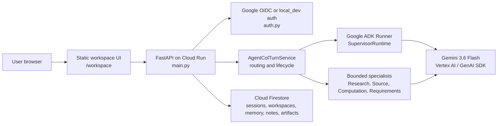

# Agent Col

Agent Col is a persistent AI collaborative partner built for the All Things
Agentic Hackathon. It helps a user carry work across sessions by keeping
approved memory, governed workspace notes, bounded specialist work, artifacts,
and inspectable receipts behind one browser workspace.

The submission category target is **Collaborative Partner**: Agent Col asks
clarifying questions, captures user-approved feedback, adapts later
interactions from approved context, and keeps the user in control of durable
memory and notes.

## Implemented Features

- Same-origin browser workspace at `/workspace`.
- Local-development auth and Google OIDC auth modes.
- User-owned workspaces with workspace-scoped chat, notes, memory, and work.
- Persisted chat sessions with retry-safe idempotent turn records.
- Progressive SSE chat streaming for ordinary turns at `/api/chat/stream`, with
  `/api/chat` retained as the canonical JSON and structured-decision path.
- Governed profile memory with proposal, clarification, approval, rejection,
  correction, revocation, deletion, inspection, and adaptation receipts.
- Governed collaborative notes with proposal, decision, correction, archive,
  restore, delete, active projection, and continuity receipts.
- Bounded continuity from active notes and prior chat sessions.
- Hidden same-session working state used as non-authoritative collaboration
  context.
- Narrow preference-learning observations and hypotheses from explicit concise
  or shorter-response feedback.
- Bounded specialists for Research, Source, Computation, and Requirements
  Verification.
- Synthesis blueprints and generic single-file artifacts with lifecycle,
  metadata, versioning, feedback, detail, and export surfaces.
- Offline Python and frontend test coverage plus live smoke runners for local
  configured services.

Current limitations are explicit: durable asynchronous background jobs, Cloud
Tasks, private worker execution, distributed rate limiting, and broad
preference inference are not implemented in the current runtime.

## Architecture At A Glance

Agent Col is a FastAPI application that serves a static vanilla JavaScript UI.
The browser talks only to same-origin backend APIs. The backend owns auth,
ownership checks, routing, Google ADK responder execution, specialist
execution, Gemini/Vertex AI calls, Firestore persistence, and public response
projection.



See [Architecture](docs/architecture.md) for the full source-grounded diagram,
data boundaries, and trust model.

## Google Technology

- Gemini `gemini-3.6-flash` through Vertex AI / Gemini Enterprise.
- Google GenAI SDK `2.18.1` for structured generation, URL Context, Google
  Search grounding, and Vertex client access.
- Google ADK `2.7.0` for Agent Col responder runtime and ADK-backed
  computation/specialist flows.
- Google Cloud Firestore `2.28.1` for durable sessions, memory, notes,
  workspaces, artifacts, and receipts.
- Google Cloud Run for the hosted FastAPI service.
- Google Identity Services / Google OIDC for browser sign-in in hosted mode.

## Hosted Deployment

Current hosted service:

- URL: `https://agent-col-994154906699.us-east4.run.app`
- Platform: Cloud Run in `us-east4`
- Runtime auth mode: Google OIDC
- Deployment phase status: accepted on August 28, 2026

The service is publicly reachable, but user data is protected by application
Google OIDC. Hosted evidence and pass history live in
[Deployment notes](docs/deployment/deployment-notes.md). Re-verify the hosted
URL before final submission freeze because hosted state can drift.

## Prerequisites

- macOS or Linux.
- Python 3.14 recommended.
- Node.js for frontend module tests.
- Google Cloud CLI.
- A Google Cloud project with Vertex AI enabled.
- Firestore in Native mode.
- Application Default Credentials with access to Vertex AI and Firestore.
- A Google OAuth Web Client ID when running `google_oidc` locally or in Cloud
  Run.

## Environment

Create an ignored `.env` file in the repository root:

```dotenv
GOOGLE_CLOUD_PROJECT=replace-with-your-project-id
GOOGLE_CLOUD_LOCATION=global
GOOGLE_GENAI_USE_ENTERPRISE=True
GOOGLE_OAUTH_CLIENT_ID=replace-with-public-oauth-client-id
```

`GOOGLE_OAUTH_CLIENT_ID` is public browser configuration, not a client secret.
Do not commit `.env`, OAuth client secrets, service-account keys, access
tokens, refresh tokens, or ADC credential files.

Server-side Vertex AI and Firestore calls use Application Default Credentials.
Browser Google OIDC only authenticates the end user to Agent Col.

## Local Setup

```bash
git clone git@github.com:knightsky-cpu/col-workspace.git
cd col-workspace
python3 -m venv venv
source venv/bin/activate
python -m pip install --upgrade pip
python -m pip install -r requirements.txt
python -m pip install -r requirements-dev.txt
```

Configure Google Cloud credentials:

```bash
gcloud config set project YOUR_PROJECT_ID
gcloud services enable aiplatform.googleapis.com --project=YOUR_PROJECT_ID
gcloud auth application-default login
gcloud auth application-default set-quota-project YOUR_PROJECT_ID
```

If testing Google sign-in locally, add this JavaScript origin to the OAuth Web
Client:

```text
http://127.0.0.1:8000
```

## Run Locally

Local-development auth mode:

```bash
AGENT_COL_AUTH_MODE=local_dev venv/bin/uvicorn main:app --reload --host 127.0.0.1 --port 8000
```

Google OIDC auth mode:

```bash
AGENT_COL_AUTH_MODE=google_oidc venv/bin/uvicorn main:app --reload --host 127.0.0.1 --port 8000
```

Open the browser UI:

```text
http://127.0.0.1:8000/workspace
```

Health check:

```bash
curl -fsS http://127.0.0.1:8000/
```

Expected body:

```json
{"status":"online"}
```

In `local_dev`, enter a local user/project context in the UI. In
`google_oidc`, use the Google sign-in button; the backend verifies the ID token
and maps the Google principal to an opaque public user locator.

## Deploy To Cloud Run

The repository includes a Dockerfile for Cloud Run. The accepted deployment
path is container build, Artifact Registry push, and Cloud Run deploy.

1. Set variables:

```bash
PROJECT_ID=your-project-id
REGION=us-east4
REPOSITORY=agent-col
SERVICE=agent-col
IMAGE=us-east4-docker.pkg.dev/$PROJECT_ID/$REPOSITORY/agent-col:submission
```

2. Enable required APIs:

```bash
gcloud services enable \
  run.googleapis.com \
  artifactregistry.googleapis.com \
  aiplatform.googleapis.com \
  firestore.googleapis.com \
  --project="$PROJECT_ID"
```

3. Create or verify Firestore Native mode in the project.

4. Create an Artifact Registry Docker repository if needed:

```bash
gcloud artifacts repositories create "$REPOSITORY" \
  --repository-format=docker \
  --location="$REGION" \
  --project="$PROJECT_ID"
```

5. Build and push:

```bash
gcloud auth configure-docker us-east4-docker.pkg.dev
docker build --platform linux/amd64 -t "$IMAGE" .
docker push "$IMAGE"
```

6. Deploy:

```bash
gcloud run deploy "$SERVICE" \
  --image "$IMAGE" \
  --region "$REGION" \
  --project "$PROJECT_ID" \
  --allow-unauthenticated \
  --set-env-vars "AGENT_COL_AUTH_MODE=google_oidc,GOOGLE_CLOUD_PROJECT=$PROJECT_ID,GOOGLE_CLOUD_LOCATION=global,GOOGLE_GENAI_USE_ENTERPRISE=True,GOOGLE_OAUTH_CLIENT_ID=YOUR_PUBLIC_WEB_CLIENT_ID"
```

7. Add the resulting Cloud Run URL as an authorized JavaScript origin on the
   OAuth Web Client.

8. Verify:

```bash
curl -fsS https://YOUR_SERVICE_URL/
curl -fsS https://YOUR_SERVICE_URL/api/auth/config
```

Unauthenticated `/api/auth/session` should return `401` in Google OIDC mode.
Use the browser UI at `https://YOUR_SERVICE_URL/workspace` for authenticated
chat, memory, notes, continuity, and artifact verification.

More deployment evidence and exact prior pass notes are in
[Deployment notes](docs/deployment/deployment-notes.md).

## Testing

Offline backend suite:

```bash
venv/bin/pytest -q
```

Frontend ES module tests:

```bash
node --test tests/frontend/*.test.mjs
```

Focused packaging check:

```bash
venv/bin/pytest -q tests/test_deployment_packaging.py
```

Live local smoke checks require a running configured server and real Google
Cloud access:

```bash
python3 live-tests/smoke_test_chat_idempotency.py
```

See [Testing](docs/development/testing.md) for focused command groups and what
each layer does not prove.

## Repository Navigation

- `main.py`: FastAPI app, middleware, route handlers, and dependency
  composition.
- `auth.py`: local-development and Google OIDC authentication boundaries.
- `database.py`: Firestore persistence adapter and ownership-sensitive
  operations.
- `agent_col_turn_service.py`, `supervisor_runtime.py`, `supervisor.py`:
  routing, Google ADK responder runtime, and turn orchestration.
- `research_expert_service.py`, `source_expert_service.py`,
  `computational_expert_service.py`, `requirements_verification_service.py`:
  bounded specialists.
- `trusted_memory_service.py`, `collaborative_note_service.py`,
  `continuity_service.py`, `working_state_service.py`,
  `preference_learning_service.py`: collaboration context systems.
- `synthesis_service.py`, `generic_artifact_service.py`,
  `artifact_feedback_service.py`: artifact workflows.
- `frontend/`: static browser UI modules.
- `tests/` and `tests/frontend/`: offline backend and frontend tests.
- `live-tests/`: configured local smoke runners.
- `docs/`: current docs, deployment notes, design docs, historical docs, and
  informal notes.

See [Repository map](docs/repo-map.md) for the detailed source and documentation
map.

## Documentation

- [Current state](docs/current-state.md)
- [Architecture](docs/architecture.md)
- [Repository map](docs/repo-map.md)
- [Local development setup](docs/development/local-setup.md)
- [Testing](docs/development/testing.md)
- [Troubleshooting](docs/development/troubleshooting.md)
- [Submission checklist](docs/submission-checklist.md)
- [Design and product directives](docs/design/)
- [Deployment notes](docs/deployment/)
- [Working notes](docs/notes/)
- [Historical implementation records](docs/legacy/)
- [Forward plans](docs/forward/)

## Security Notes

- Do not expose `AGENT_COL_AUTH_MODE=local_dev` as a public service.
- Cloud Run startup fails closed unless `AGENT_COL_AUTH_MODE=google_oidc` and a
  public OAuth client ID are configured.
- The backend keeps raw Google subjects internal and returns opaque public user
  locators to the browser.
- The browser never calls Firestore or Vertex AI directly.
- Request body limits, in-memory rate limiting, cache controls, and security
  headers are implemented in FastAPI middleware.

## License

Licensed under the Apache License, Version 2.0. See [LICENSE](LICENSE).

Original-project attribution is recorded in [NOTICE](NOTICE).
