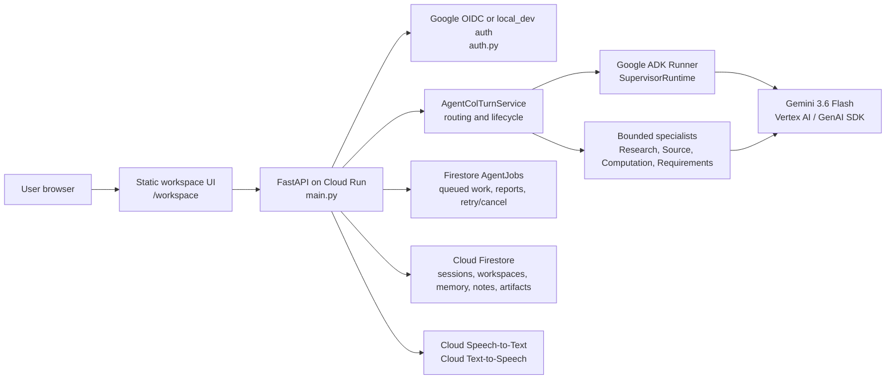

# Agent Col

Agent Col is a persistent AI collaborative partner built for the All Things
Agentic Hackathon. It helps a user carry work across sessions by keeping
approved memory, governed workspace notes, bounded specialist work, artifacts,
and inspectable receipts behind one browser workspace.

The submission category target is **Collaborative Partner**: Agent Col asks
clarifying questions, captures user-approved feedback, adapts later
interactions from approved context, and keeps the user in control of durable
memory and notes.

## Implemented Features

- Same-origin browser workspace at `/workspace`.
- Local-development auth and Google OIDC auth modes.
- User-owned workspaces with workspace-scoped chat, notes, memory, and work.
- Persisted chat sessions with retry-safe idempotent turn records.
- Progressive SSE chat streaming for ordinary turns at `/api/chat/stream`, with
  `/api/chat` retained for ordinary non-streaming JSON chat.
- Direct resource APIs for memory decisions, memory clarifications, continuity
  choices, collaborative-note decisions, artifact feedback, and lifecycle
  mutations that no longer depend on active chat turns.
- Firestore-backed `AgentJob` records, reports, events, retry/cancel APIs, and
  in-process workers for queued memory, collaborative-note, artifact, and
  working-state work.
- Governed profile memory with proposal, clarification, approval, rejection,
  correction, revocation, deletion, inspection, and adaptation receipts.
- Governed collaborative notes with proposal, decision, correction, archive,
  restore, delete, active projection, and continuity receipts.
- Bounded continuity from active notes and prior chat sessions.
- Hidden same-session working state used as non-authoritative collaboration
  context.
- Narrow preference-learning observations and hypotheses from explicit concise
  or shorter-response feedback.
- Bounded specialists for Research, Source, Computation, and Requirements
  Verification.
- Synthesis blueprints and generic single-file artifacts with lifecycle,
  metadata, versioning, feedback, detail, and export surfaces.
- Browser voice input through Google Cloud Speech-to-Text and spoken assistant
  responses through Google Cloud Text-to-Speech.
- Offline Python and frontend test coverage plus live smoke runners for local
  configured services.

Current limitations are explicit: the deployed runtime uses process-local
workers and an in-process queued-job drain loop rather than Cloud Tasks,
Pub/Sub, or a separate private worker service. Distributed rate limiting and
broad preference inference are not implemented.

## Architecture At A Glance

Agent Col is a FastAPI application that serves a static vanilla JavaScript UI.
The browser talks only to same-origin backend APIs. The backend owns auth,
ownership checks, routing, Google ADK responder execution, specialist
execution, Gemini/Vertex AI calls, Firestore persistence, and public response
projection.



See [Architecture](docs/architecture.md) for the full source-grounded diagram,
data boundaries, and trust model.

## Google Technology

- Gemini `gemini-3.6-flash` through Vertex AI / Gemini Enterprise.
- Google GenAI SDK `2.18.1` for structured generation, URL Context, Google
  Search grounding, and Vertex client access.
- Google ADK `2.7.0` for Agent Col responder runtime and ADK-backed
  computation/specialist flows.
- Google Cloud Firestore `2.28.1` for durable sessions, memory, notes,
  workspaces, artifacts, AgentJobs, reports, events, and receipts.
- Google Cloud Speech-to-Text `2.40.0` for browser microphone transcription.
- Google Cloud Text-to-Speech `2.37.0` for spoken assistant responses.
- Google Cloud Run for the hosted FastAPI service.
- Artifact Registry for Cloud Run container images.
- Google Identity Services / Google OIDC for browser sign-in in hosted mode.

## Deployment Model

Agent Col runs as one FastAPI container on Cloud Run. The container serves the
static browser UI, same-origin APIs, Google OIDC authentication, Vertex/Gemini
model calls, Firestore persistence, STT/TTS routes, and the in-process queued
AgentJob workers.

The service can be publicly reachable at the Cloud Run ingress layer, but user
data is protected by application-level Google OIDC. Do not run a public Cloud
Run service with `AGENT_COL_AUTH_MODE=local_dev`.

## Prerequisites

- macOS or Linux.
- Python 3.14. The production image uses `python:3.14-slim`.
- Node.js 20+ or a current LTS for frontend development checks.
- Google Cloud CLI.
- Docker. On Apple Silicon macOS, the documented repository deployment path
  uses Colima and builds a `linux/amd64` image.
- A Google Cloud project where you can enable APIs, create Artifact Registry
  repositories, create or select a Cloud Run runtime service account, and bind
  IAM roles.
- Firestore in Native mode.
- A Google OAuth Web Client ID for `google_oidc` mode.

There is no frontend dependency installation or frontend build step. The UI is
static ES modules in `frontend/` served by FastAPI.

## Configuration

Use generic placeholders first, then replace them with values from your own
Google Cloud project and OAuth client:

```bash
export PROJECT_ID="<YOUR_GCP_PROJECT_ID>"
export REGION="<YOUR_GCP_REGION>"
export SERVICE_NAME="<YOUR_CLOUD_RUN_SERVICE_NAME>"
export REPOSITORY="<YOUR_ARTIFACT_REGISTRY_REPOSITORY>"
export IMAGE_NAME="<YOUR_IMAGE_NAME>"
export GOOGLE_CLIENT_ID="<YOUR_GOOGLE_OAUTH_CLIENT_ID>"
```

Agent Col reads these runtime environment variables:

```dotenv
AGENT_COL_AUTH_MODE=local_dev
GOOGLE_CLOUD_PROJECT=<YOUR_GCP_PROJECT_ID>
GOOGLE_CLOUD_LOCATION=global
GOOGLE_GENAI_USE_ENTERPRISE=True
GOOGLE_OAUTH_CLIENT_ID=<YOUR_GOOGLE_OAUTH_CLIENT_ID>
AGENT_COL_STT_LANGUAGE_CODES=en-US
AGENT_COL_STT_MODEL=latest_short
```

`GOOGLE_CLIENT_ID` is also accepted as a fallback for
`GOOGLE_OAUTH_CLIENT_ID`. `AGENT_COL_SPEECH_MAX_AUDIO_BYTES` is optional and
overrides the default speech upload size limit.

`GOOGLE_OAUTH_CLIENT_ID` is public browser configuration, not a client secret.
Do not commit `.env`, OAuth client secrets, service-account keys, access
tokens, refresh tokens, or Application Default Credential files.

Server-side Vertex AI, Firestore, Speech-to-Text, and Text-to-Speech calls use
Application Default Credentials locally and the Cloud Run runtime service
account in deployment. Browser Google OIDC authenticates the end user to Agent
Col; the browser never calls Google Cloud APIs directly.

## Local Setup

Clone and install Python dependencies:

```bash
git clone git@github.com:knightsky-cpu/col-workspace.git
cd col-workspace
python3.14 -m venv venv
source venv/bin/activate
python -m pip install --upgrade pip
python -m pip install -r requirements.txt
python -m pip install -r requirements-dev.txt
```

If your system exposes Python 3.14 as `python3`, this is equivalent:

```bash
python3 -m venv venv
```

Configure Google Cloud for local development:

```bash
gcloud config set project "$PROJECT_ID"
gcloud services enable \
  aiplatform.googleapis.com \
  firestore.googleapis.com \
  serviceusage.googleapis.com \
  speech.googleapis.com \
  texttospeech.googleapis.com \
  --project="$PROJECT_ID"
gcloud auth application-default login
gcloud auth application-default set-quota-project "$PROJECT_ID"
```

Create or verify Firestore Native mode in the Google Cloud project before
running workflows that persist users, workspaces, chats, memory, notes,
artifacts, or AgentJobs.

For local Google sign-in, add this authorized JavaScript origin to the OAuth
Web Client:

```text
http://127.0.0.1:8000
```

Create an ignored `.env` file for local runs if you do not want to export the
values in your shell:

```dotenv
GOOGLE_CLOUD_PROJECT=<YOUR_GCP_PROJECT_ID>
GOOGLE_CLOUD_LOCATION=global
GOOGLE_GENAI_USE_ENTERPRISE=True
GOOGLE_OAUTH_CLIENT_ID=<YOUR_GOOGLE_OAUTH_CLIENT_ID>
AGENT_COL_STT_LANGUAGE_CODES=en-US
AGENT_COL_STT_MODEL=latest_short
```

## Run Locally

Local-development auth mode:

```bash
AGENT_COL_AUTH_MODE=local_dev venv/bin/uvicorn main:app --reload --host 127.0.0.1 --port 8000
```

Google OIDC auth mode:

```bash
AGENT_COL_AUTH_MODE=google_oidc venv/bin/uvicorn main:app --reload --host 127.0.0.1 --port 8000
```

Open the browser UI:

```text
http://127.0.0.1:8000/workspace
```

Health check:

```bash
curl -fsS http://127.0.0.1:8000/
```

Expected body:

```json
{"status":"online"}
```

In `local_dev`, enter a local user/project context in the UI. In
`google_oidc`, use the Google sign-in button; the backend verifies the ID token
and maps the Google principal to an opaque public user locator.

## Speech Setup

Speech-to-Text and Text-to-Speech use Google Cloud provider APIs through the
backend.

Enable the APIs:

```bash
gcloud services enable \
  speech.googleapis.com \
  texttospeech.googleapis.com \
  serviceusage.googleapis.com \
  --project="$PROJECT_ID"
```

Local transcription uses these defaults unless overridden:

- `AGENT_COL_STT_LANGUAGE_CODES=en-US`
- `AGENT_COL_STT_MODEL=latest_short`
- `GOOGLE_CLOUD_LOCATION=global`

Text-to-Speech currently uses backend defaults from `speech_service.py`: female
voice `en-GB-Chirp3-HD-Kore`, male voice `en-GB-Chirp3-HD-Alnilam`, MP3 audio,
and speaking rate `1.0`.

The browser microphone path posts `audio/webm` or `audio/webm;codecs=opus` to
`/api/speech/transcribe`. Spoken responses call
`/api/users/{user_id}/speech/synthesize` for completed assistant messages.

## Deploy To Cloud Run

The repository Cloud Run path is container build, Artifact Registry push, and
Cloud Run deploy. On Apple Silicon macOS, use Colima and build for
`linux/amd64`.

Set deployment variables:

```bash
export PROJECT_ID="<YOUR_GCP_PROJECT_ID>"
export REGION="<YOUR_GCP_REGION>"
export SERVICE_NAME="<YOUR_CLOUD_RUN_SERVICE_NAME>"
export REPOSITORY="<YOUR_ARTIFACT_REGISTRY_REPOSITORY>"
export IMAGE_NAME="<YOUR_IMAGE_NAME>"
export GOOGLE_CLIENT_ID="<YOUR_GOOGLE_OAUTH_CLIENT_ID>"
export RUNTIME_SERVICE_ACCOUNT="<YOUR_RUNTIME_SERVICE_ACCOUNT_EMAIL>"
export COMMIT_SHA="$(git rev-parse HEAD)"
export IMAGE="$REGION-docker.pkg.dev/$PROJECT_ID/$REPOSITORY/$IMAGE_NAME:$COMMIT_SHA"
```

Enable required APIs:

```bash
gcloud services enable \
  run.googleapis.com \
  artifactregistry.googleapis.com \
  orgpolicy.googleapis.com \
  firestore.googleapis.com \
  aiplatform.googleapis.com \
  logging.googleapis.com \
  serviceusage.googleapis.com \
  speech.googleapis.com \
  texttospeech.googleapis.com \
  --project="$PROJECT_ID"
```

Create or verify Firestore Native mode in the project.

Create an Artifact Registry Docker repository if needed:

```bash
gcloud artifacts repositories create "$REPOSITORY" \
  --repository-format=docker \
  --location="$REGION" \
  --project="$PROJECT_ID"
```

Create a runtime service account if needed:

```bash
gcloud iam service-accounts create "$SERVICE_NAME-cloud-run" \
  --display-name="$SERVICE_NAME Cloud Run runtime" \
  --project="$PROJECT_ID"

export RUNTIME_SERVICE_ACCOUNT="$SERVICE_NAME-cloud-run@$PROJECT_ID.iam.gserviceaccount.com"
```

Grant the runtime service account the roles used by the current backend:

```bash
gcloud projects add-iam-policy-binding "$PROJECT_ID" \
  --member="serviceAccount:$RUNTIME_SERVICE_ACCOUNT" \
  --role="roles/aiplatform.user"

gcloud projects add-iam-policy-binding "$PROJECT_ID" \
  --member="serviceAccount:$RUNTIME_SERVICE_ACCOUNT" \
  --role="roles/datastore.user"

gcloud projects add-iam-policy-binding "$PROJECT_ID" \
  --member="serviceAccount:$RUNTIME_SERVICE_ACCOUNT" \
  --role="roles/serviceusage.serviceUsageConsumer"

gcloud projects add-iam-policy-binding "$PROJECT_ID" \
  --member="serviceAccount:$RUNTIME_SERVICE_ACCOUNT" \
  --role="roles/speech.client"
```

`roles/serviceusage.serviceUsageConsumer` is required for the service account
to use the enabled Google APIs. The Text-to-Speech runtime path requires
`texttospeech.googleapis.com` to be enabled; the documented deployment role set
does not add a separate Text-to-Speech-specific role.

On macOS with Colima:

```bash
colima status
colima list
docker context ls
```

If Colima is stopped:

```bash
colima start
```

Verify Docker is reachable:

```bash
docker version --format '{{.Server.Version}}'
```

Authenticate Docker, build the image for Cloud Run, and push it:

```bash
gcloud auth configure-docker "$REGION-docker.pkg.dev" --quiet
docker build --platform linux/amd64 -t "$IMAGE" .
docker image inspect "$IMAGE" --format '{{.Architecture}}'
docker push "$IMAGE"
gcloud artifacts docker images describe "$IMAGE" --project="$PROJECT_ID"
```

Deploy to Cloud Run:

```bash
gcloud run deploy "$SERVICE_NAME" \
  --image="$IMAGE" \
  --project="$PROJECT_ID" \
  --region="$REGION" \
  --service-account="$RUNTIME_SERVICE_ACCOUNT" \
  --no-invoker-iam-check \
  --ingress=all \
  --port=8080 \
  --cpu=1 \
  --memory=512Mi \
  --concurrency=8 \
  --timeout=180s \
  --max-instances=1 \
  --min-instances=0 \
  --cpu-boost \
  --set-env-vars="AGENT_COL_AUTH_MODE=google_oidc,GOOGLE_OAUTH_CLIENT_ID=$GOOGLE_CLIENT_ID,GOOGLE_CLOUD_PROJECT=$PROJECT_ID,GOOGLE_CLOUD_LOCATION=global,GOOGLE_GENAI_USE_ENTERPRISE=True,AGENT_COL_STT_LANGUAGE_CODES=en-US,AGENT_COL_STT_MODEL=latest_short"
```

Add the resulting Cloud Run URL as an authorized JavaScript origin on the OAuth
Web Client.

Verify the deployed service:

```bash
export SERVICE_URL="$(gcloud run services describe "$SERVICE_NAME" \
  --project="$PROJECT_ID" \
  --region="$REGION" \
  --format='value(status.url)')"

curl -fsS "$SERVICE_URL/"
curl -fsS "$SERVICE_URL/api/auth/config"
curl -sS -o /tmp/agent-col-auth-session.json -w '%{http_code}\n' "$SERVICE_URL/api/auth/session"

gcloud run services describe "$SERVICE_NAME" \
  --project="$PROJECT_ID" \
  --region="$REGION" \
  --format='yaml(status.latestReadyRevisionName,status.traffic,status.url)'
```

Unauthenticated `/api/auth/session` should return `401` in Google OIDC mode.
Use the browser UI at `$SERVICE_URL/workspace` for authenticated chat, memory,
notes, continuity, artifact, microphone transcription, and spoken-response
verification.

Deployment should follow the maintained project runbook kept with the private
local project documentation.

## Verification

Use the private local test suites and live smoke checks for verification before
changing behavior or preparing a release.

The public repository intentionally excludes the local unit-test and live-smoke
directories. The private local project documentation keeps the expanded test
matrix, commands, and layer-specific limits.

## Repository Navigation

- `main.py`: FastAPI app, middleware, route handlers, and dependency
  composition.
- `auth.py`: local-development and Google OIDC authentication boundaries.
- `database.py`: Firestore persistence adapter and ownership-sensitive
  operations.
- `agent_col_turn_service.py`, `supervisor_runtime.py`, `supervisor.py`:
  routing, Google ADK responder runtime, and turn orchestration.
- `agent_col_agent_jobs.py`, `agent_job_repository.py`, `*_job_worker.py`:
  Firestore-backed queued work, reports, leases, retry, and cancel boundaries.
- `research_expert_service.py`, `source_expert_service.py`,
  `computational_expert_service.py`, `requirements_verification_service.py`:
  bounded specialists.
- `trusted_memory_service.py`, `collaborative_note_service.py`,
  `continuity_service.py`, `working_state_service.py`,
  `preference_learning_service.py`: collaboration context systems.
- `synthesis_service.py`, `generic_artifact_service.py`,
  `artifact_feedback_service.py`: artifact workflows.
- `speech_service.py`: Speech-to-Text transcription and Text-to-Speech
  synthesis provider boundary.
- `frontend/`: static browser UI modules.
- Private local test suites and live smoke checks are intentionally excluded
  from the public repository.
- `docs/`: public project overview documents. Private local documentation
  subdirectories are intentionally excluded from the public repository.

See [Repository map](docs/repo-map.md) for the detailed source and documentation
map.

## Documentation

- [Current state](docs/current-state.md)
- [Architecture](docs/architecture.md)
- [Repository map](docs/repo-map.md)
- [Local development setup](docs/local-setup.md)
- [Submission checklist](docs/submission-checklist.md)

## Security Notes

- Do not expose `AGENT_COL_AUTH_MODE=local_dev` as a public service.
- Cloud Run startup fails closed unless `AGENT_COL_AUTH_MODE=google_oidc` and a
  public OAuth client ID are configured.
- The backend keeps raw Google subjects internal and returns opaque public user
  locators to the browser.
- The browser never calls Firestore or Vertex AI directly.
- Request body limits, in-memory rate limiting, cache controls, and security
  headers are implemented in FastAPI middleware.

## License

Licensed under the Apache License, Version 2.0. See [LICENSE](LICENSE).

Original-project attribution is recorded in [NOTICE](NOTICE).
