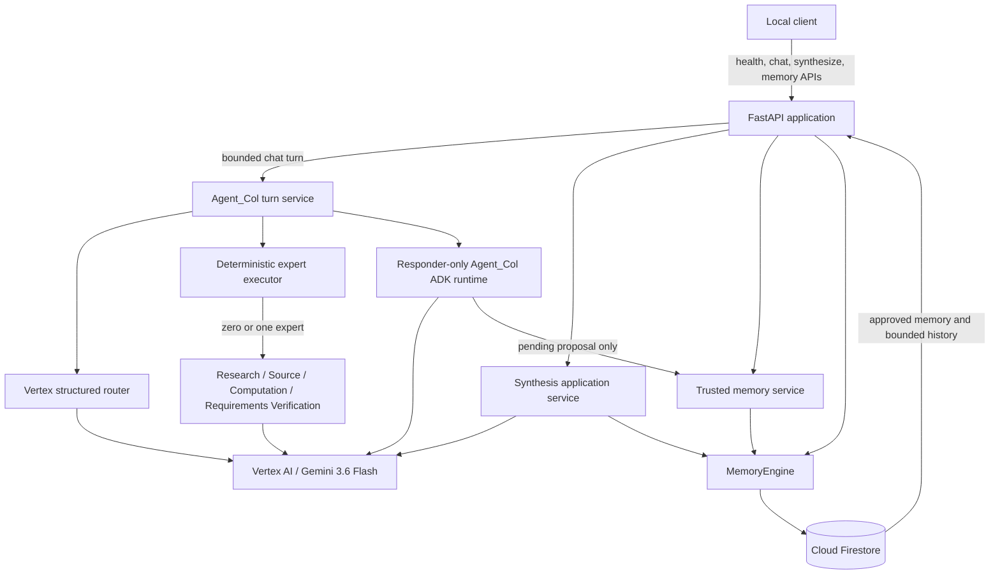
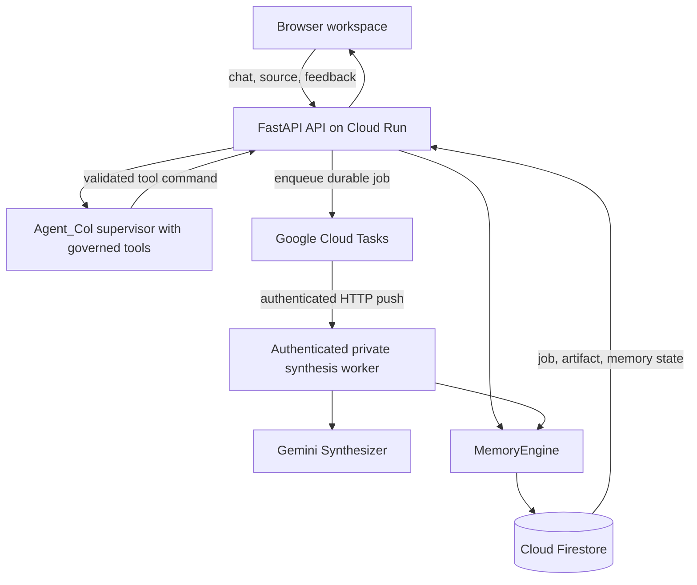

# Agent_Col Architecture

## Current implemented system

The current application is a synchronous HTTP system: an API request remains
open while Agent_Col or the Synthesizer calls Gemini and persists its result.
Firestore is the source of truth for durable collaboration state. ADK sessions
are temporary and are deleted after each supervisor invocation.



The production chat path separates Agent_Col's routing judgment from its final
response. The structured router receives server-projected URL, numerical, and
text-block candidates. Strict local validation accepts one of six routes:
`direct`, `clarify`, `source`, `research`, `computation`, or
`requirements_verification`. Deterministic application code then executes zero
or one matching expert and derives validated results and receipts. A separate
responder-only Agent_Col instance integrates that context into one final
answer. It has no model-visible cognitive expert tools; its only optional tool
is the governed creation of one pending memory proposal.

Synthesis remains exposed as a separate deterministic application service
rather than a chat-routed cognitive capability.

## Current request flows

### Chat without an idempotency key

1. FastAPI validates the request.
2. Firestore loads up to 20 history messages and the approved collaboration
   profile.
3. The application saves the user message.
4. An optional explicit memory decision is applied.
5. Approved memory and bounded history are rendered as model input context.
6. The ADK supervisor calls Gemini and returns one response.
7. The application saves the model message.

This path is retained for compatibility but does not provide durable replay.

### Chat with an idempotency key

1. Firestore transactionally claims or replays the logical turn.
2. A completed identical request returns its stored `ChatResponse` without a
   new supervisor call.
3. A changed request or active owner returns HTTP 409.
4. A new/resumed owner loads context, applies any memory decision, and renews
   its lease before cognitive work.
5. The turn service projects bounded URL, numeric, and text-block candidates.
6. Vertex returns one structured routing directive, which local code validates.
7. Deterministic execution runs zero or one selected expert under a bounded
   deadline and derives action, citation, and execution receipts.
8. Responder-only Agent_Col integrates the validated route and result. It may
   create one governed pending-memory proposal from an eligible statement in
   the current message, but it cannot invoke a cognitive expert.
9. Firestore transactionally writes the deterministic model message and marks
   the turn completed with the public `ChatResponse`.
10. Provider failures and timeouts expire the owned lease so the same request
    can be retried. A completed identical request replays without repeating
    routing, expert execution, response generation, or persistence effects.

See [Chat turn idempotency](design/turn-idempotency.md) for exact guarantees
and limitations.

### Structured synthesis

1. FastAPI validates the source, user, session, and project identifiers.
2. The application concurrently loads the root user document and bounded
   history.
3. The Synthesizer filters that document through its legacy six-key profile
   allowlist; it does not yet consume the governed collaboration projection.
4. Gemini receives a provider-compatible structured-output schema.
5. Strict local Pydantic and semantic validation remain authoritative.
6. Firestore atomically persists the version 2.0 blueprint under its project.

Synthesis is currently synchronous and has no durable job or request-id
idempotency boundary. Migrating synthesis personalization to governed memory
is also pending.

### Trusted memory

Memory is explicit-feedback-driven. A proposal is not active memory. Approval
or correction transactionally updates the governed profile and writes
provenance. Rejection leaves the profile unchanged. Revocation removes the
active projection while retaining an audit event. Hard deletion removes the
target signal's governed value-bearing artifacts. Inspection returns a bounded
profile, unresolved proposals, and up to 50 events per page.

The current public API supports inspection, revocation, hard deletion, and a
chat-carried decision for an existing proposal. Responder-only Agent_Col can
also submit one allowlisted pending proposal from an eligible explicit
statement in the current user message. The deterministic service, not the
model, owns identifiers, policy validation, provenance, and persistence.

## Responsibility boundaries

### FastAPI

- validates HTTP contracts and maps bounded public errors;
- owns application startup and shutdown;
- constructs explicit global Vertex AI clients that authenticate through ADC;
- coordinates service calls without treating request identifiers as verified
  identity;
- does not expose provider error bodies or stored content in logs.

### Agent_Col supervisor

- maintains the user-facing conversation and one final response;
- receives only server-rendered approved memory and bounded untrusted history;
- makes one structured, locally validated route selection from a bounded
  production capability catalog;
- asks a clarifying question when consequential information is missing or one
  expert cannot safely satisfy a multi-capability request;
- defaults to direct response when no expert materially improves the answer;
- integrates only validated expert results and application-derived receipts;
- can propose one pending governed-memory signal but cannot activate it;
- uses an in-memory ADK invocation session that is deleted after each responder
  turn.

### Cognitive expert executor

- executes zero or one route-matching expert under an explicit deadline;
- prevents expert chaining and fallback routing;
- maps validated results into responder context and authoritative receipts;
- treats expert output as untrusted evidence rather than instructions;
- grants experts no generic Firestore or durable mutation authority.

### Synthesizer

- receives bounded, delimited, untrusted source and context;
- returns one strict `SynthesisBlueprint` response;
- uses a provider-compatible derivative of the canonical local schema;
- has no direct Firestore access;
- fails closed when output violates local structural, semantic,
  personalization, or 128 KiB validation.

### Trusted memory service

- accepts typed lifecycle commands;
- keeps approval and rejection deterministic rather than model-authoritative;
- returns action and adaptation receipts;
- does not infer unrestricted permanent traits.

### MemoryEngine

- provides typed asynchronous persistence operations;
- performs transactions or batches where parent, child, projection, and event
  state must agree;
- validates stored documents before returning them;
- translates Firestore failures without logging user content;
- has no prompting or model-selection responsibility.

## Current Firestore data model

```text
users/{user_id}
  memory_schema_version
  memory_revision
  identity_context
  active_preferences
  memory_updated_at

users/{user_id}/memory_proposals/{category}
  proposal_id
  category
  proposed_value
  expected_signal_id
  policy_version
  status
  source_session_id
  source_message_id
  created_at
  expires_at
  resolved_at (after a decision)

users/{user_id}/memory_events/{event_id}
  event_type
  signal_id
  category
  value
  policy_version
  source and confirmation provenance
  memory_revision
  created_at

sessions/{session_id}
  updated_at

sessions/{session_id}/messages/{message_id}
  role
  text
  timestamp

sessions/{session_id}/turns/{turn_id}
  schema_version
  status
  project_id
  user_id
  memory_decision
  user_message_id
  model_message_id
  lease fields while in progress
  response receipts and completed_at after completion
  created_at
  updated_at

projects/{project_id}
  updated_at

projects/{project_id}/blueprints/{blueprint_id}
  originating_session_id
  created_at
  user_id
  model_name
  schema_version (current: 2.0)
  blueprint
```

The turn document deliberately does not store the raw idempotency key, user
message, or model-response text. Text remains in the deterministic message
documents. Raw memory values, chat text, blueprints, and corrections must not
appear in application logs.

## Target asynchronous system

Cloud Tasks and the private synthesis worker are a planned deployment stage,
not current runtime components.



The target worker will advance jobs through `queued`, `running`, `completed`,
or `failed`, and a deterministic request ID will prevent a task retry from
creating duplicate blueprints. Those job records and guarantees do not exist
yet.

## Delivery stages

### Phase 3A: synchronous synthesis core

Implemented: schema, prompt, context, validation, persistence, and live smoke
boundaries.

### Phase 3B: supervisor and trusted continuity

In progress: the hybrid responder, structured production routing, four-expert
core tool belt, governed memory lifecycle, ordinary-chat pending proposals,
cross-session adaptation, retry-safe chat turns, and layered tool-belt
evaluation are implemented and have accepted live evidence. Chat-routed
synthesis, artifact feedback, and governed-memory synthesis personalization
remain pending.

### Phase 3C: durable background execution

Planned: job persistence, Cloud Tasks, authenticated workers, retry-safe
synthesis jobs, and status polling.

### Phase 4: browser workspace

Planned after the backend collaboration loop is complete: chat, memory
inspection/control, and artifact views.

## Public deployment gate

Public deployment requires all of the following:

- verified user identity and project/session ownership checks;
- rate and upload limits;
- synthesis-job idempotency;
- private task-worker authentication;
- maximum Cloud Run instance limits;
- structured logs without user content;
- documented retention and deletion behavior;
- deployed browser and API security review.
