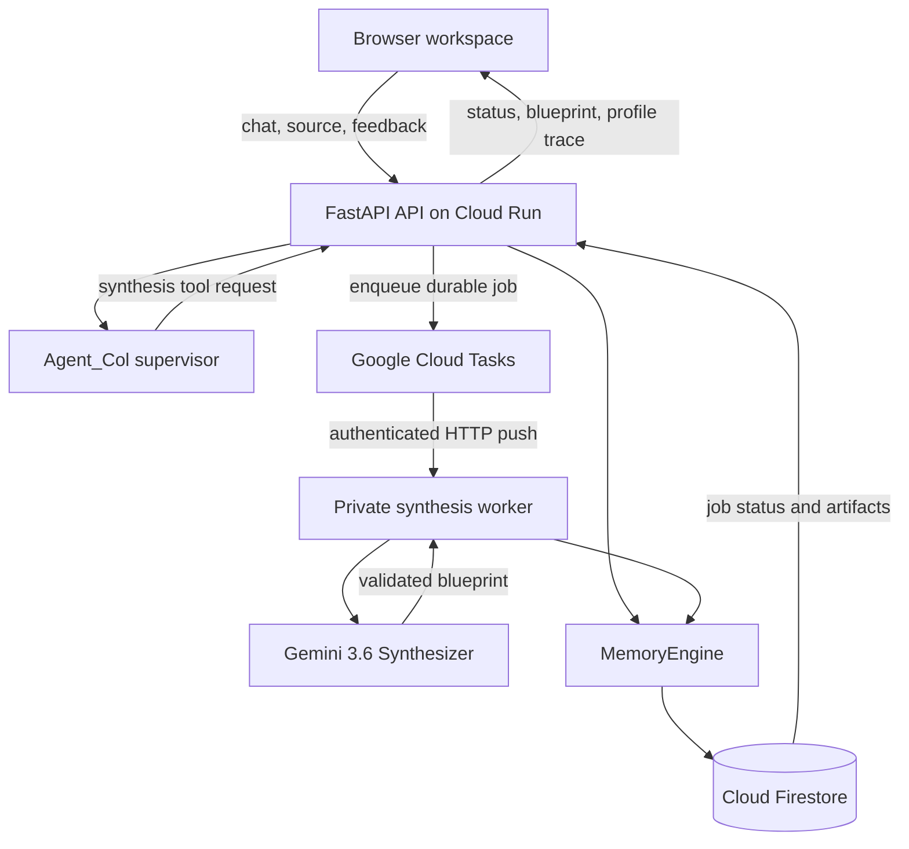

# Agent_Col Architecture

## Target System



## Responsibility Boundaries

### Agent_Col supervisor

- maintains the user-facing conversation;
- asks clarifying questions before consequential work;
- decides when to invoke the synthesis tool;
- reports artifact and job status;
- never treats stored profile or document text as executable instructions.

### Synthesizer

- receives bounded, explicitly delimited, untrusted source and context;
- returns one strict `SynthesisBlueprint` structured response;
- uses a provider-compatible derivative of the canonical local schema;
- has no direct Firestore access;
- cannot update the user profile;
- fails closed when provider output does not pass local structural, semantic,
  personalization, or 128 KiB size validation.

### MemoryEngine

- provides typed persistence operations;
- performs atomic writes where parent and child state must agree;
- translates Firestore provider failures without logging user content;
- has no prompting or model-selection responsibility.

### Profile updater

- consumes explicit feedback instead of inferring permanent traits freely;
- accepts only approved profile keys;
- records provenance so the user can inspect or remove an adaptation;
- has no Gemini or Firestore-query responsibility outside its public adapter.

## Canonical Data Model

```text
users/{user_id}
  experience_level
  preferred_languages
  preferred_frameworks
  learning_style
  response_detail
  accessibility_preferences
  updated_at

projects/{project_id}
  owner_user_id
  name
  created_at
  updated_at

projects/{project_id}/blueprints/{blueprint_id}
  originating_session_id
  created_at
  model_name
  schema_version (current: 2.0)
  blueprint

projects/{project_id}/feedback/{feedback_id}
  blueprint_id
  decision
  component_path
  correction
  created_at

projects/{project_id}/jobs/{job_id}
  status
  request_id
  source_metadata
  blueprint_id
  attempt_count
  created_at
  started_at
  completed_at
  failure_code

sessions/{session_id}
  owner_user_id
  project_id
  created_at
  updated_at

sessions/{session_id}/messages/{message_id}
  role
  text
  timestamp
```

Raw profile values, source material, chat text, blueprints, and corrections
must not appear in application logs.

## Delivery Stages

### Phase 3A: Synchronous synthesis core

The HTTP request remains open while the Synthesizer produces and persists a
blueprint. This proves the schema, prompt, context, validation, and persistence
boundaries before queue infrastructure is added.

### Phase 3B: Supervisor and feedback

Agent_Col invokes synthesis through an explicit tool contract. Feedback events
produce inspectable, allowlisted profile changes and demonstrate adaptation on
the next blueprint.

### Phase 3C: Durable background execution

The public synthesis endpoint creates a Firestore job and returns HTTP 202.
Cloud Tasks invokes a private worker, which advances the job through `queued`,
`running`, `completed`, or `failed`. A deterministic request ID prevents a
retry from creating duplicate blueprints.

## Public Deployment Gate

The target deployment requires all of the following:

- Firebase anonymous identity verified by the backend;
- project and session ownership checks;
- rate and upload limits;
- synthesis idempotency;
- private task-worker authentication;
- maximum Cloud Run instance limits;
- structured logs without user content;
- documented retention and deletion behavior.
