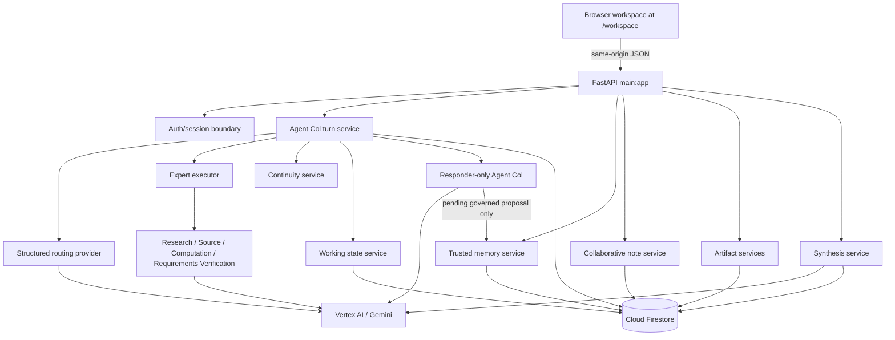

# Agent Col Architecture

Last reconciled: August 27, 2026.

For the complete status summary, see [Current state](current-state.md).

## Current Implemented System

Agent Col is a FastAPI application with a same-origin browser workspace,
server-routed specialist capabilities, deterministic application services, and
Firestore persistence.

Requests currently remain open while routing, expert execution, synthesis,
artifact effects, note effects, continuity resolution, response generation, and
persistence complete. Durable asynchronous jobs and private Cloud Run worker
execution remain planned Phase 4 work.

## Browser Workspace

The browser workspace is implemented under `frontend/` and served at
`GET /workspace`. Static assets are mounted under `/static/agent-col`.

The workspace includes:

- auth entry and local/Google session state;
- workspace list/create;
- conversation and receipts;
- Work/artifact list and detail;
- Notes lifecycle controls;
- Memory inspection and lifecycle controls;
- Chats list/detail;
- Activity view;
- left/right drawer layout controls.

The browser must not call Vertex AI or Firestore directly. It communicates only
with same-origin FastAPI JSON routes.

## Authentication Boundary

Supported local auth modes:

- `local_dev`
- `google_oidc`

Google OIDC verifies browser-provided Google ID tokens and derives the
effective application principal. Firestore and Vertex AI server clients use
Application Default Credentials separately.

Production authentication and ownership hardening is not complete. Phase 4
must replace remaining local-development assumptions with fail-closed
production startup, canonical workspace ownership, and cross-owner denial
proof.

## Chat Turn Flow

1. FastAPI validates the `ChatRequest`.
2. The application resolves effective user/workspace identity.
3. Idempotent turns claim, replay, or reject conflicts through Firestore.
4. Memory decisions, note decisions, feedback decisions, clarification
   selections, and continuity selections are applied only through typed
   application services.
5. The turn service projects bounded URL, numeric, and text-block routing
   inputs.
6. The structured router returns one locally validated route.
7. The expert executor runs zero or one selected expert under a deadline.
8. Artifact execution may persist an approved chat artifact effect when
   selected by the artifact-capable route.
9. The continuity and working-state services provide bounded context.
10. Responder-only Agent Col writes the final response from server-validated
    context.
11. Firestore stores the deterministic model message and public receipts.

The responder has no model-visible Research, Source, Computation, or
Requirements Verification tools. It receives validated results and receipts
from application code.

## Specialist Capability Boundary

The current capability catalog contains four expert routes:

| Capability | Provider surface | Public receipt on completion |
| --- | --- | --- |
| Research | Direct GenAI `generate_content` with Google Search grounding | `google_search` action and citations |
| Source | Direct GenAI chat with URL Context, then tool-free classification | `url_context` action and citations |
| Computation | ADK isolated workflow with built-in Python execution | `run_computation` action |
| Requirements Verification | Direct tool-free structured generation | `verify_requirements` action |

Experts are bounded evidence producers, not authorities over persistence,
memory, identity, or final user-visible response policy.

## Memory, Notes, Continuity, And Working State

Profile memory and workspace notes are separate domains.

Profile memory stores approved reusable collaboration preferences and allowed
low-sensitivity identity context. Pending memory proposals are not active until
approved.

Workspace notes store user-approved project/workspace context. Notes support
proposal, approval/rejection, correction, archive, restore, deletion, active
projection, and provenance.

Continuity retrieves bounded active notes and prior chat sessions, returning
receipts or ambiguity choices.

Working state is hidden same-session collaboration context. It is
non-authoritative, possibly stale, and cannot authorize tools, durable memory,
notes, artifacts, identity changes, or actions.

## Synthesis And Artifacts

`POST /api/synthesize` remains a synchronous structured synthesis endpoint.
The current source also supports:

- blueprint artifact listing/detail;
- generic single-file artifact listing/detail/create;
- archive and restore;
- metadata update;
- version creation;
- artifact feedback targets and lifecycle records;
- chat-carried artifact feedback decisions.

Durable background artifact jobs, Cloud Tasks, private worker execution, and
queued/running/completed/failed/cancelled job states remain planned work.

## Firestore Responsibility

Firestore is the durable source of truth for:

- user profile memory and lifecycle events;
- workspace notes and note events;
- chat sessions, messages, turns, and receipts;
- working state snapshots;
- projects and blueprints;
- generic artifacts and versions;
- artifact feedback records.

ADK sessions and provider interactions are temporary execution state and are
not the durable memory system.

## Current Gaps

- No Dockerfile, `.dockerignore`, production start scripts, or Cloud Run
  service descriptors are present.
- No Google Cloud Tasks runtime dependency or private worker implementation is
  present.
- Durable asynchronous jobs are planned, not implemented.
- Full production ownership, rate limiting, security headers, retention,
  deletion, and hosted verification remain Phase 4.
- Phase 5 documentation and clean-clone evidence remain pending.
- Phase 6 demo freeze remains pending.
