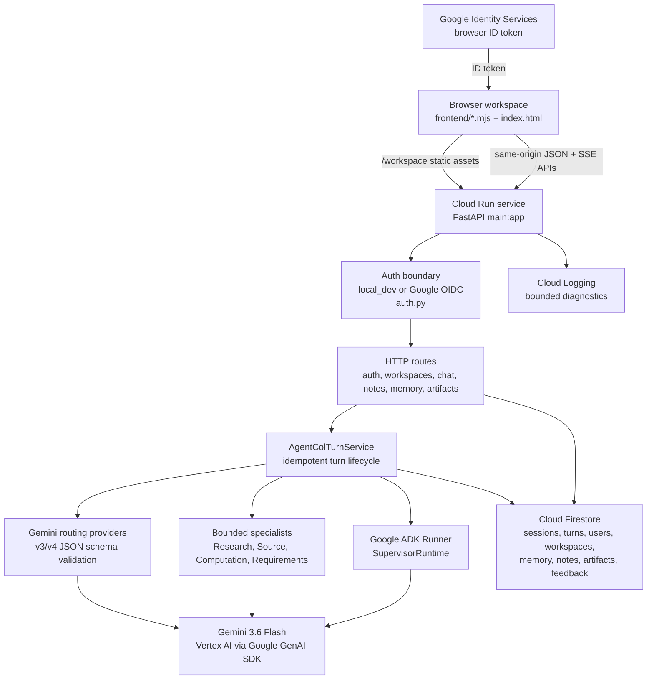

# Agent Col Architecture

Last reconciled: August 30, 2026.

This document describes the current production architecture. Source code and
tests are the authority; historical files under `docs/legacy/` are provenance
and planning records only.

## System Overview

Agent Col is a FastAPI backend with a same-origin static browser workspace.
The backend owns authentication, workspace ownership, request validation,
Firestore persistence, chat-turn idempotency, routing, expert execution,
Google ADK responder execution, Gemini/Vertex AI calls, governed memory,
collaborative notes, continuity, working state, preference learning, and
artifacts.

The browser workspace is served at `GET /workspace`. Static modules live in
`frontend/` and are mounted at `/static/agent-col`. The browser does not call
Firestore, Vertex AI, Gemini, or Google ADK directly; it uses same-origin
FastAPI JSON or SSE endpoints.

## Judge-Facing Architecture Diagram



## Runtime Composition

`main.py` is the composition root. During FastAPI lifespan startup it loads
Vertex settings, creates a Google GenAI client, creates the Firestore-backed
`MemoryEngine`, constructs memory, note, continuity, working-state,
preference, synthesis, artifact, feedback, specialist, routing, responder, and
turn services, then stores them on `app.state`.

The container image is built from `python:3.14-slim`, installs
`requirements.txt`, runs as non-root `appuser`, exposes port 8080, and starts
`uvicorn main:app --host 0.0.0.0 --port ${PORT:-8080}`.

## Browser Frontend

The frontend is static HTML, CSS, and vanilla JavaScript ES modules:

- `frontend/index.html`: shell for auth/context entry, drawers, conversation,
  composer, notes, memory, chats, work, and artifact viewer regions.
- `frontend/app.mjs`: bootstrap and event wiring for auth, workspace, chat,
  memory, notes, chats, and artifacts.
- `frontend/state.mjs`: immutable client state transitions for context,
  transcript, retries, memory clarification choices, continuity choices,
  drawer disclosure, work, notes, memory, chats, and activity.
- `frontend/api.mjs`: same-origin request helper with relative-path
  enforcement, auth headers, idempotency headers, JSON parsing, and error
  normalization.
- `frontend/chat-view.mjs`, `work-view.mjs`, `notes-view.mjs`,
  `memory-view.mjs`, `chats-view.mjs`, and related modules: panel rendering.

Rendering is deliberately bounded. General text goes through `textContent`,
model Markdown goes through a small safe Markdown renderer, and artifact
content is displayed as text inside code blocks rather than injected HTML.

## FastAPI Boundary

The public runtime entry points are:

- `GET /`: health check.
- `GET /workspace`: browser UI.
- `GET /api/auth/config` and `GET /api/auth/session`: auth configuration and
  principal/session projection.
- Workspace, memory, notes, chat-session, synthesis, blueprint, artifact, and
  feedback APIs.
- `POST /api/chat`: canonical JSON chat and all structured decision turns.
- `POST /api/chat/stream`: SSE transport for ordinary conversational chat
  turns only.

The streaming endpoint emits provisional `delta` events and an authoritative
`final` event containing the canonical validated `ChatResponse`. It does not
make streamed fragments durable chat truth. Structured decisions stay on the
JSON endpoint.

## Authentication And Identity

Auth has two modes:

- `local_dev`: local development accepts supplied user/project IDs.
- `google_oidc`: browser requests carry a Google ID token; the backend verifies
  the token, derives the internal owner, and returns an opaque public user
  locator to the browser.

Cloud Run startup fails closed unless `AGENT_COL_AUTH_MODE=google_oidc` and a
public OAuth client ID is configured. Server-side Firestore and Vertex AI calls
use Application Default Credentials or the Cloud Run service identity, not the
browser token.

## Google Model And Agent Runtime

Gemini access uses `gemini-3.6-flash` through Vertex AI / Gemini Enterprise.
`vertex_config.py` requires:

- `GOOGLE_CLOUD_PROJECT`
- `GOOGLE_CLOUD_LOCATION=global`
- `GOOGLE_GENAI_USE_ENTERPRISE=True`

Google ADK is used for the Agent Col responder runtime through
`SupervisorRuntime`, which wraps an ADK `Runner` and calls `run_async`.
Streaming uses ADK `StreamingMode.SSE`; non-streaming turns use
`StreamingMode.NONE`.

Google GenAI SDK is used for Vertex client construction, structured routing
generation, direct specialist generation, synthesis, generic artifact
generation, working-state summarization, URL Context, and Google Search
grounding.

## Chat And Session Lifecycle

For `POST /api/chat`, the backend:

1. Resolves authenticated user and project identity.
2. Validates idempotency requirements.
3. Claims, replays, rejects, or resumes a durable chat turn record.
4. Loads chat history and collaboration profile context.
5. Persists the user message when appropriate.
6. Handles structured decisions for memory, notes, continuity, and artifact
   feedback before ordinary model work.
7. Loads governed memory, note continuity, preference, and hidden working-state
   context.
8. Routes the turn.
9. Executes zero or one specialist when selected.
10. Runs the responder-only Agent Col through Google ADK.
11. Persists the canonical model message and turn effects.
12. Attempts hidden working-state maintenance.
13. Returns a public `ChatResponse`.

The authoritative ordering is:

```text
canonical responder completion
-> durable chat/message/effect persistence
-> awaited best-effort working-state maintenance
-> HTTP JSON response or SSE final event
```

## Routing And Expert Execution

Routing providers use Gemini with JSON schemas and local validation. Routing is
a decision boundary, not a tool-execution boundary.

Current routed outcomes include direct response, clarification, Source,
Research, Computation, Requirements Verification, and artifact creation.
Experts are bounded evidence producers. The responder receives validated expert
results and receipts from application code; it does not receive open-ended
model-visible Research, Source, Computation, or Requirements Verification
tools.

Specialist boundaries:

- Research: direct GenAI Google Search grounding with grounding metadata
  validation and public citation receipts.
- Source: GenAI URL Context for supplied public URLs.
- Computation: ADK computation flow with bounded execution.
- Requirements Verification: structured Gemini generation plus local evidence
  validation.

## Firestore Persistence

Firestore stores durable product state:

- `sessions/{session_id}` with child `messages`, `turns`,
  `memory_clarifications`, and `working_state`.
- `users/{user_id}` with workspaces, memory proposals/origins/events,
  collaborative note proposals, collaborative notes and events, preference
  observations, and preference hypotheses.
- `projects/{project_id}` with blueprint artifacts, generic artifacts,
  artifact versions, blueprint feedback, and feedback supersession records.

User-owned workspace data is under `users/{user_id}/workspaces/{workspace_id}`.
Project artifact data is under `projects/{project_id}`. Authenticated requests
resolve supplied user/project IDs against the authenticated principal before
service access.

## Governed Memory

Profile memory is proposal-based. Pending memory is not active until user
approval. The memory system supports clarification, approval, rejection,
correction, revocation, deletion, inspection, provenance records, lifecycle
events, and adaptation receipts.

Memory is intentionally not an uncontrolled transcript scrape. It is a durable,
user-governed projection of approved signals.

## Collaborative Notes And Continuity

Collaborative notes are workspace-scoped durable records. They support pending
proposals, approval/rejection, correction proposals, archive, restore, delete,
active projection, and event history.

Continuity does not own a separate collection. It reads active notes and prior
chat sessions/messages, then returns bounded context receipts or explicit
ambiguity choices. The system treats continuity as context, not authority.

## Preference And Adaptation System

Preference learning is implemented narrowly. It records non-authoritative
observations and hypotheses for explicit concise or shorter-response feedback.
Those records can surface through governed memory clarification and adaptation
receipts; they do not silently mutate active memory.

## Working State

Working state is hidden same-session context. It can preserve current goals,
constraints, unresolved questions, next-step hypotheses, and confidence for
the ongoing session. It is non-authoritative and cannot approve tools,
identity changes, memory, notes, artifacts, or other durable effects.

## Artifacts

Agent Col has two artifact families:

- Synthesis blueprints from the structured synthesis path.
- Generic single-file artifacts from chat or artifact APIs.

Artifacts support list, detail, create, archive, restore, delete, metadata
update, version creation, feedback, and export surfaces. Current artifact
execution is request-bound. Durable asynchronous background execution is future
work, not production behavior in this checkout.

## Cloud Run Deployment

The selected hosted path is:

```text
Dockerfile
-> Artifact Registry image
-> Cloud Run service
-> application-level Google OIDC
-> Firestore and Vertex AI through service identity/ADC
```

The current hosted service is in `us-east4` and is documented in
[Deployment notes](deployment/deployment-notes.md). Hosted verification must
be refreshed before submission freeze because Cloud Run configuration,
OAuth origins, IAM, and live model availability can drift outside Git.

## Trust And Security Boundaries

- Browser code only talks to same-origin FastAPI APIs.
- Google ID tokens are verified at the backend auth boundary.
- Raw Google subjects stay internal; public responses use opaque locators.
- Workspace/project ownership is resolved before state access.
- Structured decisions mutate state only through typed backend services.
- Pending memory and notes are not active until approval.
- Hidden working state and continuity context are not authorization sources.
- Experts return bounded evidence and receipts; responder text is validated
  before persistence.
- Request body limits, per-client/path in-memory rate limiting, cache control,
  and security headers are applied in middleware.
- Public errors are bounded; provider and database details stay server-side.
- The rate limiter is per-process and per Cloud Run instance, not a global
  distributed control.

## Source Authority

Use [Repository map](repo-map.md) for exact file ownership, route inventory,
and test layout. Use [Current state](current-state.md) for user-visible
implemented capability status. Legacy documents preserve history but are not
current architecture truth unless the current source still matches them.
