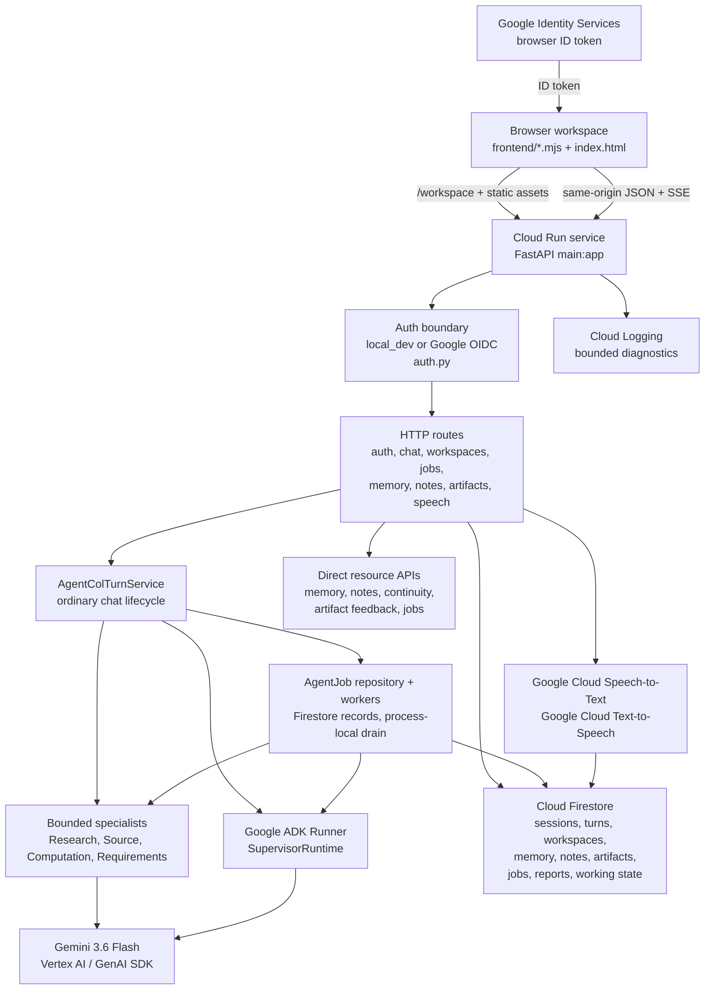

# Agent Col Architecture

Last reconciled: September 5, 2026.

This document describes the current implemented architecture. Source code and
[Repository map](repo-map.md) are the authority. Historical docs under
`docs/legacy/`, forward plans under `docs/forward/`, and migration research are
not current implementation truth unless current source still matches them.

## System Overview

Agent Col is a FastAPI application that serves a same-origin static browser
workspace. The backend owns authentication, workspace ownership, request
validation, Firestore persistence, chat-turn idempotency, routing, bounded
specialist execution, Google ADK responder execution, Gemini/Vertex AI calls,
governed memory, collaborative notes, continuity, hidden working state,
preference learning, artifacts, AgentJobs, STT, and TTS.

The browser workspace is served at `GET /workspace`. Static modules live in
`frontend/` and are mounted at `/static/agent-col`. The browser calls only
same-origin FastAPI JSON or SSE endpoints; it does not call Firestore, Vertex
AI, Gemini, ADK, Speech-to-Text, or Text-to-Speech directly.

## Current Architecture Diagram



## Runtime Composition

`main.py` is the composition root. During FastAPI lifespan startup it loads
Vertex settings, creates a Google GenAI client, creates the Firestore-backed
`MemoryEngine`, constructs memory, note, continuity, working-state,
preference, synthesis, artifact, feedback, specialist, routing, speech, and
turn services, then stores them on `app.state`.

Startup also wires the Firestore-backed AgentJob repository, registered
dispatchers for supported job kinds, process-local worker task sets, expired
running job recovery, a startup queued-job drain, and a runtime queued-job
polling drain loop.

The container image is built from `python:3.14-slim`, installs
`requirements.txt`, runs as non-root `appuser`, exposes port 8080, and starts
`uvicorn main:app --host 0.0.0.0 --port ${PORT:-8080}`.

## Browser Frontend

The frontend is static HTML, CSS, and vanilla JavaScript ES modules:

- `frontend/index.html`: shell for auth, workspace, drawers, conversation,
  composer, notes, memory, chats, work, Agents, and artifact viewer regions.
- `frontend/app.mjs`: bootstrap and event wiring for auth, workspace, chat,
  memory, notes, chats, Agents, speech, and artifacts.
- `frontend/state.mjs`: client state transitions for auth, workspace,
  transcript, retries, queued actions, memory clarification choices,
  continuity choices, drawer disclosure, work, notes, memory, chats, Agents,
  and activity.
- `frontend/api.mjs`: same-origin request helper with relative-path
  enforcement, auth headers, idempotency headers, JSON parsing, SSE frame
  parsing, and error normalization.
- `frontend/requests.mjs`: request builders and chat endpoint selection.
- `frontend/chat-view.mjs`, `work-view.mjs`, `notes-view.mjs`,
  `memory-view.mjs`, `agents-view.mjs`, `chats-view.mjs`, and related modules:
  panel rendering and direct resource operations.

Rendering is bounded. General text goes through `textContent`, model Markdown
goes through a small safe Markdown renderer, and artifact content is displayed
as text/code rather than injected HTML.

## FastAPI Boundary

Current public entry points include:

- `GET /`: shallow process health.
- `GET /workspace`: browser UI.
- `GET /api/auth/config` and `GET /api/auth/session`: browser auth bootstrap.
- Workspace, memory, memory clarification, continuity, notes, chat-session,
  AgentJob, synthesis, blueprint, artifact, artifact-feedback, and speech APIs.
- `POST /api/chat`: ordinary non-streaming JSON chat.
- `POST /api/chat/stream`: ordinary SSE chat.

The full route table lives in [Repository map](repo-map.md). Current
`/api/chat` and `/api/chat/stream` reject legacy structured decision payloads
for memory decisions, memory clarification selections, collaborative-note
decisions, continuity selections, and artifact feedback. Those mutations use
direct resource APIs instead.

The streaming endpoint emits provisional `delta` events and one authoritative
`final` event containing the validated `ChatResponse`. Streamed fragments are
not durable chat truth.

## Authentication And Identity

Auth has two modes:

- `local_dev`: local development accepts validated supplied user/project
  locators.
- `google_oidc`: browser requests carry a Google ID token; the backend verifies
  the token, derives the internal owner, and returns opaque public user/project
  locators to the browser.

Cloud Run startup fails closed unless `AGENT_COL_AUTH_MODE=google_oidc` and a
public OAuth client ID is configured. Server-side Firestore, Vertex AI,
Speech-to-Text, and Text-to-Speech calls use Application Default Credentials or
the Cloud Run service identity, not the browser token.

## Google Model, ADK, And Speech Runtime

Gemini access uses `gemini-3.6-flash` through Vertex AI / Gemini Enterprise.
`vertex_config.py` requires:

- `GOOGLE_CLOUD_PROJECT`
- `GOOGLE_CLOUD_LOCATION=global`
- `GOOGLE_GENAI_USE_ENTERPRISE=True`

Google ADK is used for the Agent Col responder runtime through
`SupervisorRuntime`, which wraps an ADK `Runner` and calls `run_async`.
Streaming uses ADK `StreamingMode.SSE`; non-streaming turns use
`StreamingMode.NONE`.

Google GenAI SDK is used for Vertex client construction, structured routing,
direct specialist generation, synthesis, generic artifact generation,
working-state summarization, URL Context, and Google Search grounding.

Speech routes are backend-owned:

- `POST /api/speech/transcribe` accepts browser microphone audio and uses
  Google Cloud Speech-to-Text with configured language/model defaults.
- `POST /api/users/{user_id}/speech/synthesize` reads an authorized completed
  assistant message and uses Google Cloud Text-to-Speech to return audio.

Current speech defaults are in `speech_service.py`: STT language `en-US`, STT
model `latest_short`, female TTS voice `en-GB-Chirp3-HD-Kore`, male TTS voice
`en-GB-Chirp3-HD-Alnilam`, MP3 audio, and speaking rate `1.0`.

## Chat And Session Lifecycle

For ordinary chat, the backend:

1. Resolves authenticated user and project identity.
2. Rejects legacy structured decision request fields with direct-API guidance.
3. Validates idempotency requirements.
4. Claims, replays, rejects, or resumes a durable chat turn record when an
   idempotency key is present.
5. Loads chat history and collaboration context.
6. Persists the user message when appropriate.
7. Applies narrow queue-first acceptance for supported explicit memory,
   collaborative-note, and blueprint artifact work.
8. Loads governed memory, note continuity, preference, and hidden working-state
   context.
9. Routes the turn.
10. Executes zero or one bounded specialist when selected.
11. Runs the responder-only Agent Col through Google ADK.
12. Persists the canonical model message and turn effects.
13. Schedules hidden working-state maintenance after canonical persistence.
14. Returns a public `ChatResponse` or SSE `final` projection.

The authoritative ordering is:

```text
canonical responder completion
-> durable chat/message/effect persistence
-> best-effort hidden working-state maintenance scheduled
-> HTTP JSON response or SSE final event
```

## Routing And Expert Execution

Routing providers use Gemini with JSON schemas and local validation. Routing is
a decision boundary, not a mutation authority.

Current routed outcomes include direct response, clarification, Source,
Research, Computation, Requirements Verification, and artifact creation.
Experts are bounded evidence producers. The responder receives validated
expert results and receipts from application code; it does not receive
open-ended model-visible expert tools for Research, Source, Computation, or
Requirements Verification.

Specialist boundaries:

- Research: direct GenAI Google Search grounding with grounding metadata
  validation and public citation receipts.
- Source: GenAI URL Context for supplied public URLs.
- Computation: ADK computation flow with bounded execution.
- Requirements Verification: structured Gemini generation plus local evidence
  validation.

## AgentJobs And Background Work

AgentJobs are Firestore-backed records under the resolved workspace scope.
They have private payload records, public-visible events, reports, status
transitions, retry/cancel APIs, leases, startup/runtime drain loops, and
process-local workers.

Current background work is queue-backed but not externally distributed. The
accepting FastAPI/Cloud Run process schedules in-process workers and drains
queued/expired jobs. There is no Cloud Tasks, Pub/Sub, or separate private
worker service in this checkout.

Supported queued job families include profile-memory proposal work,
collaborative-note proposal work, blueprint artifact creation, and hidden
working-state maintenance where wired by the current service graph.

## Firestore Persistence

Firestore stores durable product state:

- `sessions/{session_id}` with child `messages`, `turns`,
  `memory_clarifications`, and `working_state`.
- `users/{user_id}` with workspaces, memory proposals/origins/events,
  collaborative-note proposals, collaborative notes and events, preference
  observations, and preference hypotheses.
- `users/{user_id}/workspaces/{workspace_id}/agent_jobs/{job_id}` plus private
  payload, event, and report collections.
- `projects/{project_id}` with blueprint artifacts, generic artifacts,
  artifact versions, blueprint feedback, and feedback supersession records.

User-owned workspace data is scoped under the authenticated effective user.
Project artifact data is under `projects/{project_id}` after project locator
resolution. Model text, routing output, continuity context, working state, and
frontend state are not ownership authority.

## Governed Memory

Profile memory is proposal-based. Pending memory is not active until user
approval. The memory system supports clarification, approval, rejection,
correction, revocation, deletion, inspection, provenance records, lifecycle
events, and adaptation receipts.

Memory proposals use a shared exclusion-first eligibility boundary for both
deterministic prequeue and model/tool evidence. Retrieval/history-only,
social/phatic-only, external-topic/informational/opinion-only, and narrowly
current-turn-only clauses are excluded. Remaining ambiguous fallback clauses
must pass a low user/future-collaboration context plausibility floor. This is
not a storage-worthiness score; downstream governed memory still decides what
can become active.

## Collaborative Notes And Continuity

Collaborative notes are workspace-scoped durable records. They support pending
proposals, approval/rejection, correction proposals, archive, restore, delete,
active projection, and event history. Note decisions use the direct Notes API.

Continuity does not own a separate collection. It reads active notes and prior
chat sessions/messages, then returns bounded context receipts or explicit
ambiguity choices. Continuity choices are resolved through the direct
continuity API. Continuity is context, not authority.

## Preference And Working State

Preference learning is intentionally narrow. It records non-authoritative
observations and hypotheses for explicit concise or shorter-response feedback.
Those records can surface through governed memory clarification and adaptation
receipts; they do not silently mutate active memory.

Working state is hidden same-session context. It can preserve current goals,
constraints, unresolved questions, next-step hypotheses, and confidence for
the ongoing session. It is non-authoritative and cannot approve tools,
identity changes, memory, notes, artifacts, or other durable effects.

## Artifacts

Agent Col has two artifact families:

- Synthesis blueprints from the structured synthesis path.
- Generic single-file artifacts from chat or artifact APIs.

Artifacts support list, detail, create, archive, restore, delete, metadata
update, version creation, feedback, and export surfaces. Direct synthesis and
generic artifact generation remain request-bound. Chat-routed blueprint
artifact creation is queue-backed through AgentJobs.

## Cloud Run Deployment

The selected hosted path is:

```text
Dockerfile
-> linux/amd64 image
-> Artifact Registry
-> Cloud Run service
-> application-level Google OIDC
-> Firestore, Vertex AI, STT, and TTS through service identity
```

The root [README](../README.md), [Local setup](local-setup.md), and deployment
runbook under `docs/deployment/` document the command path. This architecture
doc intentionally avoids transient project IDs, revision IDs, URLs, image
digests, account identifiers, and secrets.

## Trust And Security Boundaries

- Browser code only talks to same-origin FastAPI APIs.
- Google ID tokens are verified at the backend auth boundary.
- Raw Google subjects stay internal; public responses use opaque locators.
- Workspace/project ownership is resolved before state access.
- Governed memory and notes are not active until approval.
- Direct resource APIs own governed decisions and lifecycle mutations.
- Hidden working state and continuity context are not authorization sources.
- Experts return bounded evidence and receipts; server-side validation decides
  public response and persisted effects.
- Request body limits, per-client/path in-memory rate limiting, cache control,
  and security headers are applied in middleware.
- Public errors are bounded; provider and database details stay server-side.
- The rate limiter is per-process and per Cloud Run instance, not a global
  distributed control.

## Source Authority

Use [Repository map](repo-map.md) for exact file ownership, route inventory,
and test layout. Use [Current state](current-state.md) for implemented
capability status. Use [Local setup](local-setup.md) for fresh-clone setup and
Cloud Run deployment commands. Legacy documents preserve history but are not
current architecture truth unless the current source still matches them.
