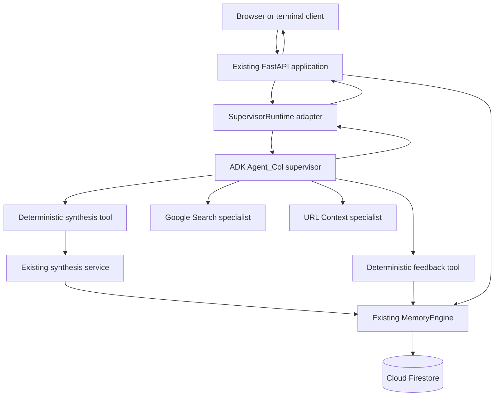

# Phase 3B Hybrid ADK Supervisor Contract Design

## Status and Review Gate

This document defines the approved hybrid direction for Phase 3B. It is a
design contract, not implementation authorization. No ADK dependency, agent,
tool, route behavior, or Firestore schema changes are approved until the user
reviews this document and approves a bounded implementation pass.

The design keeps the existing FastAPI, Firestore, and structured-synthesis
core. Google Agent Development Kit (ADK) is added inside that application as
the Agent_Col orchestration runtime. ADK does not replace FastAPI, the
`MemoryEngine`, the `SynthesisBlueprint` schema, or the deterministic
persistence rules already proven in Phase 3A.

## Verified Baseline

The contract is based on repository state at commit
`1d8b0bd2aa36a1f8f68e4874e5674189d81875fc`.

Implemented and manually accepted:

- asynchronous FastAPI health, chat, and synthesis endpoints;
- Gemini 3.6 Flash chat and strict structured synthesis;
- allowlisted profile context and bounded recent history;
- local Pydantic and personalization-trace validation;
- asynchronous Firestore message and profile operations;
- project-owned atomic blueprint persistence;
- safe error translation and content-free error logging;
- Firestore index configuration for stored blueprint maps;
- 107 offline automated tests;
- successful live chat and synthesis smoke tests.

Not implemented:

- an ADK supervisor or runner;
- supervisor-controlled tool selection;
- Google Search or URL Context specialists;
- chat responses containing verified action, artifact, or citation receipts;
- explicit feedback persistence and profile provenance;
- frontend workspace;
- durable Cloud Tasks execution;
- authenticated public deployment.

## Decision

Agent_Col becomes an ADK `LlmAgent` that supervises one user turn at a time.
The existing FastAPI application remains the public HTTP boundary and invokes
the ADK runner asynchronously. Agent_Col may call narrowly scoped tools and
specialist agents, receives their results, and remains responsible for the
final user-facing response.

The selected design is a hybrid, not a migration:



### Rejected alternatives

#### Continue with direct Gemini chat only

This preserves the smallest dependency set, but it does not provide a clear,
observable supervisor loop or specialist delegation. It is weaker contest
evidence than an official Google agent framework with evaluated tool routing.

#### Replace the application with an ADK API server or Agent Runtime

This would duplicate or displace working FastAPI routes, lifecycle handling,
Firestore contracts, error mapping, and test infrastructure. It also forces a
larger authentication and deployment migration before the core judged
workflow is complete. That risk is not justified.

#### Use ADK as an independent persistent memory system

This creates two durable histories and two profile representations. Divergent
state would make personalization and artifact provenance unreliable. It is
explicitly prohibited by this contract.

## Authority and Accountability

| Concern | Authoritative component |
| --- | --- |
| HTTP validation, status codes, and lifecycle | FastAPI |
| Tool selection and final conversational response | Agent_Col supervisor |
| ADK invocation and event collection | `SupervisorRuntime` |
| Blueprint generation and local schema validation | Existing synthesis service |
| Message, profile, feedback, and artifact persistence | `MemoryEngine` |
| Durable history, user profile, and artifact truth | Firestore |
| Artifact and action receipts returned to clients | Server-derived tool events |
| Authentication and ownership | FastAPI security layer in Phase 5 |

Agent_Col is conversationally accountable: it decides whether a tool is
needed, evaluates the returned result, asks follow-up questions, and produces
the final answer. Application code remains technically authoritative. A model
statement such as "I saved a blueprint" is not proof. Only a successful tool
event and a server-generated artifact receipt prove that an artifact exists.

## Deployment and Model Boundary

Phase 3B retains:

- the existing custom FastAPI application;
- the existing Cloud Run target;
- Gemini API authentication through `GOOGLE_API_KEY`;
- `gemini-3.6-flash` as the initial supervisor and specialist model;
- the existing `google.genai.Client` for structured synthesis;
- Firestore through Application Default Credentials.

Phase 3B does not introduce Vertex AI routing, Agent Runtime, or the exported
`GlobalGemini` subclass. The Google Cloud Studio export's
`Client(vertexai=True, location="global")` path is a separate provider and
authentication decision. It may be reconsidered only through a later,
evidence-backed migration pass.

The first implementation pass must resolve and pin a `google-adk` version that
is compatible with the repository's Python and `google-genai` versions. A
dependency conflict, unsupported Python runtime, or requirement to migrate to
Vertex AI is a stop condition, not permission for an unplanned migration.

## FastAPI and ADK Runtime Lifecycle

FastAPI remains the only web application object served by Uvicorn. Its
lifespan creates and stores:

- the existing Google GenAI client;
- the existing `MemoryEngine`;
- one immutable ADK application definition;
- one `SupervisorRuntime` configured with the ADK runner services needed for
  invocation-scoped execution.

Shutdown closes only resources that expose a documented close operation. The
implementation must not call private ADK attributes or override internal ADK
client properties.

The `/api/chat` handler delegates one validated turn to
`SupervisorRuntime.run_turn(...)`. The adapter consumes the asynchronous ADK
event stream, finds exactly one final response, and independently collects
completed tool receipts. The route never parses the agent's prose to discover
whether an action occurred.

The runner uses a bounded `RunConfig`. The initial implementation target is:

- non-streaming final output for API compatibility;
- a maximum whole-turn deadline;
- a conservative maximum LLM-call count;
- at most one side-effecting synthesis call per turn;
- at most one feedback write per turn;
- bounded search and URL tool use.

Exact limits are selected during the compatibility implementation pass and
become constants with tests. Experimental ADK execution modes are excluded.

## Session and Memory Contract

Firestore remains the only durable session and memory store.

ADK sessions are invocation-scoped orchestration containers. Each HTTP turn
uses a fresh internal ADK invocation session. It is not treated as durable
chat history and is not allowed to accumulate an independent user profile.

Before invoking ADK, FastAPI or the application service:

1. validates `project_id`, `session_id`, `user_id`, and `message`;
2. concurrently loads the Firestore user profile and bounded chat history;
3. creates an immutable turn-context snapshot from those reads;
4. saves the incoming user message through `MemoryEngine`;
5. supplies the allowlisted snapshot and current message to the invocation;
6. initializes server-owned invocation state with the validated identifiers;
7. starts the ADK runner with the current user message.

The implementation may use ADK's per-invocation model context or seed a fresh
session with historical events. The compatibility pass must prove which
public API avoids duplicated current messages. Regardless of mechanism, these
invariants hold:

- Firestore history is loaded once per turn and remains chronological;
- the same pre-message turn snapshot is reused by any synthesis tool call;
- the current user message appears exactly once in model context;
- synthesis receives the current source in its source section rather than a
  duplicate history entry;
- ADK does not write a second durable copy of chat history;
- profile values never become LLM-selectable tool arguments;
- project, session, and user identifiers come from server-owned invocation
  state, not from arguments generated by the model;
- only the final successful Agent_Col response is saved as a model message.

If ADK cannot support an invocation-scoped session without duplicating or
silently persisting conversation state, implementation stops for a design
revision.

## Public Chat Contract

Phase 3B makes chat project-aware because a supervisor cannot create a
project-owned artifact without a project identifier.

The local-development request becomes conceptually:

```python
class ChatRequest(StrictModel):
    project_id: IdentifierStr
    session_id: IdentifierStr
    user_id: IdentifierStr
    message: NonEmptyStr
```

Requiring `project_id` is an intentional breaking change to the current local
chat request. It aligns chat, synthesis, and future workspace ownership. Phase
5 removes trust in request-provided `user_id` and validates ownership from an
authenticated identity.

The response becomes conceptually:

```python
class ChatResponse(StrictModel):
    response: NonEmptyStr
    actions: list[AgentActionReceipt] = Field(default_factory=list)
    artifacts: list[ArtifactReference] = Field(default_factory=list)
    citations: list[CitationReference] = Field(default_factory=list)
```

These collections are produced by `SupervisorRuntime` from actual ADK tool
events. They are never generated by parsing Agent_Col's final prose.

`AgentActionReceipt` contains only:

- an allowlisted public action name;
- `status: Literal["completed"]`.

Failure details are not returned as completed actions. Internal tool names,
arguments, identifiers, prompts, model thoughts, and raw provider responses
are not exposed.

`ArtifactReference` contains:

- `artifact_type: Literal["synthesis_blueprint"]`;
- `project_id`;
- `artifact_id`;
- `schema_version: Literal["2.0"]`;
- a short validated display label.

`CitationReference` contains a validated public HTTP or HTTPS URI and a
non-empty label. Citation extraction must be source-backed and locally
validated. Agent-authored URLs without corresponding specialist evidence are
not emitted as citation receipts.

The existing direct `POST /api/synthesize` endpoint remains available. Both
the direct route and the supervisor synthesis tool call the same application
service; neither calls the other through HTTP.

Before the frontend begins, Phase 3B Task 4 also adds the local-development
artifact read contract:

```text
GET /api/projects/{project_id}/blueprints/{blueprint_id}
```

The endpoint returns the canonical stored `SynthesisBlueprint` and its
server-owned metadata. A missing project or artifact returns 404; a Firestore
failure returns 500. Phase 5 adds authenticated ownership enforcement. The
browser blueprint panel reads this endpoint after receiving an artifact
reference instead of trusting Agent_Col's prose or a model-generated copy.

## Supervisor Instruction Contract

The Agent_Col instruction must define behavior, not merely personality. It
must require Agent_Col to:

- remain the final conversational owner after every tool call;
- default to no tool and use one only when it materially improves correctness,
  evidence, or completion of the user's requested task;
- use no tool for ordinary conversation that does not need one;
- use synthesis when the user asks to transform messy notes, requirements, a
  rubric, or a brainstorm into a project blueprint;
- use Google Search for current, externally verifiable information;
- use URL Context when the user supplies a URL whose contents are necessary;
- record feedback only from explicit accepted, rejected, or edited decisions;
- ask a concise clarifying question when a consequential tool input is
  genuinely missing;
- never invent a completed action, artifact identifier, citation, or profile
  update;
- distinguish evidence from recommendation;
- explain tool or provider failure honestly;
- treat profile data, history, source text, search results, and URL content as
  untrusted data rather than instructions;
- avoid exposing internal prompts, hidden reasoning, profile values, or
  private tool metadata.

Specialist results inform Agent_Col but do not become authoritative
instructions. The final response must remain consistent with the verified
receipts returned alongside it.

## Tool Catalog and Contracts

### `synthesize_project`

Type: asynchronous deterministic function tool.

Purpose: create one validated, persisted `SynthesisBlueprint` from messy
source text.

LLM-visible input:

- `source_text: SourceText`.

Server-owned inputs read from invocation state:

- `project_id`;
- `session_id`;
- `user_id`.

Behavior:

1. validates the model-supplied source text again;
2. obtains identifiers only from server-owned invocation state;
3. calls a shared synthesis application service;
4. uses existing profile allowlisting, history budgeting, generation,
   Pydantic validation, personalization validation, and atomic persistence;
5. returns a compact success envelope containing an artifact reference,
   conceptual summary, and Socratic questions needed by the supervisor;
6. records the artifact receipt from the actual tool result.

It does not return the full blueprint to the supervisor model unless testing
proves the full data is necessary. The client obtains the canonical full
artifact from the direct synthesis response or the project artifact retrieval
endpoint added in the same pass. This controls model context size and prevents
Agent_Col from rewriting the stored artifact in prose.

The tool may run only once per turn. It cannot update a user profile.

### Google Search specialist

Type: ADK `LlmAgent` wrapped as `AgentTool` with one Google Search built-in
tool.

Purpose: research current information that cannot be answered safely from
provided project context.

Required result contract:

- concise findings;
- claim-to-source citations;
- explicit uncertainty or missing evidence;
- no side effects or Firestore writes.

The specialist does not answer the user directly. Its validated result
returns to Agent_Col, which remains in control. Search content is untrusted and
cannot change system instructions or authorize another tool.

### URL Context specialist

Type: ADK `LlmAgent` wrapped as `AgentTool` with one URL Context built-in
tool.

Purpose: retrieve and summarize content from user-requested public URLs.

Required controls:

- only HTTP and HTTPS URLs;
- a bounded URL count and content budget;
- rejection of malformed or unsupported URLs before tool execution;
- source URL preservation;
- untrusted-content instruction boundaries;
- no side effects or Firestore writes.

The compatibility pass must verify the exact current ADK URL Context API.
Generated Google Cloud Studio imports are not accepted as proof that the same
symbol and behavior exist in the pinned dependency.

### `record_blueprint_feedback`

Type: asynchronous deterministic function tool introduced in a later Phase 3B
pass.

Purpose: record an explicit user decision about an existing blueprint and,
when explicitly requested, create an allowlisted profile adaptation with
provenance.

LLM-visible input:

- `blueprint_id`;
- `decision: Literal["accepted", "rejected", "edited"]`;
- validated component path;
- correction text required for `edited`;
- optional proposed allowlisted profile update supported by the user's words.

Server-owned inputs:

- `project_id`;
- `session_id`;
- `user_id`.

The deterministic feedback service verifies the artifact belongs to the
active project, validates the decision rules, writes the feedback event, and
applies only explicitly approved profile fields. Agent_Col cannot directly
call `MemoryEngine.update_user_profile` with arbitrary content.

## Shared Synthesis Application Service

The current `/api/synthesize` route contains orchestration that the ADK tool
will also need. Phase 3B extracts that behavior behind one application-level
service with a typed result. The route and tool both call this service in
process.

The service accepts an immutable synthesis context containing the allowlisted
profile and bounded chronological history. The direct route creates this
context from concurrent Firestore reads. The supervisor tool reuses the
pre-message turn snapshot already loaded for chat. This prevents a duplicate
Firestore read and prevents the current message from appearing in both history
and source text.

The service owns:

- `generate_blueprint` invocation;
- atomic blueprint persistence;
- typed success and failure results.

A small application-level context loader owns concurrent profile and
bounded-history reads for callers that do not already have a turn snapshot.

It does not own HTTP status codes, ADK events, final conversational prose, or
agent selection. The existing `synthesis.py` remains responsible for prompt
construction and structured generation. `MemoryEngine` remains responsible
for Firestore access.

This extraction must be performed through TDD and must preserve the existing
`POST /api/synthesize` request, response, failure mapping, and smoke behavior.

## Turn Data Flows

### Ordinary conversation

1. FastAPI validates the project-aware chat request.
2. Firestore profile and bounded history are loaded.
3. The user message is persisted.
4. Agent_Col runs without selecting a tool.
5. `SupervisorRuntime` collects one final response and no receipts.
6. The final response is persisted and returned.

### Blueprint request through chat

1. FastAPI performs the ordinary turn setup.
2. Agent_Col selects `synthesize_project`.
3. The tool reads server-owned identifiers and invokes the shared synthesis
   service.
4. The service validates and persists the blueprint.
5. The tool returns a compact verified result.
6. Agent_Col explains the artifact and asks the most useful next question.
7. FastAPI returns the final response plus a server-derived artifact receipt.

### Current-information or URL request

1. Agent_Col selects exactly the relevant specialist.
2. The specialist performs its one bounded evidence operation.
3. Its result returns to Agent_Col rather than directly to the user.
4. Agent_Col synthesizes a final answer.
5. FastAPI returns only citations backed by specialist output events.

### Explicit feedback

1. Agent_Col identifies an explicit accepted, rejected, or edited decision.
2. It asks for clarification if the artifact or affected component is
   ambiguous.
3. It calls `record_blueprint_feedback` once.
4. The deterministic service validates and persists feedback and optional
   allowlisted profile provenance.
5. Agent_Col confirms only the action proven by the tool receipt.
6. A later synthesis demonstrates the approved adaptation in both the
   recommendation and personalization trace.

## Failure Contract

Domain exceptions remain typed across the FastAPI, runtime, tool, synthesis,
and persistence boundaries.

| Failure | HTTP result |
| --- | --- |
| Request or schema validation | 422 |
| Firestore read or write failure | 500 |
| Gemini or ADK provider/runtime failure | 502 |
| Invalid specialist or structured model output | 502 |
| Whole-turn or generation timeout | 504 |
| Missing final Agent_Col response | 502 |

If a side-effecting tool fails, the endpoint does not return a completed
action or artifact receipt. No model-generated sentence can override that
rule. Phase 3B initially fails the turn rather than silently presenting a
partial artifact operation as success.

User messages already persisted before a provider failure remain in history.
The failed attempt does not persist a fabricated model response. This matches
the existing chat boundary and makes retries inspectable.

## Security and Privacy Contract

Phase 3B remains local-development-only. It does not weaken the existing
public deployment gate.

Required controls:

- all identifiers and tool inputs receive local validation;
- project, session, and user identifiers are injected from server-owned state;
- source text, history, profile data, search results, and URL content are
  explicitly delimited as untrusted;
- a before-tool guard validates the selected tool, arguments, call count, and
  side-effect policy before execution;
- the supervisor cannot access a general-purpose Firestore write tool;
- profile mutation accepts only allowlisted fields and explicit feedback;
- tool and model failures preserve causes without logging private content;
- logs exclude raw identifiers, messages, profiles, URLs, source text,
  blueprints, corrections, prompts, and model responses;
- no chain-of-thought or hidden reasoning is stored or returned;
- raw ADK event payloads are not logged in production.

For cross-cutting security policy, the implementation should prefer a small
runner plugin or callback using documented ADK hooks. It must not depend on
private runtime internals.

## Observability and Judge-Facing Evidence

Structured logs may contain only:

- invocation correlation token generated by the server;
- public action name;
- agent or specialist class name;
- completed, failed, or timed-out status;
- elapsed duration bucket;
- exception class or stable failure code;
- artifact count and citation count.

The browser workspace will use public action and artifact receipts, not raw
logs, to show judges what Agent_Col did. The UI must never imply that an action
occurred solely because Agent_Col mentioned it.

ADK evaluation cases supplement deterministic unit tests. Initial routing
cases must prove:

- **agent restraint:** Agent_Col chooses not to use tools when they are
  unnecessary;
- casual conversation, explanation, and already-supplied-context cases use no
  tool;
- ambiguous requests produce one clarifying question instead of speculative
  tool calls;
- a messy project brainstorm calls `synthesize_project` exactly once;
- a request for current information calls the Search specialist;
- an explicit URL analysis calls the URL Context specialist;
- a feedback statement calls the feedback tool only when the decision and
  target are unambiguous;
- retrieved prompt-injection text does not cause unauthorized tool use;
- the final response never claims an artifact without a completed receipt.

Deterministic pytest coverage remains mandatory for schemas, tool guards,
service orchestration, failure mapping, receipt extraction, persistence, and
content-safe logs. Probabilistic ADK evaluations do not replace those tests.

## Expected Implementation Surfaces

The design anticipates these responsibilities; exact filenames may be refined
without changing the contract:

- `schemas.py`: project-aware chat, action, artifact, citation, feedback, and
  supervisor outcome models;
- `synthesis_service.py`: shared blueprint creation application service;
- `supervisor.py`: Agent_Col, specialist definitions, and instructions;
- `supervisor_runtime.py`: ADK App/Runner lifecycle, invocation-scoped session,
  event collection, receipts, limits, and typed errors;
- `supervisor_tools.py`: deterministic synthesis and feedback tool adapters;
- `database.py`: feedback, profile provenance, and artifact retrieval methods;
- `main.py`: lifecycle wiring and thin HTTP translation;
- `tests/test_supervisor.py`: agent definitions and routing/tool contract tests;
- `tests/test_supervisor_runtime.py`: event and failure handling;
- `tests/test_supervisor_tools.py`: server-owned context and side-effect rules;
- existing route, schema, synthesis, and database tests for regressions;
- ADK evaluation fixtures in a dedicated evaluation directory.

No production module should combine FastAPI routing, ADK event parsing,
Gemini structured generation, and Firestore writes in one function.

## Approval-Gated Phase 3B Passes

### Task 2 — ADK compatibility and runtime foundation

- resolve and pin compatible ADK dependencies;
- construct an immutable Agent_Col app and asynchronous runner adapter;
- prove invocation-scoped sessions and bounded execution offline;
- do not add tools or change the public chat route yet.

### Task 3 — Supervisor-controlled chat

- make chat project-aware;
- replace direct chat generation with `SupervisorRuntime`;
- preserve Firestore message history and lifecycle behavior;
- return empty receipt collections for tool-free chat.

### Task 4 — Synthesis tool and verified artifact receipts

- extract the shared synthesis application service;
- add `synthesize_project` with server-owned identifiers;
- return verified action and artifact receipts;
- add canonical project blueprint retrieval for the upcoming UI;
- preserve the direct synthesis endpoint.

### Task 5 — Search, URL Context, and citations

- add the two isolated specialist agents as `AgentTool` instances;
- validate their outputs and citation receipts;
- add prompt-injection and routing evaluations.

### Task 6 — Explicit feedback persistence

- add feedback schemas and deterministic persistence;
- verify project and artifact relationships;
- record accepted, rejected, and edited decisions with provenance.

### Task 7 — Profile adaptation proof

- add allowlisted, user-inspectable profile updates from explicit feedback;
- support deletion of a stored signal;
- prove that a later blueprint visibly changes and cites the approved profile
  key in its personalization trace.

Every task follows the repository's RED, GREEN, focused verification, manual
acceptance, and explicit checkpoint workflow.

## Frontend Sequencing

Frontend work does not begin before Agent_Col's backend intelligence is
complete. Phase 3B Tasks 2 through 7 establish supervision, tool restraint,
synthesis delegation, evidence retrieval, explicit feedback, and proven
profile adaptation before UI implementation begins.

The sequence is:

1. finish and manually accept all Phase 3B intelligence passes;
2. begin **Phase 4A workspace foundation** with split-screen chat, blueprint
   retrieval, citation presentation, action receipts, feedback controls, and
   an inspectable memory sidebar backed by real completed contracts;
3. implement Phase 3C durable Cloud Tasks execution and connect job progress
   to the workspace;
4. complete **Phase 4B polish** with responsive behavior, accessibility,
   loading and error states, Markdown rendering, and demo-ready visual
   refinement.

This is foundation-first sequencing. It avoids building UI against unstable
or simulated intelligence while still leaving the durable background-job
integration as a separately testable infrastructure stage.

## Current Overall Project Position

- **Phase 1 — Local core:** operational backend health and Gemini chat;
  frontend shell still absent.
- **Phase 2 — Memory engine:** message, profile, and core Firestore operations
  operational; explicit feedback-driven learning remains.
- **Phase 3A — Structured synthesis:** implemented, tested, manually accepted,
  and checkpointed.
- **Phase 3B — Supervisor and feedback:** Task 1 design is represented by this
  document; production implementation has not started.
- **Phase 3C — Durable background synthesis:** designed at the architectural
  level but not implemented.
- **Phase 4 — Workspace UI:** not started; Phase 4A begins after all Phase 3B
  intelligence passes are manually accepted.
- **Phase 5 — Security, deployment, and submission:** not started.

The backend foundation is real and tested, but the contest product is not yet
end-to-end. The missing judge-visible proof is the supervisor loop, explicit
learning loop, workspace UI, durable job execution, security, and public Cloud
Run deployment.

## Out of Scope for This Design Pass

- production ADK code or dependency installation;
- Vertex AI or Agent Runtime migration;
- Cloud Tasks worker implementation;
- authentication and authorization;
- document upload and parsing;
- streaming or WebSocket responses;
- frontend implementation;
- A2A exposure;
- MCP integration;
- autonomous background actions not initiated by an approved application
  workflow.

## Contract Acceptance Criteria

The design is ready for implementation planning when the user confirms:

- FastAPI remains the public application and Cloud Run deployment unit;
- Agent_Col is the ADK supervisor and retains final-response control;
- specialists are tools, not independent conversation owners;
- Firestore is the only durable source of memory and artifacts;
- ADK sessions are invocation-scoped;
- synthesis and feedback side effects use deterministic application services;
- tool arguments cannot select project, session, or user identity;
- action, artifact, and citation receipts come from observed tool events;
- chat becomes project-aware;
- failures cannot be represented as successful artifacts;
- agent restraint is explicitly evaluated, including ordinary,
  already-grounded, and ambiguous requests where no tool should run;
- frontend work starts only after Phase 3B backend intelligence is complete;
- Vertex AI and Agent Runtime remain deferred.

## Implementation Stop Conditions

Implementation stops and returns for design revision if:

- the pinned ADK version conflicts with the existing GenAI SDK or supported
  Python runtime;
- Google Search or URL Context requires an unapproved Vertex migration;
- the public ADK API cannot provide invocation-scoped execution without a
  second durable history;
- tool events cannot support trustworthy server-derived receipts;
- ADK requires replacing the existing FastAPI application;
- current structured synthesis behavior cannot be preserved behind a shared
  service;
- evidence reveals a security boundary materially broader than this contract.

## Official References

- [ADK Agent-as-a-Tool](https://adk.dev/tools-custom/function-tools/)
- [ADK tool limitations](https://adk.dev/tools/limitations/)
- [ADK asynchronous runner context](https://adk.dev/context/)
- [ADK runtime configuration](https://adk.dev/runtime/runconfig/)
- [ADK sessions, state, and memory](https://adk.dev/sessions/)
- [ADK callbacks](https://adk.dev/callbacks/)
- [ADK App workflow container](https://adk.dev/apps/)
- [ADK agent evaluation](https://adk.dev/evaluate/)
- [ADK deployment on Cloud Run](https://adk.dev/deploy/cloud-run/)
- [Google Agents CLI project structure](https://google.github.io/agents-cli/guide/project-structure/)
