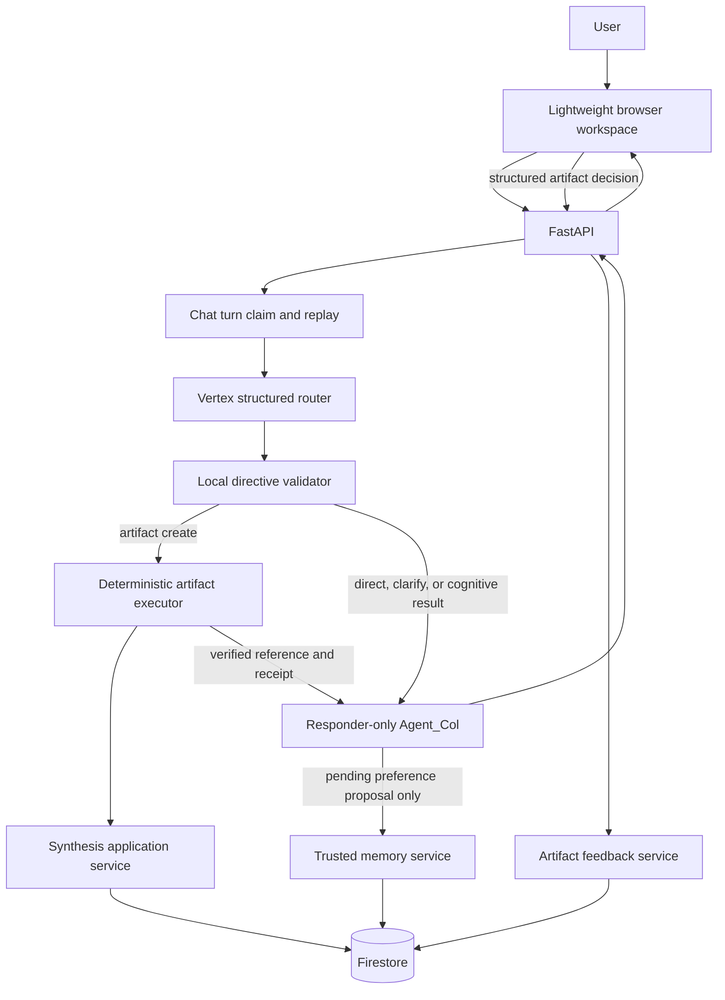

# M8-COL.1 Judge-Facing Collaborative Artifact Loop Boundary Design

## Status and authority

Approved by the repository owner for design work on August 23, 2026. This
document defines the target boundary but authorizes no production-code, test,
fixture, schema, dependency, API, persistence, frontend, authentication, job,
or deployment change.

This design is subordinate to:

- [`AGENTS.md`](../../../AGENTS.md);
- [`AGENT_COL_IDENTITY_AND_ALIGNMENT.md`](../../../AGENT_COL_IDENTITY_AND_ALIGNMENT.md);
- [`DOCUMENTATION_AND_REPRODUCIBILITY_CONTRACT.md`](../../../DOCUMENTATION_AND_REPRODUCIBILITY_CONTRACT.md);
- [`2026-08-23-m7-exp-7c-core-tool-belt-evaluation-closure.md`](2026-08-23-m7-exp-7c-core-tool-belt-evaluation-closure.md);
- [`2026-08-20-phase-3b-trusted-memory-design.md`](2026-08-20-phase-3b-trusted-memory-design.md).

Agent_Col remains a general collaborative partner and the only user-facing
conversational owner. Structured synthesis is one artifact workflow, not the
identity of the product.

## Executive decision

The judge-facing artifact loop will extend the current structured production
routing boundary with one deterministic artifact-workflow route. It will not
give the responder a generic model-visible persistence tool, treat synthesis as
a fifth cognitive expert, or let the browser call Gemini directly.

The first implementation sequence will remain synchronous and bounded while
preserving the existing chat-turn idempotency ledger. Durable background jobs
will be introduced only after the application can persist and resume a
completed artifact effect without regenerating it. This lets a lightweight
local browser workspace use real contracts before Cloud Tasks or equivalent
infrastructure is added.

The complete loop is:

1. the user asks Agent_Col to create a blueprint from source text in the
   current message;
2. model-controlled routing selects the artifact workflow;
3. deterministic application code invokes the shared synthesis service once;
4. Firestore stores an immutable blueprint and returns an authoritative
   artifact reference;
5. responder-only Agent_Col explains the result without rewriting the stored
   artifact;
6. the user inspects the canonical artifact through a read API;
7. the user submits an explicit structured accepted, rejected, or edited
   decision against a server-issued feedback target;
8. deterministic application code stores the artifact feedback event;
9. a reusable collaboration preference, when separately stated in an ordinary
   chat turn, becomes only a pending governed-memory proposal and still
   requires approval;
10. a later synthesis can use an approved, synthesis-relevant memory signal
    and expose an application-verified adaptation receipt.

Artifact feedback and user memory remain separate durable domains. Rejecting a
blueprint decision does not silently create a global user preference.

## Verified current baseline

The current repository already provides:

- project-aware `ChatRequest` values;
- optional retry-safe chat turns with claim, lease, replay, conflict, and
  atomic completion;
- a responder-only Agent_Col production boundary;
- model-controlled structured routing with strict local validation;
- zero-or-one cognitive expert execution and delegation depth one;
- `AgentActionReceipt` names for `synthesize_project` and
  `record_blueprint_feedback`;
- an `ArtifactReference` contract for schema-2.0 synthesis blueprints;
- a shared `SynthesisApplicationService` used by `/api/synthesize`;
- strict provider-safe generation and local blueprint validation;
- atomic Firestore blueprint creation under a project;
- governed memory proposals, decisions, provenance, correction, revocation,
  deletion, inspection, cross-session context, and adaptation receipts.

The missing production boundaries are:

- an artifact route in the production routing contract;
- execution of synthesis inside an idempotent chat turn;
- persistence of completed artifact effects before final-response generation;
- canonical blueprint read and list APIs;
- explicit artifact feedback models and persistence;
- governed-memory projection for synthesis;
- verified artifact adaptation and lineage metadata;
- browser-facing presentation of these contracts.

The current direct synthesis service still reads a legacy root-user profile
allowlist. Its keys do not match the governed memory categories, so it must not
be described as trusted-memory personalization.

## Goals

M8-COL must:

1. let Agent_Col select blueprint creation from a natural-language chat turn;
2. preserve model-controlled judgment and direct-response restraint;
3. use the exact current user message as source data rather than allowing the
   routing model to rewrite or invent source text;
4. execute at most one major routed capability per turn;
5. create no artifact without a completed deterministic action receipt;
6. return a compact artifact reference while keeping the canonical blueprint
   in Firestore;
7. provide bounded project blueprint list and detail APIs for the workspace;
8. record explicit accepted, rejected, and edited artifact feedback with
   server-issued identifiers and provenance;
9. preserve artifact immutability and create later versions as new documents;
10. keep project-scoped artifact feedback separate from cross-project user
    memory;
11. allow only approved, synthesis-relevant memory to influence a later
    blueprint;
12. expose why an adaptation occurred through application-verified receipts;
13. preserve retry safety when synthesis or feedback finishes before the final
    response;
14. define the smallest stable contract needed by a lightweight browser UI;
15. keep public deployment blocked until identity and ownership are enforced.

## Non-goals

M8-COL.1 does not:

- implement any part of this design;
- add Deep Research, another cognitive expert, MCP, or external integrations;
- add PDF, DOCX, image, email, or arbitrary file ingestion;
- analyze multiple URLs and synthesize an artifact in one turn;
- permit two experts or nested delegation;
- let the browser or model write Firestore directly;
- infer feedback or durable preferences from sentiment or behavior;
- mutate an existing blueprint document in place;
- implement free-form collaborative document editing;
- add streaming, WebSockets, notifications, Cloud Tasks, or job polling;
- select an authentication provider;
- claim that request-provided user IDs are secure identity;
- build the browser workspace;
- redesign blueprint requirement coverage or introduce schema 3.0 merely to
  satisfy this artifact loop.

## Considered approaches

### Approach A: expose synthesis as an ADK function tool on the responder

Agent_Col would call `synthesize_project` directly while composing its final
answer.

Benefits:

- superficially matches conventional agent-tool examples;
- requires no new routing route.

Costs:

- reverses the accepted responder-only architecture;
- mixes route selection, side-effect authority, and final-response generation;
- makes partial completion and retry recovery harder to reason about;
- permits the model to choose arguments at the persistence boundary;
- creates a different execution architecture from the four accepted experts.

Decision: rejected.

### Approach B: let the browser call `/api/synthesize` directly

The UI would submit source text to the current endpoint and then display its
response beside chat.

Benefits:

- smallest initial frontend integration;
- reuses the existing synchronous endpoint unchanged.

Costs:

- Agent_Col does not choose, explain, or own the workflow;
- chat and artifact state can diverge;
- chat idempotency does not protect artifact creation;
- the judge sees two adjacent applications rather than one collaborator;
- action and artifact receipts do not originate from the conversational turn.

Decision: retained only as a backward-compatible developer endpoint, rejected
as the judge-facing workflow.

### Approach C: add one artifact route and deterministic workflow executor

The production router selects a bounded artifact intent. Application code uses
server-owned turn context and the exact current message to invoke the shared
synthesis service, records the effect, and passes a compact result to
responder-only Agent_Col.

Benefits:

- preserves Agent_Col's model-controlled judgment;
- follows the accepted router, validator, executor, responder architecture;
- keeps artifact identifiers and writes deterministic;
- supports retry-safe partial completion;
- gives the UI one coherent chat-and-artifact contract;
- leaves a clean seam for later durable job execution.

Costs:

- expands routing, turn-ledger, response, persistence, and evaluation
  contracts;
- synchronous generation remains vulnerable to request termination until the
  durable job phase;
- requires careful separation between artifact feedback and memory.

Decision: selected.

## Target architecture



The browser is a consumer of application contracts. It never becomes an
authority for artifact ownership, completion, feedback provenance, or memory.

## Domain separation

### Artifact

An artifact is an immutable generated project document with server-owned
identity, ownership metadata, schema version, originating turn, optional
lineage, and verified adaptation metadata.

### Artifact feedback

Artifact feedback is a project-scoped explicit decision about a whole artifact
or one server-issued component target. It can be accepted, rejected, or edited.
It is durable project evidence, not a global profile trait.

### Governed collaboration memory

Governed memory is an allowlisted, user-approved preference or low-sensitivity
identity signal intended to influence later collaboration across sessions. A
feedback event cannot activate memory. An eligible reusable preference stated
in the same or another message may produce one separate pending proposal under
the existing trusted-memory contract.

### Artifact lineage

A later blueprint derived from an earlier one is a new immutable artifact. Its
metadata may reference one parent artifact and the bounded feedback event IDs
supplied to generation. M8 must never overwrite the original blueprint to make
history appear cleaner.

## Production routing contract

### Route extension

Add one future route:

```text
artifact
```

The artifact route carries exactly one intent:

```text
operation: create_blueprint
objective: bounded nonnumeric task description
```

The routing model does not supply:

- source text;
- project, session, user, message, turn, or artifact identifiers;
- Firestore paths;
- profile values;
- feedback;
- schema versions;
- model names;
- provider configuration.

The application uses the exact validated current `ChatRequest.message` as the
synthesis source. The objective helps Agent_Col explain why the route was
selected but is not persisted as source evidence.

### Invocation rule

Select `artifact/create_blueprint` only when the user asks to transform
substantial source material in the current message into a structured project
blueprint. Stable explanation, brainstorming without a requested artifact, or
an ambiguous reference to material not present in the current message remains
`direct` or `clarify`.

The first implementation will not synthesize from a URL, search result, prior
artifact, upload, or multiple earlier messages in the same turn. A request that
requires Source or Research before synthesis must be staged across separate
turns. This preserves the accepted one-major-capability boundary.

### Local validation

Local validation must enforce:

- route and intent agreement;
- exactly one allowed artifact operation;
- no cognitive expert intent in an artifact directive;
- no source text or server-owned identifier in model output;
- source size and type from the existing validated chat request;
- no artifact route on a structured memory or artifact-feedback decision turn;
- no fallback to another route after artifact execution begins.

Whether the source is semantically sufficient remains Agent_Col's bounded
routing judgment and an evaluation target. Local code enforces exact source
provenance, type, and size; it must not introduce a keyword or length heuristic
that overrides a structurally valid decision. If Agent_Col selects `artifact`
for an insufficient request, that is a routing-quality failure rather than a
reason to weaken or disguise the decision.

## Artifact creation contract

### Server-owned command

The deterministic executor constructs an immutable command containing:

- project ID;
- session ID;
- user ID during local development, later replaced by authenticated subject;
- current turn and source-message identifiers;
- exact current message as source text;
- the pre-message bounded history snapshot;
- the governed synthesis-memory projection;
- optional parent artifact and project-feedback references only in a later
  versioning pass.

The routing model supplies none of these values.

### Shared service

Both chat-routed creation and `POST /api/synthesize` call the same application
service in process. One endpoint must not call the other through HTTP.

The service owns:

- synthesis context construction;
- one bounded provider generation operation under the current retry policy;
- strict Pydantic and semantic validation;
- deterministic mapping of used memory signals to adaptation receipts;
- immutable Firestore persistence;
- an authoritative `ArtifactReference`;
- a compact responder projection.

The responder projection includes only:

- artifact reference;
- project name and core value proposition;
- Socratic questions;
- verified adaptation receipts;
- limitations required to explain a partial or failed result.

The full blueprint is excluded from responder context. The browser reads the
canonical artifact through the detail API, preventing Agent_Col from becoming
an unverified second copy of the artifact.

### Public success receipts

A completed chat creation returns:

- `AgentActionReceipt(action_name="synthesize_project", status="completed")`;
- one matching `ArtifactReference`;
- zero citations unless a future separately approved workflow adds validated
  source citations;
- only application-verified adaptation receipts.

No completed action or artifact reference is returned when validation or
persistence fails.

## Artifact read contracts

The workspace requires two deterministic APIs:

```text
GET /api/projects/{project_id}/blueprints?limit=20&before=CURSOR
GET /api/projects/{project_id}/blueprints/{blueprint_id}
```

### Bounded list

The list returns newest-first metadata only:

- artifact reference;
- created timestamp;
- originating session and turn identifiers;
- optional parent artifact ID;
- feedback counts by decision;
- verified adaptation categories without exposing private values in logs.

The cursor is server-issued. The endpoint must not scan unbounded project
history.

### Canonical detail

The detail response returns:

- artifact metadata;
- the stored strict `SynthesisBlueprint`;
- server-issued feedback targets;
- verified adaptation receipts;
- optional parent and applied-feedback references;
- no hidden prompt, model reasoning, raw history, or profile snapshot.

A missing artifact returns 404. A known artifact outside the authenticated
owner's project must also appear unavailable after authorization is added; the
local-development implementation must not pretend request identifiers provide
that protection.

## Feedback target contract

Clients and models may not submit arbitrary JSONPath, dotted paths, array
indexes, or field names as mutation authority. The detail API derives bounded
opaque target IDs for:

- the whole blueprint;
- each architectural decision;
- each Socratic question;
- each roadmap milestone;
- each diagnostic warning.

Each target carries a short display label and target kind. The server resolves
the target against the immutable stored artifact during feedback validation.
Targets identify what feedback concerns; they do not permit modification of
the stored blueprint.

## Explicit artifact feedback contract

### Structured authority

An artifact decision is a structured `ChatRequest` field, not an interpretation
of free-form `yes`, `no`, approval sentiment, or model reasoning. This follows
the existing memory-decision pattern and avoids creating a second public write
contract before the workspace needs one.

The command contains:

- artifact ID;
- server-issued target ID;
- decision: `accepted`, `rejected`, or `edited`;
- bounded user-authored feedback text;
- correction text required only for `edited`;
- expected artifact schema version;
- server-owned project, session, user, source-message, and turn identifiers.

The request surface is conceptually:

```text
POST /api/chat
artifact_feedback_decision:
  artifact_id
  target_id
  decision
  feedback_text
  correction_text
  expected_schema_version
```

The chat request supplies project and session locators during local
development. The application executes the validated decision before response
generation, records its receipt in the idempotent turn, and gives the bounded
result to responder-only Agent_Col. A structured artifact-feedback decision and
a structured memory decision are mutually exclusive in one turn. The later
authenticated implementation derives user identity from the verified request
principal.

A dedicated feedback write endpoint is deferred. The application service
remains independently testable without exposing another HTTP mutation path.

### Validation

The deterministic service verifies:

- the artifact exists under the active project;
- the target was issued for that exact artifact;
- decision and correction fields agree;
- text sizes and character policy;
- the same logical decision has not already been applied;
- the chat turn owns the operation when submitted through chat;
- the stored artifact schema is supported;
- no feedback value is treated as a memory category or Firestore path.

### Persistence

Store immutable events under the project artifact boundary:

```text
projects/{project_id}/blueprints/{blueprint_id}/feedback/{feedback_id}
```

Each event records:

- feedback ID;
- target ID and kind;
- decision;
- feedback and optional correction text;
- originating session, message, and turn;
- user identity subject once authentication exists;
- artifact schema version;
- created timestamp;
- status and optional supersession relationship.

The blueprint document remains unchanged. Corrections and later reversals are
new events, not destructive rewrites.

### Public receipts

A completed decision returns:

- `AgentActionReceipt(action_name="record_blueprint_feedback", status="completed")`;
- a bounded feedback reference containing feedback ID, artifact ID, target ID,
  and decision;
- no memory adaptation receipt unless a separately approved memory signal was
  already active and merely supplied as response context.

A feedback response must not claim that Agent_Col learned a global preference.

## Governed-memory synthesis personalization

### Migration rule

The legacy synthesis profile allowlist must be replaced by a dedicated adapter
over `CollaborationProfile`. The synthesis generator must never read arbitrary
root-user fields as personalization authority.

The first judged proof should use one category with an observable,
deterministically testable artifact effect:

```text
planning_granularity = milestones | tasks | micro_steps
```

This keeps the first proof honest:

- `milestones` favors fewer high-level roadmap units;
- `tasks` favors ordinary task decomposition;
- `micro_steps` favors smaller micro-tasks and explicit verification steps.

Other approved memory categories continue to affect chat but do not
automatically enter synthesis. Each additional synthesis-relevant category
requires a documented mapping and local validation rule.

### Provenance and receipts

For every synthesis-relevant signal supplied to generation, the application
retains:

- signal ID;
- category and normalized value;
- source event ID;
- memory policy version.

The model may describe the resulting artifact change, but local validation
must ensure every claimed adaptation maps to an active supplied signal. The
application then stores and returns an `AdaptationReceipt` derived from that
signal, not from model prose.

An active preference is not proof that it affected a particular artifact. If
the generated artifact contains no validated trace for that category, the
application must not emit an artifact adaptation receipt.

### Project feedback versus memory

Project feedback can guide a later version of the same artifact only when that
later version explicitly selects bounded feedback event IDs. It cannot affect
unrelated projects or sessions as a user trait.

Governed memory can affect later sessions and projects, but only after the
existing pending-proposal and structured-approval lifecycle. Artifact feedback
may motivate Agent_Col to explain that a reusable preference is separate, but
the feedback event is neither proposal evidence nor approval.

The first implementation prohibits a memory-proposal call during an artifact
creation or structured artifact-feedback turn. This prevents source documents
and project corrections from being mistaken for global user preferences. A
user who wants a reusable preference remembered states it in a separate
ordinary chat turn, receives one pending proposal, and approves it through the
existing structured decision flow.

## Idempotency and partial completion

Artifact generation and feedback are durable side effects. They require the
same retry discipline as memory proposals.

Before the responder runs, the chat-turn ledger must be able to record:

- completed action receipts;
- completed artifact references;
- completed feedback references;
- verified adaptation receipts;
- the effect's deterministic ownership relationship to the turn.

If synthesis or feedback succeeds and the responder fails:

1. the completed effect remains durable;
2. the public response may expose a bounded partial-failure envelope with the
   completed receipts;
3. a retry with the same idempotency key reuses the completed effect;
4. the application must not regenerate the blueprint or duplicate feedback;
5. a changed request with the same key returns HTTP 409.

This prerequisite must exist before chat-routed synthesis is accepted. Merely
checking for an artifact with similar content is not idempotency.

The current headerless chat path may remain for local compatibility, but the
browser should always generate and retain an idempotency key per submitted
turn.

## Synchronous first, durable later

### Initial boundary

The first implementation may keep one HTTP request open through routing,
synthesis, persistence, and response generation because:

- the current service already supports bounded synchronous synthesis;
- the initial browser is local and lightweight;
- the artifact-effect ledger prevents duplicate generation on retry;
- adding infrastructure before the artifact contract is stable would expand
  the debugging surface.

### Durable-job promotion gate

Promote artifact creation to an application-owned durable job before public
deployment when any of these is true:

- the operation can exceed the accepted Cloud Run request budget;
- work must survive client disconnect, process termination, or instance
  replacement;
- the UI must display queued, running, failed, completed, or cancelled states;
- one user request can create more than one provider operation or artifact;
- background completion or notification is required.

The durable worker will reuse the same synthesis command, service, validation,
artifact, and receipt contracts. The UI must not depend on whether execution is
synchronous or job-backed.

## Failure behavior

| Failure | Public behavior | Durable behavior |
| --- | --- | --- |
| Invalid artifact directive | HTTP 502 at the current routing boundary; no action or artifact | No artifact effect |
| Missing source material | Clarification response; no artifact route | No artifact effect |
| Provider or validation failure before persistence | Bounded failure; no completed artifact receipt | No artifact document |
| Firestore artifact failure | Bounded database failure; no completed receipt | Atomic write leaves no partial artifact |
| Responder failure after artifact persistence | Partial failure exposes verified completed effects | Artifact and turn effect remain retryable |
| Invalid feedback target or fields | HTTP 422 | No feedback event |
| Missing artifact | HTTP 404 | No feedback event |
| Conflicting or stale feedback command | HTTP 409 | Existing event remains authoritative |
| Memory proposal absent or rejected | Artifact feedback still stands | No active memory change |

Agent_Col must not compensate for a failed artifact operation by inventing a
blueprint in prose.

## Browser-facing contract

The first workspace can remain deliberately small:

- one chat transcript;
- one prompt input and submit control;
- visible pending/error state;
- action, citation, artifact, memory-proposal, and adaptation receipts;
- an artifact panel that loads canonical detail by `ArtifactReference`;
- a bounded blueprint list for the active project;
- simple accept, reject, and edit controls on server-issued feedback targets;
- a memory panel using the existing inspection and lifecycle APIs.

The user-facing term is **Work** rather than Blueprint. The application and
persistence layers retain the precise `synthesis_blueprint` artifact type; the
interface uses the domain-neutral label so synthesis remains one collaborative
workflow rather than Agent_Col's identity.

The UI does not need dashboards, drag-and-drop editing, multi-pane project
management, streaming tokens, animations, or a component library to prove the
collaboration loop. It does need accessible labels, keyboard operation, clear
loading/error states, and explicit distinction among pending memory,
active memory, artifact feedback, and generated content.

The browser may render only capabilities backed by accepted API contracts.
Requirements, sources, restored conversation history, background work,
artifact version comparison, additional artifact types, and export formats
must remain hidden or explicitly unavailable until their read models exist.
The initial export behavior is a normal browser download; a native file-system
chooser is an optional progressive enhancement rather than a portability
requirement.

Phase 4A must reconcile transcript restoration before claiming persistent
conversation history. The current chat service loads bounded history for model
context but exposes no client-readable session-history endpoint. The first UI
may retain the active transcript in page state, or a separately approved
bounded session/history read contract may be added before reload continuity is
advertised.

Layout dimensions remain responsive design inputs, not fixed percentages. In
particular, an expanded navigation drawer must be wide enough for memory values,
source labels, and accessible controls; a hard fifteen-percent maximum is not
an accepted requirement. Exact widths belong to Phase 4A visual and responsive
verification.

## Learning-language boundary

Agent_Col may notice a possible collaboration pattern and ask the user whether
it is accurate. Current-turn observations and project-scoped evidence do not
become durable user traits by themselves. Durable personalization continues to
require:

1. a candidate understanding grounded in explicit user-provided information;
2. user confirmation, correction, or rejection;
3. deterministic allowlist and sensitivity validation;
4. a pending governed proposal;
5. explicit approval with provenance and lifecycle controls.

Successful collaborations, project outcomes, conversation patterns, sentiment,
or expert output cannot silently create or activate profile memory. Broader
pattern-learning remains a future governed design problem and must not be
claimed as implemented behavior.

## Authentication boundary

The local request still carries `user_id`, `session_id`, and `project_id` and
must remain labeled insecure for public deployment. M8-COL does not select or
implement authentication.

Before public Cloud Run deployment, an authentication design must:

- derive the user subject from a server-verified identity token;
- stop trusting request-provided `user_id`;
- enforce project, session, artifact, feedback, and memory ownership;
- define session creation and logout behavior;
- keep provider and Firestore service credentials server-side;
- support local development without weakening deployed verification;
- document account deletion and data-retention consequences.

A custom username/password system should not be introduced merely to avoid a
Google sign-in dependency. Credential storage, password reset, account
recovery, abuse controls, and authentication security are a separate product.
The next authentication pass must verify current official Google identity,
OAuth/OIDC, and Cloud Run guidance before selecting Google sign-in or any
alternative. Existing external credential code is not assumed reusable without
a separate security review.

The leading direction is Google-provider sign-in through Google Cloud Identity
Platform or Firebase Authentication, with FastAPI verifying short-lived ID
tokens and deriving the application user from the immutable token subject. This
is a design preference, not an implemented authentication contract. The
dedicated authentication pass must still verify dependencies, token lifecycle,
local-development behavior, account deletion, and ownership migration before
source changes.

## Security and privacy invariants

- Browser input, source text, artifact content, feedback, history, expert
  results, and profile values remain untrusted data.
- No generic model-facing Firestore write tool is introduced.
- Server-owned identifiers never come from model output.
- Artifact and feedback text never appears in content-bearing application
  logs.
- Feedback cannot activate memory or bypass its allowlist.
- Retrieved or generated content cannot authorize another expert or action.
- Artifact list and detail APIs require ownership enforcement before public
  exposure.
- The browser must not store ADC credentials, service-account credentials, or
  provider access tokens.
- Hard deletion of memory does not silently delete project feedback, and
  artifact deletion does not silently delete global memory. Each domain needs
  an explicit control and retention policy.

## Evaluation strategy

The implementation must be evaluated in separate layers:

### Deterministic tests

- artifact route and intent schema;
- rejection of mixed cognitive and artifact intents;
- exact current-message source ownership;
- artifact-reference and feedback-reference validation;
- list/detail bounds and cursor validation;
- target derivation and stale-target rejection;
- immutable feedback persistence;
- separation of feedback and memory;
- governed synthesis projection and adaptation-receipt derivation;
- partial-completion recovery and replay without duplicate synthesis;
- changed-request conflict;
- content-safe logging.

### Controlled orchestration

- Direct and Clarify still execute no artifact operation;
- each cognitive expert path remains unchanged;
- artifact creation executes once and produces matching receipts;
- responder failure preserves the completed artifact effect;
- structured feedback bypasses speculative expert routing;
- expert output cannot cause artifact creation or feedback;
- artifact feedback cannot create active memory.

### Bounded live evaluation

- one explicit blueprint request routes to artifact creation;
- one ordinary brainstorming turn does not create an artifact;
- one missing-source request asks a useful clarification;
- the canonical detail matches the returned reference;
- exact replay returns the same artifact without regeneration;
- changed reuse returns HTTP 409;
- accepted, rejected, and edited feedback writes are inspectable;
- one approved `planning_granularity` signal visibly changes a later artifact
  and produces verified provenance;
- no raw source, feedback, memory value, or blueprint appears in terminal
  metadata output.

Manual review remains decisive for whether Agent_Col clearly explains the
artifact, asks a meaningful question, distinguishes feedback from memory, and
demonstrates adaptation without overstating what it learned.

## Implementation decomposition after design acceptance

This design must be implemented through separately approved passes:

1. **M8-COL.2 — Artifact Read Models and Persistence**
   - canonical artifact envelope;
   - bounded list and detail database services;
   - server-issued feedback targets;
   - read-only FastAPI endpoints.
2. **M8-COL.3 — Artifact Effect Ledger and Chat Routing Contracts**
   - artifact route and provider-safe schema;
   - exact current-message source ownership;
   - durable pre-responder action/artifact effects;
   - replay and conflict contracts.
3. **M8-COL.4 — Synchronous Chat-Controlled Synthesis Cutover**
   - deterministic artifact executor;
   - shared synthesis-service invocation;
   - responder projection and public receipts;
   - preservation of `/api/synthesize`.
4. **M8-COL.5 — Explicit Artifact Feedback Lifecycle**
   - feedback request/reference schemas;
   - immutable persistence and service validation;
   - structured chat decision and direct service boundary;
   - inspection and correction/supersession behavior.
5. **M8-COL.6 — Governed Synthesis Personalization Proof**
   - `CollaborationProfile` adapter;
   - `planning_granularity` mapping;
   - verified artifact adaptation receipts;
   - genuinely separate-session live proof.
6. **Phase 4A — Lightweight Browser Workspace**
   - chat, prompt input, receipts, artifact detail/list, feedback controls, and
     memory inspection using only accepted backend contracts.

Durable jobs, authentication, deployment, and additional experts remain
separate designs and implementation sequences.

## Development-direction decision

After this design, the recommended order is:

1. implement the bounded M8-COL.2 through M8-COL.6 backend contracts;
2. build the lightweight browser workspace described above;
3. research and design authenticated identity and ownership using current
   official Google documentation;
4. add durable background execution if the measured synthesis lifecycle or
   deployment requirements demand it;
5. deploy to Cloud Run and run hosted security and smoke checks;
6. complete reproducibility documentation, the demo, and submission material;
7. return to Deep Research only if the judged workflow, reliability, and demo
   schedule have adequate margin.

The frontend idea is directionally correct, but building it immediately before
artifact read, feedback, and adaptation contracts exist would force the UI to
mock or bypass the behavior judges need to see. The smallest useful frontend
should begin as soon as those backend contracts stabilize, not after every
possible backend capability is finished.

For authentication, a Google-backed identity path is the leading candidate
because the deployment already depends on Google Cloud. The correct technical
term and token-verification architecture must be established through an
official-documentation research pass; “OAuth 2” alone describes authorization
and is not yet a complete user-identity design.

## Design acceptance criteria

The design is accepted when the repository owner confirms that it:

1. keeps Agent_Col as the only conversational owner;
2. adds one deterministic artifact route rather than a fifth cognitive expert;
3. keeps exact source text and all identifiers server-owned;
4. preserves zero-or-one major routed capability per turn;
5. requires authoritative action and artifact receipts;
6. defines bounded artifact list and detail contracts;
7. uses server-issued feedback targets and immutable feedback events;
8. separates project artifact feedback from governed user memory;
9. proves later adaptation from an approved synthesis-relevant signal;
10. defines retry-safe partial completion before chat-routed synthesis;
11. permits a lightweight frontend without coupling it to synchronous versus
    durable execution;
12. keeps authentication, jobs, frontend code, deployment, and Deep Research
    outside this design pass.

## Stop conditions

Implementation must stop and return to design review if:

- the routing provider must reproduce or transform source text;
- a generic model-facing persistence tool becomes necessary;
- synthesis can complete without a durable turn effect;
- retry can create duplicate blueprints or feedback events;
- feedback must mutate an existing blueprint in place;
- artifact feedback must activate memory without structured approval;
- the browser would need Firestore or provider credentials;
- the first implementation requires file ingestion, multi-expert execution,
  streaming, Cloud Tasks, authentication, or public deployment;
- the `planning_granularity` adaptation cannot be validated without weakening
  the blueprint contract;
- the design expands into a full collaborative editor rather than the bounded
  judge-facing loop.
