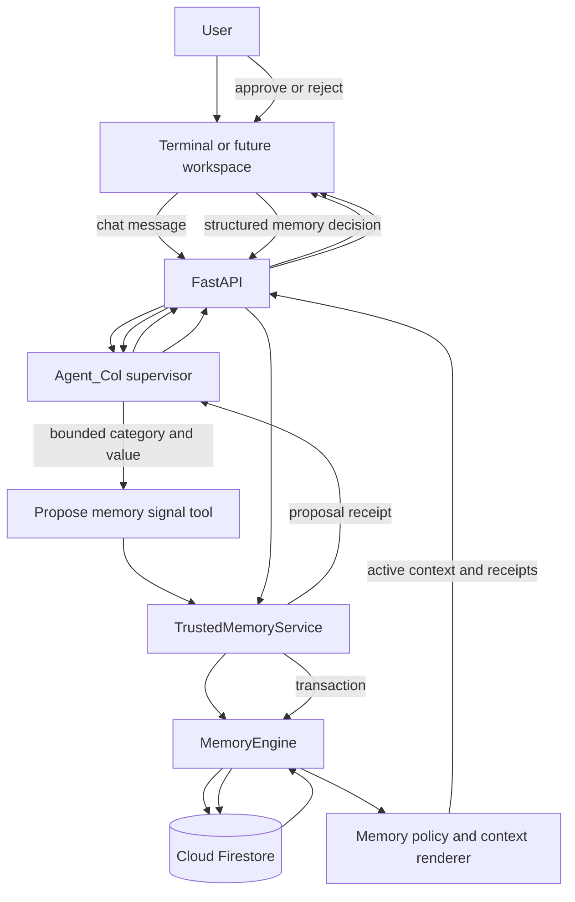
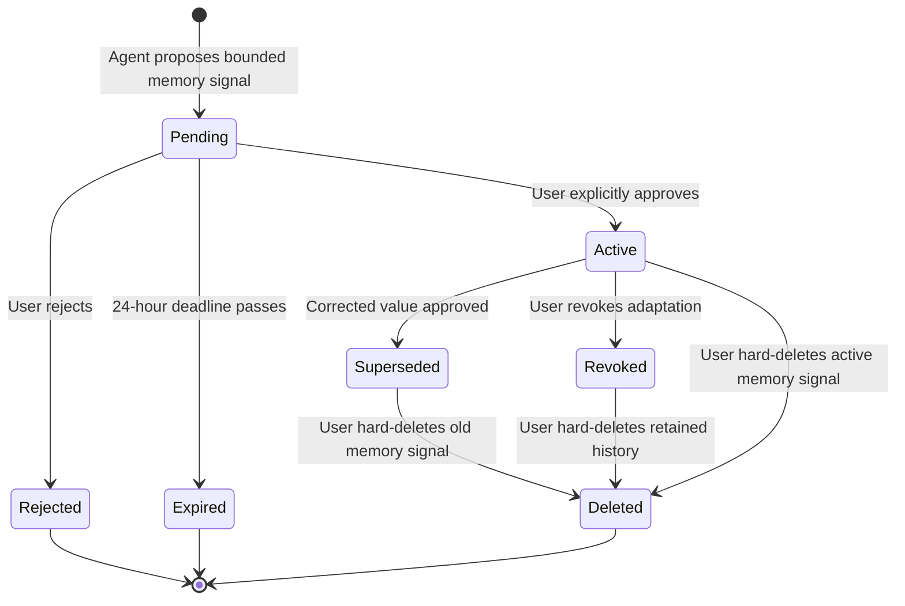

# Phase 3B Trusted Memory Contract Design

## Status

Approved as a design contract. This document authorizes no production-code
change; each implementation pass still requires separate approval.

## Governing directives

This design is subordinate to:

- [`AGENT_COL_IDENTITY_AND_ALIGNMENT.md`](../../../AGENT_COL_IDENTITY_AND_ALIGNMENT.md)
- [`DOCUMENTATION_AND_REPRODUCIBILITY_CONTRACT.md`](../../../DOCUMENTATION_AND_REPRODUCIBILITY_CONTRACT.md)
- [`AGENTS.md`](../../../AGENTS.md)
- [`2026-08-19-hybrid-adk-supervisor-contract-design.md`](2026-08-19-hybrid-adk-supervisor-contract-design.md)

Agent_Col is a general collaborative partner. This contract governs only the
trusted continuity mechanism through which a user explicitly teaches
Agent_Col collaboration preferences and a minimal set of low-sensitivity
identity context.

The product term is **explicit feedback-driven adaptation**. The system must
not claim autonomous learning, hidden profiling, or unrestricted knowledge of
the user.

## Verified repository baseline

The design is based on repository commit
`fb3dd441a10494b9b375ba85eda1bc7fdb4cedee`.

Implemented:

- FastAPI owns request validation, application lifecycle, and HTTP errors;
- the hybrid ADK supervisor handles `/api/chat` through a bounded, temporary
  invocation session;
- Firestore chat history and the user profile load across separate session
  identifiers;
- the current `users/{user_id}` document is a flat mutable profile mapping;
- chat and synthesis consume that profile mapping;
- structured synthesis rejects personalization claims that reference profile
  keys absent from the loaded profile;
- chat responses already reserve server-owned action, artifact, and citation
  receipt collections;
- `MemoryEngine` validates inputs, uses asynchronous Firestore operations, and
  translates provider failures without logging user content.

Not implemented:

- a governed way to propose an allowlisted memory signal;
- explicit confirmation before activation;
- feedback-event provenance;
- typed, allowlisted profile projection;
- memory-signal correction, revocation, or deletion;
- server-derived memory proposal or adaptation receipts;
- a supervisor memory-proposal tool;
- an end-to-end cross-session adaptation test or live demonstration;
- authenticated ownership or public deployment controls.

The current `update_user_profile()` method can merge arbitrary fields into the
root user document. It is a compatibility primitive, not an acceptable public
or model-facing memory policy.

## Problem statement

Reading a profile document is not a trustworthy learning system. Agent_Col
must be able to answer all of these questions for every active memory signal:

- What collaboration behavior is being adapted?
- Which bounded value is active?
- Did the user explicitly approve it?
- Which session and message supplied the proposal?
- Which confirmation activated it?
- Has it been corrected, superseded, revoked, or deleted?
- Why was it supplied to the model for this response?

Gemini may recognize a possible preference, but model recognition is not
authority to create durable memory. Application code must own every persistent
state transition.

## Goals

The trusted-memory subsystem must:

1. allow Agent_Col to propose an allowlisted collaboration preference or
   low-sensitivity identity field;
2. require an explicit structured user decision before activation;
3. store approved lifecycle events with provenance;
4. maintain a bounded active-memory projection for efficient reads;
5. inject only active, allowlisted memory signals into model context;
6. return server-derived proposal and adaptation receipts;
7. support correction, revocation, and hard deletion;
8. make proposal creation and every lifecycle decision idempotent under
   repeated tool or client requests;
9. preserve existing chat and synthesis behavior during migration;
10. prove adaptation across distinct session identifiers;
11. exclude memory values and user content from logs;
12. remain local-development-only until authentication and ownership exist.

## Non-goals

This design does not:

- infer personality, identity, role, health, finances, protected traits,
  location, contact details, or other personal facts the user did not
  explicitly supply;
- store arbitrary free-form biographical facts;
- let Gemini write Firestore fields directly;
- make ADK invocation sessions durable memory;
- implement blueprint decision feedback;
- integrate synthesis, Search, or URL Context tools;
- implement account-wide chat-history deletion;
- add Firebase Authentication or Firestore Security Rules;
- add Cloud Tasks or background memory inference;
- build the browser workspace;
- implement the R2 requirement-coverage pipeline;
- claim that model output perfectly obeys every style instruction.

Blueprint feedback and general collaboration preferences are separate domain
concepts. A rejected architectural recommendation does not automatically
become a permanent user trait.

## Considered approaches

### Approach A: direct model-written profile updates

Give Agent_Col a generic Firestore or `update_user_profile` tool.

Benefits:

- minimal application code;
- conversationally flexible;
- one model turn can identify and store a preference.

Costs:

- no reliable consent boundary;
- arbitrary keys and values can become durable;
- prompt injection can influence profile writes;
- provenance and correction behavior depend on model prose;
- retries can duplicate or overwrite memory;
- impossible to audit confidently.

Decision: rejected.

### Approach B: mutable profile document only

Validate a small set of keys, then merge approved values directly into the
existing `users/{user_id}` document.

Benefits:

- one efficient profile read;
- small migration;
- simple model context.

Costs:

- overwrites destroy history;
- correction cannot be distinguished from initial approval;
- no evidence explains who approved the value;
- revocation and deletion are indistinguishable;
- concurrent updates can silently replace one another.

Decision: rejected as the source-of-truth design. A bounded projection is
still useful, but it must be derived from lifecycle events.

### Approach C: event ledger plus active projection

Store short-lived pending proposals, persist user-approved lifecycle events,
and transactionally update a bounded active-memory projection on the root
user document.

Benefits:

- explicit confirmation is visible and testable;
- provenance survives ordinary corrections and revocations;
- chat and synthesis retain one efficient profile read;
- model-facing context can be strictly allowlisted;
- deterministic services own state transitions;
- retry and concurrency behavior can be specified exactly.

Costs:

- more schemas and Firestore operations;
- deletion must remove both projection and related event documents;
- supervisor receipt integration is required for a natural chat flow;
- the application must distinguish operational proposals from durable memory.

Decision: selected.

## System architecture



The model may select the proposal tool. It never receives a generic profile
write tool. Approval, rejection, correction, revocation, and deletion are
application commands initiated through validated user input.

## Version 1 trusted-memory policy

### Bounded categories

Version 1 supports global collaboration-style preferences plus two explicit
identity-context fields. Preference values and broad roles are enums owned by
application code. A preferred name is the only bounded free-text value.

| Category | Allowed values |
| --- | --- |
| `response_length` | `concise`, `balanced`, `detailed` |
| `explanation_structure` | `direct_then_steps`, `step_by_step`, `concept_then_example` |
| `example_usage` | `none`, `when_helpful`, `always_practical` |
| `question_style` | `ask_before_assuming`, `recommend_then_ask`, `minimal_follow_up` |
| `planning_granularity` | `milestones`, `tasks`, `micro_steps` |
| `progress_check_ins` | `only_when_blocked`, `at_milestones`, `frequent` |
| `tool_use_style` | `ask_before_external_tools`, `use_when_needed`, `minimize_tools` |
| `formatting_style` | `prose`, `bullets`, `mixed` |

Identity-context fields:

| Field | Allowed value |
| --- | --- |
| `preferred_name` | One explicitly supplied and approved name or display name, 1 through 80 characters |
| `broad_roles` | One through three of `student`, `professional`, `educator`, `researcher`, `hobbyist`, `retired`, `career_transition` |

The initial allowlist intentionally excludes legal-identity verification,
birthdays, telephone numbers, email or postal addresses, account and government
identifiers, exact schools or employers, precise locations, medical or
accessibility diagnoses, financial details, credentials, protected traits,
political or religious identity, and model-inferred domain skill ratings.

Preferred names and broad roles are personal data, and a name is ordinarily
PII. They are allowed because the user explicitly supplies and approves them,
they are narrowly bounded, and the full memory lifecycle applies. The system
must never advertise this storage as “no PII.” The accurate claim is that
Agent_Col permits limited low-sensitivity identity context while excluding
sensitive PII and unapproved personal profiling.

An interface preference that may assist accessibility can be considered in a
later design, but it must describe the requested interface behavior rather
than a medical condition.

### Policy ownership

Application code owns:

- category, preference-value, and broad-role enums;
- preferred-name normalization and character validation;
- user-facing labels;
- the exact model instruction rendered for each value;
- category replacement rules;
- maximum active memory-signal count;
- maximum pending proposal count;
- proposal lifetime;
- schema and policy versions.

The model supplies one allowlisted category and the corresponding bounded
value. It does not author the durable model instruction or the stored
user-facing description. A preferred-name proposal is permitted only when the
current user message explicitly supplies the proposed name; it cannot be
inferred from history, a URL, or another tool result.

### Instruction precedence

Preferences adjust collaboration style; they do not override the current
request. Model instructions use this precedence:

1. system safety, authorization, privacy, tool, and output contracts;
2. the user's explicit request in the current turn;
3. active approved collaboration preferences that do not conflict with the
   current request;
4. Agent_Col defaults.

For example, a saved `response_length=concise` preference does not prevent the
user from asking for a detailed explanation in one turn. It remains active for
later turns and is not silently rewritten.

### Normative policy rendering

`PreferencePolicy` renders these application-owned instructions:

| Category and value | Rendered instruction |
| --- | --- |
| `response_length=concise` | Keep the response compact while preserving information required to complete the request. |
| `response_length=balanced` | Use moderate detail, covering the answer and its most important supporting context. |
| `response_length=detailed` | Provide thorough context, explicit steps, and important limitations without exposing hidden reasoning. |
| `explanation_structure=direct_then_steps` | Lead with the outcome, then give ordered steps when the task requires them. |
| `explanation_structure=step_by_step` | Explain complex work as ordered, independently checkable steps. |
| `explanation_structure=concept_then_example` | Explain the governing concept before demonstrating it with an example. |
| `example_usage=none` | Do not add examples unless the current request requires one for correctness. |
| `example_usage=when_helpful` | Add a concise example when it materially improves understanding. |
| `example_usage=always_practical` | Include one practical example when the task permits it. |
| `question_style=ask_before_assuming` | Ask one concise question before making a consequential unsupported assumption. |
| `question_style=recommend_then_ask` | Give the safest bounded recommendation, then ask one question that could materially change it. |
| `question_style=minimal_follow_up` | Ask a follow-up only when missing information prevents safe or correct progress. |
| `planning_granularity=milestones` | Organize plans around outcomes and major milestones. |
| `planning_granularity=tasks` | Organize plans into independently reviewable tasks with clear outcomes. |
| `planning_granularity=micro_steps` | Break complex plans into small sequential actions with explicit verification. |
| `progress_check_ins=only_when_blocked` | Request a check-in only when progress is blocked or authority is required. |
| `progress_check_ins=at_milestones` | Request confirmation at consequential milestone boundaries. |
| `progress_check_ins=frequent` | Offer brief progress check-ins during longer collaborative work. |
| `tool_use_style=ask_before_external_tools` | Ask before using an external information tool unless the current request already authorizes it. |
| `tool_use_style=use_when_needed` | Use a tool only when it materially improves correctness, evidence, or completion. |
| `tool_use_style=minimize_tools` | Prefer the fewest tool calls that can reliably complete the request. |
| `formatting_style=prose` | Prefer compact prose unless another format is necessary for clarity. |
| `formatting_style=bullets` | Prefer concise bullets for multiple facts, options, or actions. |
| `formatting_style=mixed` | Use short prose for conclusions and lists for comparisons or sequential work. |

`IdentityContextPolicy` renders these application-owned instructions:

| Field | Rendered instruction |
| --- | --- |
| `preferred_name` | Address the user by their approved preferred name when natural; do not repeat it mechanically or treat it as verified legal identity. |
| `broad_roles` | Use the approved broad role context only to calibrate examples and explanations; do not infer expertise, employer, school, seniority, or credentials. |

These instructions may be revised only by a policy-version change with schema,
context-rendering, and behavior-evaluation tests.

### Bounds

- at most one active value per category;
- at most eight active preferences per user;
- at most one approved preferred name and three approved broad roles;
- at most ten active memory signals per user;
- at most ten unresolved proposals per user;
- pending proposals expire 24 hours after creation;
- one supervisor turn may create at most one proposal;
- one chat request may resolve at most one proposal;
- values outside the versioned allowlist and invalid preferred names fail
  before Firestore access.

Firestore TTL is cleanup, not correctness. The application rejects an expired
proposal immediately by comparing `expires_at`; it does not wait for eventual
TTL deletion.

## Domain models

Exact names are normative for the later implementation plan.

```python
PreferenceCategory = Literal[
    "response_length",
    "explanation_structure",
    "example_usage",
    "question_style",
    "planning_granularity",
    "progress_check_ins",
    "tool_use_style",
    "formatting_style",
]

IdentityContextCategory = Literal[
    "preferred_name",
    "broad_roles",
]

MemoryCategory = PreferenceCategory | IdentityContextCategory

PreferenceValue = Literal[
    "concise",
    "balanced",
    "detailed",
    "direct_then_steps",
    "step_by_step",
    "concept_then_example",
    "none",
    "when_helpful",
    "always_practical",
    "ask_before_assuming",
    "recommend_then_ask",
    "minimal_follow_up",
    "milestones",
    "tasks",
    "micro_steps",
    "only_when_blocked",
    "at_milestones",
    "frequent",
    "ask_before_external_tools",
    "use_when_needed",
    "minimize_tools",
    "prose",
    "bullets",
    "mixed",
]

BroadRole = Literal[
    "student",
    "professional",
    "educator",
    "researcher",
    "hobbyist",
    "retired",
    "career_transition",
]

PreferredNameStr = Annotated[
    str,
    StringConstraints(strip_whitespace=True, min_length=1, max_length=80),
]

MemoryValue = PreferenceValue | PreferredNameStr | list[BroadRole]

MemoryDecision = Literal["approve", "reject"]
ConfirmationChannel = Literal["chat_decision", "memory_api"]
MemoryEventType = Literal[
    "approved",
    "corrected",
    "superseded",
    "revoked",
]
```

Cross-field validation must reject a value that is valid globally but invalid
for the selected category. Preferred names are Unicode NFC-normalized, have
internal whitespace collapsed, contain at least one alphabetic character, and
allow only alphabetic characters, spaces, apostrophes, typographic
apostrophes, periods, and hyphens. Broad-role lists contain one through three
unique enum values and are stored in policy-defined order.

A normalized preferred-name proposal must occur in the normalized current user
message. This grounding check prevents Agent_Col from proposing a name found
only in history, profile data, a URL, or a tool result. Broad-role proposals
remain inactive until the structured user confirmation even when Agent_Col
maps the user's wording to a role enum.

### Pending proposal

```python
class MemoryProposal(StrictModel):
    proposal_id: IdentifierStr
    category: MemoryCategory
    proposed_value: MemoryValue
    expected_signal_id: IdentifierStr | None
    policy_version: Literal["1.0"]
    status: Literal["pending", "approved", "rejected"]
    source_session_id: IdentifierStr
    source_message_id: IdentifierStr
    created_at: datetime
    expires_at: datetime
```

A proposal is operational confirmation state. It is never included in model
profile context and never treated as an active user trait.

### Active memory projection

```python
class ActiveMemorySignal(StrictModel):
    signal_id: IdentifierStr
    category: MemoryCategory
    value: MemoryValue
    policy_version: Literal["1.0"]
    source_event_id: IdentifierStr
    approved_at: datetime


class CollaborationProfile(StrictModel):
    memory_schema_version: Literal["1.0"]
    memory_revision: int = Field(ge=0)
    identity_context: dict[
        IdentityContextCategory,
        ActiveMemorySignal,
    ]
    active_preferences: dict[
        PreferenceCategory,
        ActiveMemorySignal,
    ]
```

Local validation must confirm that each map key equals the nested signal
category and that no category appears more than once across both maps.

### Lifecycle event

```python
class MemoryEvent(StrictModel):
    event_id: IdentifierStr
    event_type: MemoryEventType
    signal_id: IdentifierStr
    category: MemoryCategory
    value: MemoryValue
    policy_version: Literal["1.0"]
    source_type: Literal["explicit_user_feedback"]
    source_session_id: IdentifierStr
    source_message_id: IdentifierStr
    confirmation_channel: ConfirmationChannel
    confirmation_session_id: IdentifierStr | None
    confirmation_message_id: IdentifierStr | None
    related_signal_id: IdentifierStr | None
    memory_revision: int = Field(ge=1)
    created_at: datetime
```

Event documents are immutable after creation except when the user explicitly
hard-deletes the associated memory signal. An idempotent retry must confirm an
existing event is identical; it must not overwrite a differing event. Events
contain references to stored messages, not copies of raw chat text. Message
and profile retention remain separate user controls.

Cross-field validation requires confirmation session and message IDs for
`chat_decision` and forbids them for `memory_api`. Superseded and revoked
events retain the original signal's source references while recording the
current user action through the confirmation fields.

## Firestore data model

### Materialized profile

```text
users/{user_id}
  memory_schema_version: "1.0"
  memory_revision: integer
  identity_context:
    preferred_name:
      signal_id
      category
      value
      policy_version
      source_event_id
      approved_at
    broad_roles:
      signal_id
      category
      value
      policy_version
      source_event_id
      approved_at
  active_preferences:
    response_length:
      signal_id
      category
      value
      policy_version
      source_event_id
      approved_at
  memory_updated_at
```

The two identity fields and eight preference categories produce a maximum of
ten active signals. The bounded projection preserves the existing efficient
`users/{user_id}` read while replacing arbitrary profile context with typed
identity and preference maps.

An absent user document, or a legacy document without governed memory fields,
loads as schema version `1.0`, revision `0`, and empty identity and preference
maps without performing a write.

Unrecognized legacy root fields are not copied into model context. They remain
untouched until a separately approved migration or cleanup pass.

### Pending proposals

```text
users/{user_id}/memory_proposals/{category}
  proposal_id
  category
  proposed_value
  expected_signal_id
  policy_version
  status
  source_session_id
  source_message_id
  created_at
  expires_at
  resolved_at
```

The category document ID enforces at most one unresolved proposal slot per
category. `proposal_id` has the form `{category}--{random_id}` and prevents a
stale decision from approving a newer proposal that reused the category slot.
The application parses and validates the category prefix to locate the slot;
it never queries globally by a model-supplied proposal ID.
`expires_at` is eligible for a future Firestore TTL policy. Correctness always
uses the stored timestamp directly because TTL deletion is eventual and is not
transactional.

### Approved lifecycle events

```text
users/{user_id}/memory_events/{event_id}
  event_type
  signal_id
  category
  value
  policy_version
  source_type
  source_session_id
  source_message_id
  confirmation_channel
  confirmation_session_id
  confirmation_message_id
  related_signal_id
  memory_revision
  created_at
```

Event document IDs are deterministic and bounded:

```text
{signal_id}--approved
{signal_id}--corrected
{signal_id}--superseded
{signal_id}--revoked
```

One event type may exist at most once for one signal ID. This makes retry
behavior and later hard deletion addressable without scanning an unbounded
subcollection.

### Why the root projection is not the event source of truth

The projection answers, “What may Agent_Col use now?” Lifecycle events answer,
“Why is that value active, and what happened before it?” A projection can be
rebuilt from valid events. An event must never be inferred from a mutable
projection after the fact.

## State machine



`Rejected` and `Expired` are proposal states, not durable user memory. No
lifecycle event containing the proposed value is created for either state.

### Proposal

1. FastAPI generates one server-owned `turn_id`.
2. `save_message()` persists the user message and returns its message ID.
3. Agent_Col may call `propose_memory_signal` once.
4. The tool accepts only an allowlisted category and its bounded value from the
   model; preferred names must also pass current-message grounding.
5. `TrustedMemoryService` generates a proposal ID before persistence and uses
   the category as the single unresolved proposal slot.
6. A transaction returns an identical unexpired proposal already occupying
   that slot, rejects a different unexpired proposal with `409 Conflict`, or
   replaces a resolved or expired slot with the new proposal.
7. The tool returns a server-derived proposal receipt.
8. Agent_Col asks whether the user wants to remember it.

Proposal creation does not modify `identity_context` or `active_preferences`.

### Approval

1. The client sends the proposal ID and structured `decision: "approve"`
   alongside the user's confirmation message.
2. The application saves the confirmation message and obtains its message ID.
3. A Firestore transaction reads the category proposal slot, root user
   document, and the proposal ID's deterministic approved and corrected event
   paths.
4. An identical existing lifecycle event proves an earlier retry completed and
   returns the original result. Otherwise, the transaction rejects an unknown,
   expired, rejected, or mismatched proposal.
5. The new signal ID equals the approved proposal ID.
6. It increments the root profile's `memory_revision` and creates an immutable
   approved or corrected event carrying that revision.
7. If another value is active for that category, it creates the prior
   signal's deterministic superseded event.
8. It replaces the category projection and marks the proposal approved.
9. It returns the validated updated profile and a completed memory receipt.

Transaction callbacks must be deterministic because Firestore may retry them
when a read document changes concurrently.

### Rejection

The same structured chat decision may use `decision: "reject"`. A transaction
marks the pending proposal rejected. It creates no active projection and no
event containing the rejected value. Repeated rejection returns the same
resolved result.

### Correction

A correction is a new proposal for a category that already has an active
value. The proposal records the expected active `signal_id`. Approval
fails with `409 Conflict` if that signal is no longer active. Successful
approval creates:

- a corrected event for the new signal;
- a superseded event for the previous signal;
- one replacement of the active category projection.

The previous value remains inspectable but is never injected into future model
context.

### Revocation

Revocation means “stop using this memory signal but retain its approved
history.” A transaction verifies the signal is active, removes its projection, and
increments `memory_revision` before creating its deterministic revoked event.
Repeated revocation is idempotent and does not create another event.

### Hard deletion

Deletion means “remove this memory signal and its memory provenance.” The service
removes:

- the active projection when it still points to the target signal;
- the category proposal document when its embedded proposal ID matches the
  target signal;
- the target signal's known approved, corrected, superseded, and revoked
  event document paths.

The fixed event-ID set makes this a bounded transaction rather than a recursive
subcollection deletion. The transaction increments `memory_revision` whenever
it removes any memory artifact, including inactive history. Deleting a parent
Firestore document alone is insufficient because Firestore does not
automatically delete subcollections.

Memory-signal deletion does not delete the source or confirmation chat messages.
Those messages belong to the separate collaboration-history retention domain.
The UI and documentation must state this before deletion. Account and session
history deletion require a later security and retention design.

`DELETE` is idempotent and returns `204` when the target memory artifacts are
already absent. Revoking an unknown or inactive signal returns `404` unless
the existing revoked event proves the same action already completed.

## Public API contract

All routes remain local-development-only and temporarily accept a request or
path `user_id`. Phase 5 replaces this with authenticated identity and ownership
checks.

### Chat request extension

```python
class MemoryDecisionRequest(StrictModel):
    proposal_id: IdentifierStr
    decision: Literal["approve", "reject"]


class ChatRequest(StrictModel):
    project_id: IdentifierStr
    session_id: IdentifierStr
    user_id: IdentifierStr
    message: NonEmptyStr
    memory_decision: MemoryDecisionRequest | None = None
```

The human-readable message remains part of the conversation. The structured
decision is the authorization boundary. The application never parses “yes,”
“remember that,” or similar prose as sufficient persistence authority.

### Chat response extension

```python
class MemoryProposalReceipt(StrictModel):
    proposal_id: IdentifierStr
    category: MemoryCategory
    proposed_value: MemoryValue
    expires_at: datetime


class AdaptationReceipt(StrictModel):
    signal_id: IdentifierStr
    category: MemoryCategory
    value: MemoryValue
    source_event_id: IdentifierStr
    status: Literal["provided_to_model"]


class ChatResponse(StrictModel):
    response: NonEmptyStr
    actions: list[AgentActionReceipt] = Field(default_factory=list)
    artifacts: list[ArtifactReference] = Field(default_factory=list)
    citations: list[CitationReference] = Field(default_factory=list)
    memory_proposals: list[MemoryProposalReceipt] = Field(
        default_factory=list,
        max_length=1,
    )
    adaptations: list[AdaptationReceipt] = Field(
        default_factory=list,
        max_length=10,
    )
```

Proposal receipts derive from completed proposal-tool results. Adaptation
receipts derive from the validated active memory signals actually rendered into
the turn context and prove only `provided_to_model`. Neither is parsed from
Agent_Col's prose or presented as proof of perfect model adherence.

Add these public action names:

```text
propose_memory_signal
approve_memory_signal
reject_memory_signal
revoke_memory_signal
delete_memory_signal
```

Only completed deterministic operations produce action receipts.

### Inspection and lifecycle routes

```text
GET    /api/users/{user_id}/memory?after_event_id={event_id}
POST   /api/users/{user_id}/memory/signals/{signal_id}/revoke
DELETE /api/users/{user_id}/memory/signals/{signal_id}
```

`GET` returns the typed collaboration profile and at most 50 approved lifecycle
events in reverse chronological order, plus at most ten unresolved
proposals. `after_event_id` is optional. When supplied, the application loads
that user-owned event document and applies Firestore `start_after()` to the
query ordered by `created_at` descending and document ID descending. The
secondary order makes equal server timestamps deterministic. A cursor
belonging to another user or a missing event returns `404`.

```python
class MemoryInspectionResponse(StrictModel):
    profile: CollaborationProfile
    unresolved_proposals: list[MemoryProposal] = Field(max_length=10)
    events: list[MemoryEvent] = Field(max_length=50)
    next_event_id: IdentifierStr | None


class MemoryMutationResponse(StrictModel):
    action: AgentActionReceipt
    profile: CollaborationProfile
```

The revocation route returns `MemoryMutationResponse`. Hard deletion returns
`204` with no body. Inspection never returns raw source or confirmation chat
text. `next_event_id` is the last returned event ID when another page may
exist; otherwise it is `None`.

Correction begins through the same proposal flow as initial memory-signal
creation. Approval occurs through `POST /api/chat` with a structured memory
decision so the user-visible confirmation and the deterministic state change
remain one observable turn.

## Turn orchestration

### Ordinary turn without a memory decision

1. Validate the request and generate a server-owned turn ID.
2. Concurrently load bounded prior history and the typed collaboration
   profile.
3. Persist the current user message and retain its message ID.
4. Render active memory signals into deterministic bounded context.
5. Invoke Agent_Col with the current message exactly once.
6. Allow at most one memory-signal proposal tool call.
7. Collect proposal and adaptation receipts from server-owned results.
8. Persist the final Agent_Col message.
9. Return the response and receipts.

### Turn with an explicit memory decision

1. Validate the request and decision.
2. Load bounded prior history.
3. Persist the user's confirmation message and retain its message ID.
4. Apply the decision through `TrustedMemoryService`.
5. Use the returned updated projection instead of a stale profile read.
6. Invoke Agent_Col with the confirmation message exactly once.
7. Persist the final response and return the decision plus adaptation receipts.

The current message must never appear once in history and again as ADK's new
message. Existing pre-message history behavior remains the invariant.

## Model-context contract

`MemoryContextRenderer` converts validated active memory signals into an
application-owned instruction block. It does not serialize the raw user
document.

Conceptual example:

```text
[APPROVED_IDENTITY_CONTEXT]
- preferred_name=Avery: Address the user as Avery when natural; this is not verified legal identity.
- broad_roles=[student]: Use student context to calibrate examples without inferring expertise or school.
[/APPROVED_IDENTITY_CONTEXT]
[APPROVED_COLLABORATION_PREFERENCES]
- response_length=concise: Keep the answer compact while preserving required information.
- example_usage=always_practical: Include one practical example when the task permits it.
[/APPROVED_COLLABORATION_PREFERENCES]
```

The blocks are labeled as server-validated policy context. The preferred name
and broad roles remain user-supplied personal data, not verified identity.
Stored event data and source messages remain untrusted data. No memory signal
can override system safety, authorization, output-schema, or tool constraints.

Version 1 signals are global collaboration context, so every active identity
and preference signal is rendered for every chat turn. This makes adaptation
receipts deterministic. Future domain-specific or conditional signals require
a new policy version and relevance contract.

Synthesis receives the same typed identity and active-preference mappings.
Existing personalization-trace validation continues to require an exact active
category key. Legacy arbitrary root fields no longer qualify as
personalization proof.

## Application boundaries

### `TrustedMemoryService`

Owns:

- proposal ID derivation and bounds;
- category-value compatibility;
- approval, rejection, correction, revocation, and deletion commands;
- idempotency semantics;
- typed domain results;
- deciding which deterministic persistence operation is required.

It has no Gemini, ADK, HTTP, or logging responsibility.

### `PreferencePolicy`

Owns:

- versioned enums and compatibility rules;
- user-facing labels;
- deterministic model instructions;
- profile projection validation;
- adaptation-receipt construction.

It has no Firestore responsibility.

`IdentityContextPolicy` owns preferred-name validation, broad-role ordering,
current-message grounding, and the two deterministic identity-context
instructions. It shares no arbitrary free-text storage interface with the
model.

### `MemoryEngine`

Owns:

- asynchronous Firestore references, reads, transactions, and batches;
- exact proposal, event, and projection paths;
- server timestamps;
- translating `GoogleAPIError` into `MemoryEngineError`;
- content-free logging.

It does not interpret natural language or decide whether consent occurred.

### Supervisor tool adapter

Owns:

- exposing only allowlisted categories and their bounded value schemas to
  Agent_Col;
- reading user, session, turn, and source-message IDs from server-owned state;
- calling `TrustedMemoryService` once;
- returning a compact, validated proposal result;
- emitting a proposal receipt only after persistence succeeds.

It cannot approve, revoke, or delete memory.

### FastAPI

Owns:

- request and response validation;
- authenticated identity in Phase 5;
- structured user decisions;
- mapping typed domain failures to HTTP results;
- composing chat, memory service, and supervisor operations;
- never treating model prose as a completed memory action.

## Concurrency and idempotency

Firestore supports atomic transactions and retries transaction callbacks when
concurrent writes invalidate their reads. Therefore:

- all reads occur before writes inside a transaction;
- callbacks perform no network, model, logging, UUID generation, or mutable
  application-state side effects;
- proposal, signal, and event IDs are generated before the callback;
- a category has one pending proposal slot, so retries cannot create an
  unbounded set of duplicate pending proposals;
- approval reads both proposal and root profile before writing;
- correction verifies the expected active signal ID;
- deterministic event paths make retries confirm the identical existing event
  rather than append duplicates or overwrite differing content;
- repeated identical decisions return the original successful domain result;
- conflicting later decisions return `409 Conflict`.

Decision idempotency is guaranteed while the resolved proposal or its durable
lifecycle event exists. Once a rejected or expired proposal slot has been
legitimately replaced, a stale decision for the old proposal conflicts rather
than affecting the new proposal.

A batched write is sufficient only when no current document value must be read
to determine the new projection. Approval, correction, revocation, and active
deletion require transactions.

## Error contract

| Condition | HTTP result |
| --- | --- |
| Invalid category, value, decision, or identifier | `422` |
| Unknown proposal or memory signal | `404` |
| Expired proposal | `410` |
| Stale correction or conflicting resolved decision | `409` |
| Firestore failure | `500` |
| Supervisor or Gemini failure after successful memory action | `502` |
| Whole-turn timeout | `504` |

If a memory decision succeeds but the later supervisor response fails, the
memory action remains committed and its retry is idempotent. The `502` or `504`
response uses a typed `ChatPartialFailureResponse` containing a content-free
detail, every completed action receipt, and any completed memory proposal
receipt collected before failure. It never claims rollback. The same rule
applies when a proposal tool succeeds but Agent_Col does not produce a valid
final response.

```python
class ChatPartialFailureResponse(StrictModel):
    detail: Literal[
        "Agent_Col response failed after a completed action.",
        "Agent_Col response timed out after a completed action.",
    ]
    actions: list[AgentActionReceipt]
    memory_proposals: list[MemoryProposalReceipt] = Field(
        default_factory=list,
        max_length=1,
    )
```

When no side effect completed, existing content-free `502` and `504` responses
remain unchanged. The memory inspection endpoint independently exposes the
committed state.

## Security and privacy contract

- Only allowlisted enums and one validated preferred-name field enter active
  profile memory.
- Raw chat text is never copied into proposal, event, or profile documents.
- Model-authored explanations are never persisted as memory values.
- Pending proposals are not injected into unrelated or future sessions.
- Rejected and expired proposals never become lifecycle events containing the
  rejected value.
- Profile context contains only validated identity values, deterministic policy
  instructions, and stable category keys.
- Prompt injection cannot expand the policy allowlist.
- Model-selected ownership and provenance arguments are ignored.
- Logs exclude user, project, session, message, proposal, signal, and event
  identifiers as well as all values and content.
- Memory inspection does not return raw source messages.
- Memory-signal deletion and chat-history deletion are distinct operations.
- Public deployment remains blocked until authenticated identity, ownership,
  abuse limits, retention policy, and Firestore Security Rules are implemented.

The [NIST PII glossary](https://csrc.nist.gov/glossary/term/PII) includes names
among information that may distinguish or trace identity. This design therefore
treats the preferred name as PII and broad roles as personal data, even though
they are lower sensitivity than the prohibited categories. The design does not
perform general PII detection on raw chat messages. Users must not be told that
stored memory or conversation data is automatically PII-free.

## Firestore operational constraints

The implementation must follow these official semantics:

- [Transactions and batched writes](https://firebase.google.com/docs/firestore/manage-data/transactions)
  are atomic, transaction reads precede writes, and transaction callbacks may
  be retried under contention.
- [Deleting a document does not delete its subcollections](https://firebase.google.com/docs/firestore/manage-data/delete-data),
  so hard deletion must address every known proposal and event document.
- [TTL deletion is eventual and not transactional](https://cloud.google.com/firestore/native/docs/ttl),
  so `expires_at` validation remains in application code.

TTL configuration, security rules, and production indexes are deployment
changes and require separately approved passes.

The pinned `google-cloud-firestore==2.28.1` installation exposes
`AsyncClient.transaction()`, `AsyncTransaction`, and `async_transactional`.
The persistence implementation must use those public async APIs and prove the
chosen callback pattern with an offline fake before touching live Firestore.

## Testing strategy

All implementation passes use RED-GREEN-REFACTOR. Pytest remains offline;
Gemini and live Firestore checks are explicit manual acceptance.

### Policy and schema tests

- reject extra fields and whitespace identifiers;
- reject every invalid category-value pairing;
- accept Unicode preferred names that satisfy the bounded character policy;
- reject preferred-name proposals containing email syntax, URLs, telephone-like
  numeric runs, control characters, or text absent from the current user
  message;
- reject duplicate, empty, or oversized broad-role lists;
- prove that all eight categories render one deterministic instruction;
- prove that both identity fields render bounded deterministic context;
- reject more than eight active preferences, two identity-context fields, ten
  total active signals, or ten unresolved proposals;
- ensure pending, rejected, or expired proposals cannot render context;
- ensure legacy arbitrary root fields are excluded;
- validate proposal, event, profile, receipt, and decision schemas.

### Persistence tests

- proposal creation uses a deterministic path and server timestamps;
- identical proposal retries return one proposal;
- approval transaction reads before writes;
- approval atomically writes event, projection, and proposal state;
- correction writes corrected and superseded events atomically;
- stale correction fails without writes;
- rejection never writes an active projection or value-bearing event;
- revocation removes projection and retains an immutable event;
- deletion removes projection and every fixed memory document path;
- Firestore failures preserve causes and log no identifiers or values.

### Service tests

- model-facing proposal arguments cannot supply identity or provenance;
- proposal creation cannot activate memory;
- approval requires a structured user decision;
- repeated decisions are idempotent;
- conflicting decisions return a typed conflict;
- service results contain only validated receipts;
- deletion distinguishes memory artifacts from chat history.

### API and orchestration tests

- existing chat requests without `memory_decision` remain valid;
- a proposal-producing turn returns exactly one proposal receipt;
- model prose without a tool result returns no proposal receipt;
- an approval turn saves the confirmation message before the transaction;
- an approval turn uses the updated profile without duplicating the current
  message in ADK context;
- different session IDs retrieve the same active profile;
- adaptation receipts match the exact rendered memory-signal set;
- a rejected or revoked memory signal disappears from later context;
- `404`, `409`, `410`, `422`, `500`, `502`, and `504` mappings remain distinct;
- safe logs exclude private content and identifiers.

### Cross-session acceptance fixture

The offline integration fixture must prove:

1. session A begins without `response_length` or `example_usage`;
2. Agent_Col proposes `response_length=concise`;
3. no profile projection changes before approval;
4. the user approves with a structured decision;
5. the event and active projection are written atomically;
6. a later session A turn proposes and approves
   `example_usage=always_practical` through a separate decision;
7. session B loads both active preferences;
8. the policy renderer injects both deterministic instructions;
9. the response returns both matching adaptation receipts;
10. revocation removes `response_length` from session C while leaving
    `example_usage` active;
11. hard deletion removes the revoked preference's remaining memory events.

The test proves orchestration and policy application. A separate live evaluator
checks whether Gemini's prose observably follows the injected style.

A separate identity-context fixture must prove:

1. a preferred name absent from the current message cannot become a proposal;
2. an explicitly supplied Unicode preferred name can become one pending
   proposal but not active context;
3. structured approval activates it with full provenance;
4. a broad-role proposal accepts one through three enum roles and requires its
   own approval;
5. a different session renders the approved name and roles without exposing
   source chat text;
6. Agent_Col does not claim the preferred name is verified legal identity or
   infer expertise, employer, or school from a broad role;
7. revocation and deletion remove both identity fields from later context.

## Manual acceptance

The final trusted-memory acceptance requires copy-safe, single-line commands
for each action:

1. start with a user whose active profile is empty;
2. send a session A chat message expressing a concise-response preference;
3. receive one pending proposal and verify Firestore has no active signal;
4. send a structured approval decision with a natural confirmation message;
5. inspect the approved event and active projection in Firestore;
6. use a second session A turn to propose and approve practical examples;
7. verify Firestore now has two independently approved preferences;
8. start session B with a different session ID;
9. request a general non-software explanation;
10. verify the response is concise, includes a practical example, and returns
    two matching adaptation receipts;
11. revoke `response_length` and verify session C receives only the practical
    example preference;
12. hard-delete the revoked preference and verify its proposal and fixed event
    documents are gone;
13. inspect application output and confirm no raw preference or identifiers
    were logged.

The demo must show the Firestore console link in the pass report. Live model
style adherence is manual evidence; deterministic persistence and context
injection remain automated evidence.

Before the judged recording, the live acceptance also uses a non-sensitive or
pseudonymous preferred name and one broad role to prove identity-context
continuity without exposing the developer's private information on video.

## Migration and compatibility

The migration is additive until the new path is proven:

1. introduce typed memory models and policy without changing consumers;
2. add proposal and lifecycle persistence methods;
3. add typed profile loading alongside `get_user_profile()`;
4. switch chat to the typed renderer;
5. switch synthesis personalization to the typed identity and preference
   mappings;
6. disable application use of arbitrary `update_user_profile()`;
7. remove or privatize the compatibility method only after all tests and live
   acceptance use the governed service.

Existing user root fields are not automatically promoted, deleted, or
migrated. Any development profile needed for the final demo must be recreated
through the explicit approval flow.

Existing chat, synthesis, and blueprint schemas must remain valid until the
specific additive response-contract pass is approved.

## Delivery boundaries

Implementation should be divided into separately accepted passes:

1. **M1 — Memory policy and domain schemas.** Pure preference and identity
   validation plus context rendering; no Firestore or API changes.
2. **M2 — Pending proposal persistence.** One category slot, expiry,
   idempotent retry, and no active-profile mutation.
3. **M3 — Approval, correction, and active projection.** Transactional event
   creation, revision control, supersession, and profile reads.
4. **M4 — Revocation and hard deletion.** Bounded transactional removal,
   retained revocation history, and exact deletion semantics.
5. **M5 — Trusted memory application service and inspection API.** Typed
   commands, domain errors, bounded event history, and unresolved proposals.
6. **M6 — Structured chat decisions and adaptation context.** Approval through
   chat, updated profile context, receipts, and cross-session integration.
7. **M7 — Supervisor proposal tool.** At most one bounded proposal per turn,
   server-owned provenance, partial-failure receipts, and tool restraint.
8. **M8 — Live continuity acceptance and documentation.** Firestore evidence,
   three-session adaptation and revocation proof, curl commands,
   troubleshooting, and demo-script updates.

No pass may bundle synthesis delegation, Search, URL Context, R2 requirement
coverage, frontend work, authentication, or Cloud Run deployment.

After M8, the next backend priority is supervisor-controlled synthesis with
verified artifact receipts. The judge-facing workspace follows stable chat,
memory, and artifact contracts rather than inventing them in JavaScript.

## Known limitations

- A valid adaptation receipt proves that an approved memory signal was rendered
  into model context; it does not mathematically prove perfect model adherence.
- Version 1 supports only eight general collaboration preferences, one
  preferred name, and one list of up to three broad roles.
- Additional non-sensitive user facts remain excluded until a later allowlist,
  retention, and user-control design is approved.
- Memory-signal deletion does not delete the source chat message.
- Pending proposal TTL cleanup is eventual once configured.
- Request-provided identity remains unsafe for public deployment.
- Existing development profile fields may remain in Firestore but are ignored
  by the typed context renderer.
- Blueprint feedback remains a separate later workflow.
- No background adaptation occurs without an active user request.

These limitations must remain visible in documentation and the submission.

## Stop conditions

Stop and revise the design if:

- the pinned Google ADK version cannot expose a bounded proposal tool without
  model-selected identity or provenance arguments;
- transaction support in the async Firestore client cannot be tested reliably;
- a memory value other than the validated preferred name requires arbitrary
  free text or sensitive personal data;
- one chat turn could activate memory from prose without a structured decision;
- correction cannot detect a stale active signal;
- hard deletion cannot enumerate every memory document for the signal;
- model context would receive legacy arbitrary profile fields;
- the implementation begins conflating blueprint feedback with global user
  preferences;
- the pass expands into authentication, frontend, or background execution;
- live acceptance cannot demonstrate continuity using a genuinely different
  session ID.
