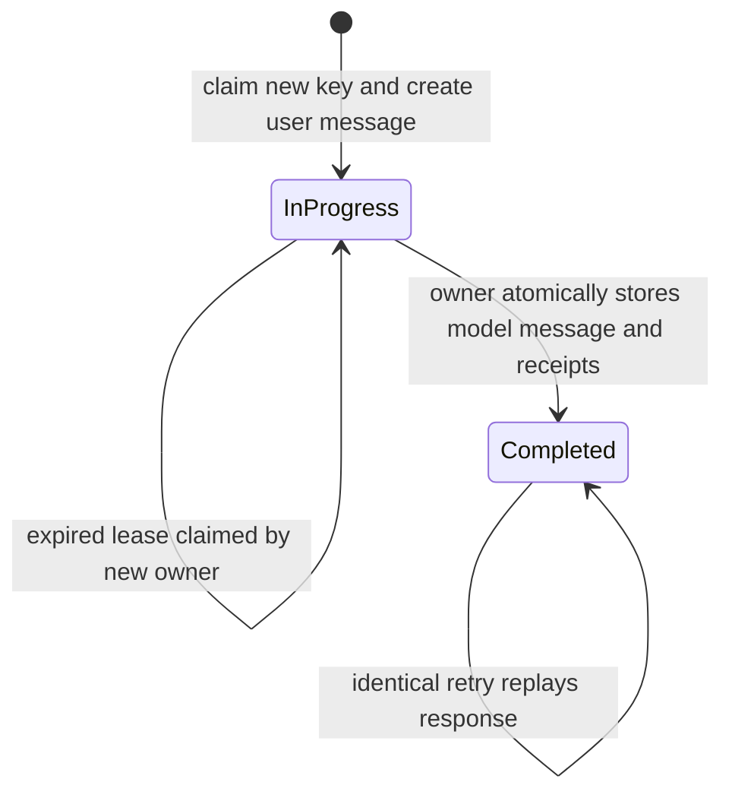

# Phase 3B Trusted Memory M6.2 Turn Idempotency Contract Design

## Status

Approved by the repository owner on 2026-08-20. This document authorizes no
production-code change. Implementation planning and source changes require
separate approval under [`AGENTS.md`](../../../AGENTS.md).

## Governing contracts

This design is subordinate to:

- [`AGENT_COL_IDENTITY_AND_ALIGNMENT.md`](../../../AGENT_COL_IDENTITY_AND_ALIGNMENT.md)
- [`DOCUMENTATION_AND_REPRODUCIBILITY_CONTRACT.md`](../../../DOCUMENTATION_AND_REPRODUCIBILITY_CONTRACT.md)
- [`2026-08-20-phase-3b-trusted-memory-design.md`](2026-08-20-phase-3b-trusted-memory-design.md)
- [`2026-08-19-hybrid-adk-supervisor-contract-design.md`](2026-08-19-hybrid-adk-supervisor-contract-design.md)

The purpose of idempotency is not merely to suppress duplicate database
records. It must preserve the integrity of one logical collaboration turn,
including its user message, explicit memory decision, model response, action
receipts, and adaptation receipts.

## Verified repository baseline

This design is based on repository commit
`e2917fe2e8b93cc2326c28e7ceac55ac8d0795bd`.

The current `/api/chat` flow:

1. validates the JSON request;
2. loads history and governed collaboration memory;
3. creates a new Firestore user-message document with an automatic ID;
4. applies an optional structured memory decision using that message ID as
   confirmation provenance;
5. invokes the bounded ADK supervisor;
6. creates a new Firestore model-message document with an automatic ID;
7. returns a typed `ChatResponse`.

The current flow is correct for one successful request but is not retry-safe:

- a provider error after the user-message write leaves a durable partial turn;
- retrying creates another user message;
- retrying an already-applied memory decision creates a different confirmation
  message ID and can conflict with the existing event;
- a provider response can be generated but lost before the model message or
  HTTP response is committed;
- two concurrent copies of the same client request can both invoke Gemini.

The accepted M6.1 live verification exposed this boundary directly: the first
cross-session request returned `502`, while the retry succeeded. The retry was
functionally useful, but the server had no durable identity tying both HTTP
attempts to one logical turn.

## Provider and platform constraints

The design relies on two documented Google Cloud behaviors:

- Firestore transactions are atomic and are automatically retried when a
  concurrently read document changes. Reads must occur before writes. This
  makes a single turn document a valid contention boundary for ownership.
  See [Firestore transactions and batched writes](https://cloud.google.com/firestore/native/docs/manage-data/transactions).
- Cloud Run can close the client connection and return `504` while the
  container continues processing the terminated request. A disconnected HTTP
  caller therefore cannot assume the original handler stopped. See
  [Cloud Run request timeouts](https://cloud.google.com/run/docs/configuring/request-timeout).

These constraints require both durable state and a lease-owner check. A client
retry alone is not a concurrency-control mechanism.

## Goals

M6.2 must:

1. let a client identify retries of one logical `/api/chat` turn;
2. preserve existing behavior for clients that do not opt into idempotency;
3. persist one logical user message and one logical model message per key;
4. reuse the same confirmation message ID for retried memory decisions;
5. prevent concurrent requests with one key from both owning the turn;
6. replay a completed typed `ChatResponse` without invoking the supervisor;
7. reject reuse of one key for a different request contract;
8. recover safely after retryable provider failures;
9. prevent a stale worker from completing a turn after another worker takes
   over an expired lease;
10. avoid placing raw user messages or API keys in the turn-control document;
11. keep logs free of message content, response content, profile values,
    memory values, identifiers, and idempotency keys;
12. state the exact delivery guarantees without claiming provider exactly-once
    execution.

## Non-goals

M6.2 does not:

- guarantee that Gemini executes exactly once across every process-crash
  boundary;
- make requests without an idempotency key retry-safe;
- add authentication, user ownership, rate limiting, or public-deployment
  authorization;
- redesign ADK session persistence;
- add background jobs, Cloud Tasks, Pub/Sub, or a general workflow engine;
- deduplicate semantically similar messages that use different keys;
- make GET, synthesis, or memory-management routes idempotent;
- define permanent retention or garbage collection for chat sessions;
- hide deterministic memory-domain conflicts behind a successful replay.

## Considered approaches

### Approach A: treat repeated memory decisions as duplicates

Change only the approval service so a second confirmation message ID is
accepted.

Decision: rejected. It hides one symptom while user messages, model messages,
provider calls, and response receipts can still duplicate.

### Approach B: process-local lock or cache

Keep active/completed keys in an in-memory dictionary protected by an async
lock.

Decision: rejected. Cloud Run can execute multiple instances, restart an
instance, or route a retry to another instance. Process memory is not a source
of truth.

### Approach C: idempotency key plus completed-response cache only

Store a response after success and replay it later.

Decision: rejected. This does not prevent two requests from concurrently
passing the cache miss and invoking Gemini, and it does not make the earlier
message or memory writes deterministic.

### Approach D: durable Firestore turn ledger with deterministic artifacts

Use one Firestore turn document as the transaction and lease boundary. Create
deterministic user/model message IDs, persist stable memory confirmation
provenance, and reconstruct completed responses from durable data.

Decision: selected. This is the smallest design that addresses the complete
logical-turn boundary and works across Cloud Run instances.

## Public HTTP contract

### Request

`POST /api/chat` accepts an optional HTTP header:

```text
Idempotency-Key: <client-generated opaque identifier>
```

The JSON `ChatRequest` contract remains unchanged. The key is transport-level
retry identity, not conversational content, so it does not belong in the JSON
body or Gemini context.

Key validation:

- optional;
- 1 through 128 ASCII characters after no normalization;
- allowed characters: letters, digits, underscore, and hyphen;
- whitespace, path separators, Unicode confusables, and all other punctuation
  are rejected with `422` before Firestore access;
- the key is case-sensitive and opaque;
- the server never logs or returns the key.

Clients should generate a fresh UUID-compatible value before the first attempt
and reuse that exact value only for retries of the same logical turn.
Keys are scoped to a session because the durable path is below
`sessions/{session_id}`. A client must still generate a new key for every new
turn, including turns in a different session.

### Compatibility

If the header is absent, `/api/chat` retains its current non-idempotent flow.
This avoids breaking existing terminal clients and tests. The future browser
workspace must send the header for every chat turn.

### Outcomes

| Condition | HTTP result | Provider invocation |
| --- | --- | --- |
| New valid key and request | Normal chat result | Once for the current owner |
| Completed key and identical request | `200` with the stored `ChatResponse` | None |
| Key owned by a live request | `409` with `Retry-After` | None for the contender |
| Expired/released key and identical request | Resume the existing turn | At most once for the new owner |
| Existing key and different request | `409` | None |
| Invalid key | `422` | None |
| No key | Existing behavior | Existing behavior |

The two `409` cases use distinct safe details:

- `"Chat turn is already in progress."`
- `"Idempotency key conflicts with a different chat request."`

No error detail includes IDs, keys, messages, profile data, or memory values.

## Request identity contract

An idempotent request is identical only when all of these fields match:

- `project_id`;
- `session_id`, implied by the turn-document path;
- `user_id`;
- `message`, compared against the existing deterministic user-message
  document;
- absence or presence of `memory_decision`;
- when present, `memory_decision.proposal_id` and
  `memory_decision.decision`;
- request-contract version.

The turn ledger stores bounded identifiers and decision metadata but does not
copy the raw user message. The transaction reads the referenced user-message
document when it must verify a retry. This avoids both raw-content duplication
and the false privacy promise of an unsalted message hash, which can be guessed
offline for low-entropy text.

## Firestore data contract

### Turn document

```text
sessions/{session_id}/turns/{turn_id}
```

`turn_id` is the lowercase hexadecimal SHA-256 digest of the validated ASCII
idempotency key. Hashing here is path derivation, not authentication or content
privacy. The raw idempotency key is not stored. A digest collision is treated
as ordinary request mismatch and returns `409` without mutation.

Version 1 fields:

```json
{
  "schema_version": "1.0",
  "status": "in_progress | completed",
  "project_id": "bounded identifier",
  "user_id": "bounded identifier",
  "memory_decision": {
    "proposal_id": "bounded identifier",
    "decision": "approve | reject"
  },
  "user_message_id": "deterministic identifier",
  "model_message_id": "deterministic identifier",
  "lease_owner": "unguessable server token",
  "lease_expires_at": "Firestore timestamp",
  "actions": [],
  "artifacts": [],
  "citations": [],
  "adaptations": [],
  "created_at": "server timestamp",
  "updated_at": "server timestamp",
  "completed_at": "server timestamp or absent"
}
```

`memory_decision` is `null` for an ordinary turn. Receipt arrays exist only on
a completed turn and must satisfy the same Pydantic bounds as `ChatResponse`.
The raw model response remains in the deterministic model-message document;
the turn document does not duplicate it.

### Deterministic message documents

```text
sessions/{session_id}/messages/turn--{turn_id}--user
sessions/{session_id}/messages/turn--{turn_id}--model
```

The user-message ID is also the memory-decision confirmation message ID. It
therefore remains stable across retries. Both derived IDs remain below the
repository's 128-character identifier limit.

The implementation must validate the key before constructing either document
ID. It must never accept caller-controlled slashes or arbitrary Firestore
paths.

### Retention

M6.2 does not add a TTL. Deleting a turn ledger while its deterministic message
documents remain would weaken conflict detection and replay behavior. Turn
retention must be designed together with session-retention and deletion policy
in a later bounded pass.

## Turn state machine



A key is never silently rebound to a different request. Request mismatch is a
terminal `409` for that attempt and does not mutate the existing turn.

## Ownership and lease contract

### Claim

`MemoryEngine.claim_chat_turn(...)` runs one Firestore transaction:

1. read the turn document;
2. when needed, read the deterministic user-message document;
3. validate request identity before any write;
4. if absent, create the in-progress turn and deterministic user message;
5. if completed and identical, return a replay result;
6. if in progress with an unexpired lease, return an in-progress result;
7. if in progress with an expired or explicitly released lease, replace the
   owner token and deadline and return a resume result.

The lease owner is a server-generated random token, not the idempotency key.
It must be generated once outside the Firestore transaction callback so an
automatic transaction retry does not change the logical ownership attempt.
The lease duration must exceed the supervisor's 90-second application timeout
and bounded persistence overhead. Version 1 uses 120 seconds. The clock is
injected for deterministic tests; server timestamps remain the audit time.

After context and an optional memory decision are prepared, the owner calls
`MemoryEngine.renew_chat_turn_lease(...)` immediately before provider
invocation. Renewal verifies the stored owner token and grants a fresh
120-second window. Version 1 does not add a background heartbeat: the existing
90-second supervisor timeout leaves a bounded completion margin. A later pass
must revisit this duration if provider or application timeouts increase.

### Completion

`MemoryEngine.complete_chat_turn(...)` runs one transaction that:

1. reads the turn document;
2. verifies `status == "in_progress"`;
3. verifies the caller still owns the stored lease token;
4. verifies the stored lease has not expired at `observed_at`;
5. creates or validates the deterministic model-message document;
6. stores validated response receipts;
7. changes the turn to `completed` and removes active lease fields;
8. updates the parent session timestamp.

If ownership changed, the stale worker cannot commit. This matters because a
Cloud Run request may continue after its client connection has timed out.

### Release after retryable failure

When supervisor generation returns a handled `502` or `504`, the current owner
attempts `MemoryEngine.release_chat_turn(...)`. Release verifies the owner token
and expires the lease without deleting the user message, memory event, or turn
document. The same key can then resume immediately.

Failure to release is logged safely and leaves the lease to expire. It must not
replace the original provider-facing HTTP error.

Firestore failure has an ambiguous commit boundary. The server must not guess
whether a failed persistence call committed. A retry with the same key re-reads
the durable turn and resolves the actual state.

## Application orchestration

For a request with an idempotency key, FastAPI owns this order:

1. validate the JSON body and header;
2. claim the durable turn;
3. return `409` for conflict or active ownership;
4. reconstruct and return the completed response for replay;
5. load bounded history and governed memory;
6. apply an optional memory decision using the deterministic user-message ID;
7. build model context from the resulting governed profile;
8. invoke the supervisor under the existing timeout;
9. atomically persist the deterministic model message, receipts, and completed
   turn state;
10. return the same validated `ChatResponse` represented by durable state.

The current headerless branch remains separate until a later migration makes
idempotency mandatory.

History loaded after the claim may already include the current deterministic
user message. The history renderer must exclude that message from prior-turn
context so the supervisor receives the current message exactly once through
`SupervisorTurnContext.message`. The persistence interface therefore adds a
bounded `exclude_message_id` option to `get_chat_history()`. When a 20-message
history is requested, it reads at most 21 newest documents, excludes the
current message by snapshot ID, and returns at most 20 prior messages in
chronological order. It does not expose Firestore document IDs in the public
history payload.

## Replay contract

A completed replay:

- performs no profile, history, memory-service, ADK, or Gemini call;
- reads and validates the deterministic model-message document;
- validates stored receipt arrays through `ChatResponse`;
- returns the same response body as the original completed turn;
- performs no Firestore write;
- returns `500` with a safe detail if completed durable state is internally
  inconsistent instead of fabricating a response.

Exact response replay is defined at the JSON contract level. JSON byte order,
HTTP date headers, and transport encoding are not part of the guarantee.

## Memory-decision idempotency

The turn contract and trusted-memory lifecycle reinforce each other:

- the deterministic user-message ID provides stable confirmation provenance;
- an approval or rejection that committed before a provider failure is safely
  recognized on resume;
- no second memory event is created;
- the completed chat response carries the same server-derived action and
  adaptation receipts;
- changing the proposal or decision while reusing the key is rejected before
  the memory service is called.

This does not weaken the existing memory conflict rules. It supplies the stable
request identity those rules require.

## Delivery guarantees and hard limitation

M6.2 guarantees:

- at most one unexpired lease owner per idempotency key;
- one logical deterministic user-message document per key;
- one logical deterministic model-message document per completed key;
- stable memory confirmation provenance;
- no concurrent provider call by a correctly functioning second owner while
  the first lease is valid;
- replay of a durably completed response without another provider call.

M6.2 cannot guarantee exactly-once Gemini execution if the process crashes
after Gemini completed but before Firestore recorded completion. After the
lease expires, a new owner must invoke Gemini again because no durable response
exists. This is an unavoidable external-side-effect ambiguity without a
provider-supported idempotency token or durable provider job identifier.

The honest claim is **effectively-once durable turn completion with possible
duplicate provider computation in the crash window**, not exactly-once model
execution.

## Error translation

New internal result/error types must remain separate from provider and memory
domain failures:

- `ChatTurnConflictError`: same key, different request;
- `ChatTurnInProgressError`: valid request currently leased;
- `ChatTurnOwnershipError`: stale worker attempted release or completion;
- `ChatTurnStateError`: stored turn/message/receipt state is invalid.

Firestore `GoogleAPIError` remains translated to `MemoryEngineError` with the
original exception preserved as the cause. Logs identify only operation and
exception type.

## Security and privacy boundaries

- The idempotency key is not authentication and grants no ownership.
- The route remains local-development-only until Phase 5 authentication and
  authorization exist.
- The turn document does not store raw user or model text.
- Raw text remains in the existing chat-message documents and receives the
  same Firestore access controls and future deletion policy.
- Receipts may contain approved collaboration values and are private user data;
  they must not be logged.
- No request, profile, history, response, receipt, identifier, lease token, or
  idempotency key appears in application logs.
- Safe logs may include only operation name, state category, HTTP status class,
  and exception class.

## TDD acceptance contract for implementation

Implementation must begin with focused RED tests proving, independently:

1. an invalid idempotency key returns `422` before database or provider access;
2. path derivation produces the specified SHA-256 `turn_id` and bounded
   deterministic message IDs without storing the raw key;
3. a new key atomically creates one turn and one deterministic user message;
4. a completed identical retry returns the original `ChatResponse` without
   calling profile/history loaders, memory service, supervisor, or writes;
5. the same key with a changed message, user, project, or memory decision
   returns `409` without mutation;
6. an unexpired lease returns `409` and does not invoke the supervisor;
7. an expired lease can be claimed by one new owner under contention;
8. two concurrent claims cannot both become owners;
9. a stale, released, or expired owner cannot complete a turn, and a stale
   owner cannot release a reclaimed turn;
10. transaction retries reuse one owner token generated outside the callback;
11. lease renewal verifies ownership immediately before provider invocation;
12. completion atomically writes the deterministic model message, receipts,
   parent timestamp, and completed status;
13. a provider failure releases the lease and retry does not duplicate the user
    message or memory event;
14. a retried approval reuses the exact confirmation message ID;
15. excluding the current message still returns up to 20 prior messages in
    chronological order;
16. corrupted completed state returns a safe `500` and no provider call;
17. missing `Idempotency-Key` preserves the existing route behavior;
18. failure logs exclude request content, response content, profile values,
    memory values, all identifiers, lease tokens, and idempotency keys.

Firestore transaction tests must verify reads-before-writes and automatic
transaction callback safety. Route tests may use deterministic fakes, but the
persistence tests must assert the actual document paths, transaction writes,
ownership checks, and no-write branches.

## Manual runtime acceptance targets

The eventual implementation pass is not accepted until the user verifies:

1. send one chat request with a fresh key and receive `200`;
2. repeat the identical request with the same key and receive the same JSON
   body without another model request appearing in runtime logs;
3. inspect Firestore and confirm one turn, one user message, and one model
   message exist for the key;
4. reuse the key with changed message text and receive `409` while Firestore is
   unchanged;
5. exercise a memory-approval request, force or observe one retryable provider
   failure, retry with the same key, and confirm one approval event with one
   stable confirmation message ID;
6. start a new session and confirm the approved preference still adapts the
   response;
7. confirm the existing headerless curl command still works.

## Proposed implementation decomposition

Source work should remain reviewable through three separately approved passes:

### M6.2.1: persistence primitives

- typed claim/replay/resume results;
- deterministic message IDs;
- Firestore claim, release, and completion transactions;
- focused offline database tests.

### M6.2.2: FastAPI orchestration

- optional header validation;
- idempotent `/api/chat` branch;
- conflict/error translation;
- supervisor and trusted-memory integration tests.

### M6.2.3: live reliability evidence and documentation

- a deterministic smoke runner for new/replay/conflict paths;
- explicit manual Firestore verification instructions;
- local setup, testing, troubleshooting, and API contract documentation;
- no new production behavior unless a separately approved correction is
  required by live evidence.

Each source-changing pass requires its own bounded plan, explicit approval,
RED-GREEN-REFACTOR evidence, focused verification, and user manual acceptance
before checkpointing.

## Review decisions required before implementation planning

The user should approve or revise these five decisions:

1. `Idempotency-Key` remains optional for backward compatibility in M6.2.
2. Firestore is the durable arbitration boundary; process-local locks are not.
3. turn records contain bounded metadata and receipts but no raw chat text.
4. version 1 uses a 120-second renewable/reclaimable lease.
5. the project claims effectively-once durable completion, not exactly-once
   Gemini execution.
