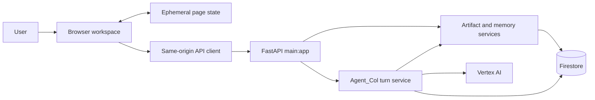

# Phase 4A.1 Lightweight Browser Workspace Boundary Design

## Status and authority

Approved by the repository owner for design work on August 23, 2026. This
document defines the target boundary for the first Agent_Col browser workspace.
It does not authorize frontend implementation, dependency changes, new API
contracts, authentication, deployment, or any other source-behavior change.

This design is subordinate to:

- [`AGENTS.md`](../../../../AGENTS.md);
- [`docs/design/AGENT_COL_IDENTITY_AND_ALIGNMENT.md`](../../../design/AGENT_COL_IDENTITY_AND_ALIGNMENT.md);
- [`docs/design/BACKEND_FRONTEND_INTEGRATION_CONTRACT_INVENTORY.md`](../../../design/BACKEND_FRONTEND_INTEGRATION_CONTRACT_INVENTORY.md);
- [`docs/design/DOCUMENTATION_AND_REPRODUCIBILITY_CONTRACT.md`](../../../design/DOCUMENTATION_AND_REPRODUCIBILITY_CONTRACT.md);
- [`2026-08-23-m8-col-1-judge-facing-collaborative-artifact-loop-design.md`](../../backend/artifacts/2026-08-23-m8-col-1-judge-facing-collaborative-artifact-loop-design.md).

The backend-to-frontend integration inventory is the primary integration
reference for this design. Executable source controls if that inventory later
drifts. Suggestive documents in the repository owner's Downloads directory
informed the interaction and visual direction but are not authority over the
implemented backend:

- `Agent_Col_Frontend_Design_Specification_UX_Mechanics_Revision.md`;
- `Agent_Col_Frontend_Design_Specification_Deployment_Context_Additions.md`;
- `Agent_Col_Economic_UI_Implementation_Focus_Specification.md`.

## Executive decision

The first workspace will be a same-origin, server-served HTML, CSS, and
JavaScript application. FastAPI will serve the workspace shell and static
assets from the existing application process. The browser will communicate
only through the accepted HTTP JSON contracts listed in the integration
inventory.

The initial frontend will use:

- semantic HTML;
- hand-authored CSS with custom properties;
- dependency-free JavaScript ES modules;
- relative same-origin API paths;
- browser-native APIs for requests, identifiers, and JSON downloads;
- Python tests for the FastAPI/static boundary;
- Node's built-in test runner for pure JavaScript contracts.

It will not introduce React, Vite, TailwindCSS, a component library, a package
manager dependency, a separate frontend service, a CDN, or direct browser
access to Google Cloud services.

The workspace will demonstrate the smallest honest collaboration loop:

1. the user enters a local development context;
2. the user converses with Agent_Col;
3. the interface shows authoritative actions, citations, pending memory, and
   adaptation receipts;
4. Agent_Col can create one supported Work artifact through idempotent chat;
5. the user reviews the canonical Work detail;
6. the user records explicit artifact feedback;
7. the user inspects and controls governed collaboration memory;
8. a new local conversation can demonstrate cross-session adaptation.

The interface will not claim persistent conversation restoration. The active
transcript exists in page state only because the backend exposes no session or
message read API.

## Reconciliation of suggestive UX material

The accepted UI direction is conversation-first, calm, professional,
domain-neutral, and progressively disclosed. The following corrections keep
that direction honest against the current backend.

| Suggestive concept | Phase 4A.1 decision | Reason |
| --- | --- | --- |
| Conversation history | Show only the active page transcript | No client-readable session-history API exists |
| Sessions navigation | Do not render it | No session list, create, detail, or history contract exists |
| Projects navigation | Use one local development project context | No project list, create, or ownership contract exists |
| Context requirements and sources | Show structured citations and receipts on the originating turn only | No general requirements/source read models exist |
| Work types including research, code, plans, data, and images | Render only `synthesis_blueprint` artifacts | It is the only implemented artifact type |
| Work versions and change comparison | Do not render version controls | Parent-based generation and version comparison are not implemented |
| Verification section | Show completed `verify_requirements` receipts only | There is no persistent verification-artifact read model |
| Activity history | Show activity from the active transcript only | No independent activity-history API exists |
| Background Work | Keep completely hidden | No durable job or status API exists |
| Capabilities/settings navigation | Do not render it | No capability discovery or management API exists |
| Native file chooser export | Provide a normal browser JSON download | Native file-system access is not portable or required |
| Fifteen-percent drawer width | Use responsive bounded widths | A narrow percentage cannot hold real memory and feedback controls |
| Rich Markdown rendering | Begin with safe plain-text presentation | No vetted renderer or sanitizer is installed |
| User profile/account shell | Show a local-development context label | There is no authenticated user principal |

## Product goal

The browser should let a judge understand, without relying only on narration,
that Agent_Col is a collaborative partner with governed continuity rather than
a generic chat wrapper.

The interface must make these facts observable:

- conversation remains the primary relationship surface;
- tool use is restrained and reported through verified receipts;
- structured Work is durable and inspectable;
- project-scoped artifact feedback is explicit and reversible through
  supersession;
- collaboration memory is proposed, approved, inspectable, revocable, and
  deletable;
- adaptations are explained by verified memory receipts;
- Agent_Col remains responsible for every user-facing response.

## Goals

Phase 4A must:

1. provide a clean, accessible chat transcript and message composer;
2. use `POST /api/chat` as the primary interaction boundary;
3. assign and retain one idempotency key for every submitted turn;
4. distinguish an HTTP response from authoritative completion receipts;
5. show actions, citations, Work references, feedback references, pending
   memory proposals, and adaptation receipts without inferring them from prose;
6. load canonical Work list and detail data through the implemented read APIs;
7. render only schema-2.0 `synthesis_blueprint` artifacts;
8. submit accepted, rejected, and edited feedback through structured chat;
9. inspect and control governed memory through the implemented memory APIs;
10. expose partial completion honestly when response generation fails after a
    durable effect;
11. support a deliberate new-conversation action for cross-session memory
    demonstrations;
12. remain usable by keyboard and at desktop and narrow viewport widths;
13. avoid content-bearing application logs and unsafe HTML rendering;
14. remain compatible with a later authenticated identity boundary;
15. preserve the existing FastAPI health endpoint and backend behavior.

## Non-goals

Phase 4A will not:

- implement Google sign-in, OAuth, OIDC, Firebase Authentication, or Identity
  Platform;
- claim that a development locator is authentication;
- retrieve or restore prior session transcripts;
- list, name, resume, delete, or synchronize sessions;
- list, create, rename, or delete projects;
- add a dedicated artifact-feedback write endpoint;
- invoke `POST /api/synthesize` as the normal user workflow;
- add artifact editing, mutation, parent-based generation, version comparison,
  or deletion;
- add background jobs, polling, cancellation, notifications, or streaming;
- add uploads, drag and drop, PDF parsing, images, voice, MCP, messaging, or
  workspace execution;
- expose routing directives, prompts, model reasoning, chain-of-thought, raw
  history context, or provider traces;
- add a capability picker or expert-selection control;
- add analytics, dashboards, animations, or decorative visual effects;
- create a general design system or reusable component package;
- make the browser authoritative for validation, persistence, memory, or
  artifact ownership;
- redesign synthesis schema 2.0 or any accepted backend contract.

## Considered approaches

### Approach A: same-origin dependency-free workspace

FastAPI serves a small HTML shell, CSS file, and JavaScript module graph. The
browser calls relative API paths on the same origin.

Benefits:

- smallest build and dependency surface;
- no CORS configuration;
- one process and one future Cloud Run service;
- no external assets or package installation;
- direct fit with the accepted backend contracts;
- fastest path to a reliable submission demo.

Costs:

- application state and components require deliberate module boundaries;
- no framework-provided rendering or accessibility primitives;
- complex future UI growth may eventually justify migration.

Decision: selected.

### Approach B: React and Vite application

A compiled React application consumes the same backend APIs and is served by
FastAPI or deployed separately.

Benefits:

- mature component and testing ecosystem;
- familiar state and view composition patterns;
- easier growth into a larger application.

Costs:

- introduces Node package dependencies, lockfiles, build configuration, and
  bundle integration before they are needed;
- increases the debugging and supply-chain surface;
- does not solve any current backend limitation;
- consumes development resources without strengthening the judged proof.

Decision: rejected for the initial workspace.

### Approach C: independent frontend service

A separately deployed frontend communicates with the FastAPI backend over a
cross-origin boundary.

Benefits:

- independent deployment lifecycle;
- potential CDN and static-hosting optimization.

Costs:

- requires CORS, separate deployment configuration, environment-specific API
  origins, and coordinated authentication;
- creates a second operational surface;
- weakens the simplest path to Cloud Run submission.

Decision: rejected for the initial workspace.

## Target architecture



The browser is a presentation and request-construction boundary. FastAPI and
its application services remain authoritative for validation, orchestration,
effects, replay, and persistence.

## HTTP and static-asset boundary

The implementation plan should add one browser entry route and one bounded
static namespace:

```text
GET /workspace
GET /static/agent-col/*
```

`GET /` remains the existing JSON liveness endpoint. Phase 4A must not silently
replace it because tests, local checks, and deployment probes already depend on
that contract.

The workspace uses relative URLs such as `/api/chat`. No configurable remote
API origin, CORS middleware, proxy protocol, or browser-held Google credential
is needed.

All scripts and styles are local static assets. The HTML contains no inline
script and no third-party CDN dependency, preserving a clean future Content
Security Policy boundary.

## Proposed frontend module boundary

The later implementation plan should preserve small modules with one clear
responsibility:

```text
frontend/
  index.html          semantic application shell
  styles.css          tokens, layout, responsive and state styling
  app.mjs             composition and event wiring
  api.mjs             same-origin HTTP client and error normalization
  requests.mjs        validated request and idempotency construction
  state.mjs           ephemeral state transitions
  render.mjs          safe DOM rendering primitives
  chat-view.mjs       transcript, composer, and turn receipts
  work-view.mjs       artifact list, detail, export, and feedback UI
  memory-view.mjs     profile, proposals, events, and lifecycle controls
```

This is a target decomposition, not authorization to create these exact files.
The implementation plan may combine a pair of very small modules, but it must
not collapse API transport, state, and DOM rendering into one monolithic file.
The `.mjs` extension keeps the browser and Node test boundary explicitly
module-based without adding a `package.json` solely to declare module type.

## Local development identity and context

The current backend has no end-user authentication. `user_id`, `project_id`,
and `session_id` are caller-supplied Firestore locators, not verified identity
or ownership.

The first workspace therefore begins with a small local-development context
gate:

- `project_id` defaults to `agent-col` and remains editable for local testing;
- `user_id` is required and must pass the backend identifier pattern;
- `session_id` is generated by the browser with `crypto.randomUUID()` after
  the context is accepted;
- the entered values remain in page memory only;
- the top bar continuously shows `Local development mode`;
- nearby text states that these values are not authentication;
- no password, access token, ADC credential, or service-account value is ever
  accepted by the form.

The browser must validate identifier shape before enabling entry, but backend
validation remains authoritative.

This gate is a temporary development adapter, not an account system. The later
authentication design must replace it with a server-verified principal and
ownership-derived project/session context rather than styling the gate as a
sign-in screen.

### New conversation behavior

The workspace exposes `New conversation` as a deliberate local action. It:

1. warns if a request is currently pending;
2. clears the active page transcript and transient activity state;
3. generates a new `session_id`;
4. retains the current development `user_id` and `project_id`;
5. refreshes memory and Work metadata;
6. does not delete any Firestore data.

This supports the accepted cross-session adaptation demonstration without
claiming session management. It must not be labeled delete, archive, or close
because the backend performs none of those operations.

A page reload also loses the active transcript. The empty state must say that
conversation restoration is not available in this local version. It must not
suggest that persisted backend messages have been deleted.

## Information architecture

### Application shell

The shell has four regions:

```text
+-------------------------------------------------------------------+
| Agent_Col | Local development mode | New conversation             |
+-------------------------------------------------------------------+
| Supporting panel | Conversation workspace | Work review panel     |
| collapsed default| primary surface        | collapsed default     |
+-------------------------------------------------------------------+
```

The conversation remains visually dominant. Supporting controls use
progressive disclosure and never become a dashboard around a small chat box.

### Top bar

The top bar contains:

- the Agent_Col product name;
- the local-development status label;
- a supporting-panel control;
- a Work-panel control when Work exists;
- the `New conversation` action.

It does not contain a fake avatar menu, account menu, project switcher,
capability picker, billing control, or deployment status.

### Supporting panel

The left supporting panel is collapsed by default and uses three implemented
sections:

1. **Work** — bounded blueprint list for the active project;
2. **Memory** — active profile, pending proposals, and lifecycle events;
3. **Activity** — observable receipts from the active page transcript.

It does not render Sessions, Projects, Settings, Capabilities, Background Work,
Requirements, Sources, or persistent History navigation. Citations remain
attached to the turn that returned them; the Work list and memory history come
from their authoritative APIs.

At desktop widths the panel is an overlay with a responsive width equivalent
to `min(90vw, 26rem)`. At narrow widths it occupies the available viewport.
These values are initial verification targets, not a general design token
system.

### Conversation workspace

The center surface contains:

- an honest empty state;
- the active page transcript;
- user messages;
- Agent_Col responses;
- clarification responses;
- per-turn status and retry controls;
- structured action, citation, Work, feedback, memory-proposal, and adaptation
  receipts;
- an anchored composer.

The empty state should explain the core interaction in one short paragraph and
offer two or three text-only example prompts. It must not advertise an
unsupported capability.

The transcript must distinguish user-authored messages, structured lifecycle
decisions, and Agent_Col responses without presenting internal orchestration as
a separate speaking agent.

### Composer

The composer uses a labeled multiline text area and submit button.

Required behavior:

- Enter submits when no modifier is held;
- Shift+Enter inserts a newline;
- empty or whitespace-only input cannot submit;
- the 10,000-character backend limit is visible before submission;
- one ordinary turn may be pending at a time;
- disabling submit does not erase the draft;
- request progress uses clear text, not an artificial typing animation;
- the user can retry a failed exact request with its original idempotency key;
- aborting the browser wait is not described as cancelling backend work.

The initial implementation does not include attachments, prompt templates,
voice input, model selection, expert selection, slash commands, or streaming.

### Work review panel

The right panel is collapsed until an `ArtifactReference` is selected. It has
two responsive states:

- **Review** — conversation remains visible beside a bounded Work panel;
- **Focus** — Work occupies the primary viewport and conversation is hidden
  behind a clear return control.

At narrow widths, opening Work always uses focus mode. The implementation must
not rely on fixed percentage widths that cut off structured fields.

The panel renders only the canonical detail returned by:

```text
GET /api/projects/{project_id}/blueprints/{blueprint_id}
```

It never reconstructs a blueprint from the chat response.

## Visual language

The visual direction is calm, compact, professional, modern, and
security-conscious. Intelligence should come from the collaboration behavior,
not visual noise.

### Color

- graphite and charcoal surfaces form the dark-first base;
- soft white is used for primary text;
- muted neutral text is used only where contrast remains accessible;
- cyan is reserved for focus, selection, active controls, links, and verified
  progress;
- success, warning, and error states use both text/iconography and color.

CSS custom properties define the palette. The initial implementation honors
`prefers-color-scheme` for dark and light presentation but does not require a
settings screen or persisted theme preference.

### Typography

Use a system sans-serif stack to avoid font downloads. Monospace is reserved
for code, identifiers, and exact structured values. Comfortable line length
and spacing take precedence over density.

### Icons and motion

Controls should use clear text labels. Small inline SVG icons may supplement a
label but must not become the only accessible name. No icon package is needed.

Motion is limited to state communication, uses approximately 150–250 ms, and
is disabled or reduced under `prefers-reduced-motion`. There are no glows,
particle effects, artificial typing effects, or decorative transitions.

## Safe content rendering

Backend content, model output, blueprint fields, memory values, feedback, and
citation labels are untrusted text.

The initial renderer must:

- construct DOM nodes through browser APIs;
- assign untrusted strings through `textContent`;
- never inject backend values through `innerHTML`;
- display Agent_Col response text with preserved whitespace and wrapping;
- render structured lists from structured response fields;
- accept citation links only from the structured `citations` array;
- require HTTP or HTTPS citation schemes;
- open external citations with `rel="noopener noreferrer"`;
- avoid rendering HTML embedded in model prose;
- avoid logging request or response bodies to the console.

Rich Markdown, syntax highlighting, mathematical rendering, and embedded HTML
are deferred. Plain-text preservation is less polished but is the correct
security and dependency trade-off for the initial workspace.

## Frontend state boundary

All initial workspace state is ephemeral and scoped to the current page:

```text
DevelopmentContext
  projectId
  userId
  sessionId

ConversationState
  draft
  turns[]
  pendingTurn

WorkState
  summaries[]
  nextBefore
  selectedDetail
  feedbackHistory
  loading/error state

MemoryState
  profile
  unresolvedProposals[]
  events[]
  nextEventId
  loading/error state

ViewState
  supportingPanel
  supportingSection
  workPanelMode
  focusedControl
```

The application does not persist transcript content, memory values, feedback,
artifact bodies, or API responses in `localStorage`, IndexedDB, cookies, or a
service worker. Firestore remains the durable source of truth behind the
backend.

An idempotency key and exact pending request remain in page state until that
turn reaches a terminal UI state. This is necessary for safe exact retry.

## API client contract

The client has one transport module responsible for:

- same-origin JSON requests;
- request timeout and `AbortController` management;
- JSON and empty-body response handling;
- `Retry-After` capture;
- normalization of FastAPI validation arrays and ordinary `detail` errors;
- preservation of non-2xx response bodies;
- differentiation of network, timeout, validation, conflict, server, and
  partial-completion outcomes.

The transport must not automatically retry mutation requests. Retry policy is
owned by the interaction that retains the exact request and idempotency key.

The client does not derive success from status code alone. Chat processing
must inspect structured receipt fields after decoding a valid response.

## Chat and idempotency flow

### Ordinary turn

For every submitted turn, the browser:

1. trims only the decision to reject an empty message; it preserves the exact
   authored message otherwise;
2. generates a key such as `turn_<uuid-without-hyphens>` that conforms to the
   accepted identifier pattern;
3. constructs one immutable `ChatRequest` snapshot;
4. renders the user message with a pending state;
5. sends `POST /api/chat` with the matching `Idempotency-Key` header;
6. decodes either `ChatResponse`, `ChatPartialFailureResponse`, or a documented
   error envelope;
7. attaches authoritative receipts to that turn;
8. refreshes Work or memory only when matching completed receipts indicate a
   durable effect;
9. retains the exact request and key if the outcome permits a safe retry.

The UI must never create an action badge by parsing phrases such as “I
searched” or “I created” from Agent_Col prose.

### Exact retry

If the browser times out, loses the network, or receives an active-turn
conflict, `Retry` resends the exact serialized request with the original key.
The user cannot edit that retained request in place. Editing creates a new turn
and new key.

When HTTP 409 includes `Retry-After`, the UI shows that processing may still be
active and may enable retry after the indicated interval. It must not promise
that the original worker was cancelled.

If HTTP 409 reports that the key conflicts with a different request, the UI
shows a terminal integrity error and does not retry automatically.

### Headerless behavior

The workspace never intentionally submits headerless chat. Headerless chat
lacks durable replay and cannot select the v4 artifact route. Developer curl
compatibility remains a backend concern, not a browser mode.

## Receipt presentation

Each Agent_Col turn may contain zero or more verified receipt groups.

### Actions

Render `actions` as concise completed-operation rows using the server-provided
`action_name`. The frontend may map the finite accepted names to human labels,
for example:

| Action name | Human label |
| --- | --- |
| `synthesize_project` | Work created |
| `google_search` | Public research completed |
| `url_context` | Supplied source reviewed |
| `run_computation` | Computation completed |
| `verify_requirements` | Requirements checked |
| `record_blueprint_feedback` | Work feedback recorded |
| `propose_memory_signal` | Memory proposal created |
| `approve_memory_signal` | Memory proposal approved |
| `reject_memory_signal` | Memory proposal rejected |
| `revoke_memory_signal` | Memory preference revoked |
| `delete_memory_signal` | Memory preference deleted |

Unknown future values must use a neutral safe label rather than breaking the
complete response view.

### Citations

Render citations only from `citations`, preserving the server label and URI.
Do not scrape Markdown links from `response` into the receipt list. A response
with no structured citation receives no citation badge even if prose contains
a URL.

### Artifacts

Render each `ArtifactReference` as a Work-created receipt with its display
label and an `Open Work` control. Opening it always loads canonical detail
before rendering.

### Memory proposals and adaptations

Pending memory receipts must say `Pending approval`; they must not say learned,
remembered, or active. Adaptation receipts may say which approved category and
value were supplied to the model, but must not expose hidden prompts or imply
that an unsupplied preference affected the turn.

### Partial completion

HTTP 502 or 504 with a valid `ChatPartialFailureResponse` is not rendered as a
total failure. The turn shows:

- a clear response-generation failure;
- every authoritative completed action or effect receipt;
- a Work or memory refresh when those receipts require it;
- an exact-retry option using the original key.

The browser must not discard a completed artifact or feedback receipt merely
because conversational response generation failed afterward.

## Work list and detail flow

### List

The supporting panel requests:

```text
GET /api/projects/{project_id}/blueprints?limit=20
```

It renders newest-first metadata:

- display label;
- created time;
- feedback counts;
- verified adaptation categories;
- an open-detail control.

`next_before` drives an explicit `Load more` action. The client does not guess
cursor values or fetch unbounded pages.

### Detail

The Work panel renders these schema-2.0 sections from the canonical response:

1. conceptual model;
2. architectural decisions and alternatives;
3. Socratic clarifying questions and suggested options;
4. execution roadmap and verification steps;
5. diagnostic warnings;
6. verified adaptations;
7. active feedback counts and feedback targets.

Every field is rendered structurally and escaped as text. Empty optional
collections use a concise empty state rather than disappearing ambiguously.

The panel may show exact artifact and schema identifiers in a collapsed
`Technical details` region. Identifiers should not dominate the default Work
presentation.

### Export

The initial export control downloads the canonical detail response as UTF-8
JSON using a browser `Blob` and object URL. The filename contains a sanitized
display label and artifact identifier. The control is labeled `Download JSON`,
not `Export document`, because no canonical Markdown, PDF, or DOCX contract
exists.

The download is a client copy of an immutable canonical response. It does not
create a new artifact, change persistence, or open a native file-system API.

### Unsupported schema

HTTP 409 for a legacy or unsupported blueprint schema produces a bounded
unavailable message. The browser does not attempt to coerce or partially
render legacy content.

## Artifact feedback flow

Feedback is always attached to a server-issued `feedback_target`. The browser
never accepts JSONPath, field names, array indexes, or arbitrary mutation paths.

The feedback form requires:

- one target from canonical detail;
- `accepted`, `rejected`, or `edited`;
- bounded user-authored feedback text;
- correction text only when `edited`;
- the detail response's schema version;
- an optional active feedback ID when explicitly superseding prior feedback.

Submission uses structured `artifact_feedback_decision` through idempotent
`POST /api/chat`. The visible transcript must show that the user recorded an
artifact decision; the request may use a concise, deterministic visible
message describing that chosen action.

After a completed `record_blueprint_feedback` receipt, the client refreshes:

- canonical Work detail;
- feedback history;
- Work-list feedback counts.

The UI never edits the stored blueprint in place and never describes an
`edited` decision as an applied artifact revision. It is immutable feedback
evidence only.

### Feedback history and supersession

The feedback view requests bounded pages from:

```text
GET /api/projects/{project_id}/blueprints/{blueprint_id}/feedback?limit=20
```

It displays active and superseded status, decision, user text, correction text,
target label when resolvable, creation time, and predecessor/successor
relationships. A superseded event remains visible as history.

Only an active compatible event may be offered as a supersession candidate.
HTTP 409 from a stale or conflicting command causes the client to refresh
history before another attempt.

Artifact feedback must never create a memory badge or claim a global
preference was learned.

## Governed-memory flow

### Inspection

The Memory section calls:

```text
GET /api/users/{user_id}/memory
```

It separates:

- approved active preferences;
- approved low-sensitivity identity context;
- pending proposals;
- lifecycle events and provenance.

Empty memory must be presented as a valid governed state, not an error.

`next_event_id` drives explicit bounded pagination. Raw internal profile fields
that are not part of the public response are never invented or requested.

### Proposal approval and rejection

Each unresolved proposal exposes explicit `Approve` and `Reject` controls. The
control submits `memory_decision` through idempotent `POST /api/chat` with a
visible deterministic message describing the decision.

The proposal remains pending until a completed `approve_memory_signal` receipt
is returned. HTTP 410 marks an expired proposal and triggers a memory refresh.
HTTP 409 triggers a refresh before another decision.

### Revocation

An active signal may be revoked through the dedicated revoke endpoint. The UI
requires confirmation that revocation disables future use but preserves
history. A successful response replaces the displayed profile with the
returned authoritative profile.

### Hard deletion

Hard deletion is visually distinct and requires explicit confirmation. The
confirmation explains that the bounded signal artifacts are deleted and that
unrelated project feedback and Work are not deleted.

After HTTP 204, the client refreshes memory because the endpoint intentionally
returns no updated profile and does not state whether data previously existed.

The frontend does not add correction controls that have no matching public
request contract.

## Loading, empty, and failure states

Every independently loaded surface owns visible loading, empty, success, and
error states. A Work-list failure must not erase the chat transcript. A memory
failure must not block ordinary chat. A chat failure must not hide canonical
Work already loaded.

### Error classification

| Condition | Required presentation |
| --- | --- |
| Network failure | Connection error with exact-retry option where safe |
| Browser timeout | Timed-out wait; explain backend work may continue; preserve key |
| HTTP 404 | Requested proposal, signal, Work, target, or cursor unavailable |
| HTTP 409 with `Retry-After` | Turn may still be active; delay exact retry |
| HTTP 409 request conflict | Terminal idempotency integrity error |
| HTTP 409 stale Work/feedback | Refresh canonical state before resubmission |
| HTTP 410 | Memory proposal expired; refresh memory |
| HTTP 422 validation array | Show concise field errors without dumping payloads |
| HTTP 500 | Backend persistence or stored-state error |
| HTTP 502/504 with partial receipts | Preserve and display completed effects |
| HTTP 502/504 without receipts | Routing, provider, responder, or timeout failure |
| Invalid JSON/unknown envelope | Protocol error; do not infer completion |

Detailed raw responses may be available in development diagnostics only if
they contain no user content. The normal UI should show actionable summaries,
not stack traces or provider exception names.

### Request concurrency

The first implementation permits:

- one pending chat or structured chat decision at a time;
- one Work list request;
- one Work detail request;
- one feedback-history request;
- one memory inspection request.

Opening a new Work detail aborts only the obsolete browser read. It does not
cancel backend mutations. Mutation controls are disabled while the matching
operation is pending.

## Accessibility contract

The initial workspace must meet these observable requirements:

- semantic `header`, `main`, `nav`, `aside`, `form`, and button elements;
- a skip link to the conversation workspace;
- explicit labels for every input and text area;
- logical document and tab order;
- visible keyboard focus on every interactive control;
- Enter and Shift+Enter composer behavior as documented;
- Escape closes the topmost overlay and returns focus to its trigger;
- opening a panel moves focus to a meaningful heading or first control;
- modal confirmations trap focus while open and restore it when closed;
- pending status uses a polite live region;
- destructive errors use an assertive live region sparingly;
- receipts and errors do not rely on color alone;
- touch targets remain usable on narrow screens;
- text can zoom to 200 percent without loss of control access;
- reduced-motion preferences are respected;
- light and dark system preferences retain readable contrast.

The implementation pass requires manual keyboard and screen-size verification.
Automated markup tests are useful but cannot establish complete accessibility.

## Responsive behavior

The design uses content-driven CSS rather than device-specific JavaScript.

### Wide viewports

- conversation is centered with a readable maximum line length;
- the supporting panel overlays from the left;
- Work review may occupy a substantial right-side region;
- focus mode can make Work the primary surface;
- closing either panel restores the uninterrupted conversation layout.

### Narrow viewports

- the top bar keeps only essential labels and controls;
- the supporting panel becomes a full-height overlay;
- Work opens as a full-viewport focus surface;
- the composer remains reachable above the on-screen keyboard;
- long URLs, identifiers, code, and generated text wrap or scroll within their
  own bounded region;
- no horizontal page-level scroll is permitted.

Representative manual widths are 1440 px, 1024 px, 768 px, and 390 px. These
are verification samples rather than CSS device classes.

## Performance and resource boundaries

The workspace should load without a JavaScript build step or third-party
network request.

Initial implementation targets:

- local static assets remain small and unminified for auditability;
- no framework runtime or icon/font bundle;
- no eager artifact-detail or feedback-history fetch;
- Work and memory fetch only when their section is first opened or after a
  matching completed effect;
- one page of bounded list/history data is retained at a time unless the user
  requests more;
- DOM updates are scoped to the affected turn or panel;
- no polling;
- no content-bearing browser console logging.

The synchronous backend remains the dominant latency. Artificial progress
percentages would be dishonest; the UI should instead state the current phase
in bounded terms such as `Waiting for Agent_Col`.

## Security and privacy invariants

- Browser code never receives ADC, service-account credentials, provider API
  keys, or direct Firestore authority.
- All API calls are relative and same-origin.
- Request-provided development identifiers are visibly labeled insecure.
- The browser never turns feedback into memory or memory into artifact
  mutation.
- The browser never fabricates server-owned IDs.
- Only server-issued feedback target IDs are submitted.
- Backend and model text is rendered as untrusted content.
- No user message, response, memory value, feedback, or blueprint body is
  written to browser console logs.
- No transcript or personal data is persisted in browser storage.
- External citations cannot access `window.opener`.
- Destructive memory deletion requires explicit confirmation.
- The workspace must not be deployed publicly before authenticated ownership,
  rate controls, and hosted security review exist.

## Testing strategy for later implementation

Phase 4A implementation is source-changing work and must use the repository's
required RED–GREEN–REFACTOR workflow. This design pass itself changes no source
behavior and therefore has no TDD cycle.

### Python boundary tests

Focused FastAPI tests should establish:

- `GET /workspace` returns the workspace HTML;
- required local static assets return the correct content type;
- `GET /` remains `{"status":"online"}`;
- existing API routes remain unchanged;
- the workspace does not add permissive CORS middleware;
- no external script, style, font, or image origin appears in the shell;
- the HTML uses required landmark and label structure.

### Dependency-free JavaScript tests

Node 26 is available in the current development environment. Tests should use
`node --test` and pure modules without installing packages. They should cover:

- identifier and message request validation;
- idempotency-key generation format;
- immutable chat-request construction;
- exact retry retaining request and key;
- edited-feedback correction requirements;
- mutual exclusion of structured decisions;
- API error normalization;
- `Retry-After` handling;
- partial-failure receipt preservation;
- receipt-to-label mapping;
- receipt-driven Work and memory refresh decisions;
- bounded pagination state;
- new-conversation state reset;
- safe filename construction for JSON download;
- safe citation-scheme acceptance;
- state isolation between chat, Work, and memory failures.

DOM composition should keep data transformation in pure functions so the
critical contracts are testable without jsdom or a browser automation
dependency.

### Manual browser verification

Automated tests cannot accept visual and interactive behavior. Each
implementation pass must provide falsifiable manual checks for:

- local context entry;
- ordinary direct conversation;
- long-running loading state;
- exact retry and 409 conflict presentation;
- one source or research citation receipt;
- one chat-created Work artifact;
- canonical Work detail and JSON download;
- accepted, rejected, edited, and superseded feedback;
- pending memory approval and active-memory inspection;
- revocation and hard deletion confirmation;
- a new session visibly using an approved preference;
- partial-completion presentation when reproducible;
- keyboard-only operation;
- reduced motion;
- dark and light system appearance;
- representative wide and narrow viewports;
- no unexpected browser console errors.

## Implementation decomposition after design acceptance

Frontend implementation should be split into independently approved passes.

### Phase 4A.2 — Workspace shell and transport foundation

- serve `/workspace` and local static assets;
- local-development context gate;
- semantic shell, responsive layout, and empty states;
- same-origin API client and normalized errors;
- pure request/idempotency contracts;
- preserve the root health response.

### Phase 4A.3 — Conversation and authoritative receipts

- active transcript and composer;
- idempotent ordinary turns and exact retry;
- structured actions, citations, memory proposals, adaptations, and partial
  completion;
- new-conversation behavior;
- no transcript restoration claim.

### Phase 4A.4 — Work inspection and feedback

- bounded Work list and canonical detail;
- structured schema-2.0 renderer;
- safe JSON download;
- feedback targets, decisions, history, and supersession;
- receipt-driven refresh.

### Phase 4A.5 — Governed memory controls and integrated proof

- profile, pending proposal, and event inspection;
- proposal approval and rejection;
- signal revocation and hard deletion;
- integrated cross-session adaptation demonstration;
- responsive, keyboard, appearance, and error-state closure.

Each pass requires a separate implementation plan, explicit approval, TDD,
focused automated verification, and user manual acceptance before checkpointing
or beginning the next pass.

Authentication and ownership begin only after the local workspace is accepted.
They require a separate research-backed design using current official Google
identity and Cloud Run guidance.

## Design acceptance criteria

The design is accepted when the repository owner confirms that it:

1. uses the integration inventory as its primary frontend contract reference;
2. keeps conversation as Agent_Col's primary interface;
3. selects a dependency-free same-origin implementation for the initial UI;
4. preserves `GET /` and all accepted API behavior;
5. uses idempotent `POST /api/chat` for every UI turn;
6. treats receipts, rather than prose or HTTP 200 alone, as effect authority;
7. renders only implemented schema-2.0 Work artifacts;
8. keeps artifact feedback separate from governed memory;
9. provides real memory lifecycle controls without claiming autonomous
   learning;
10. labels request-provided identities as insecure local locators;
11. makes transcript state explicitly ephemeral;
12. hides unsupported sessions, projects, versions, jobs, uploads, and
    capability management;
13. defines safe rendering, accessibility, responsive, error, and test
    boundaries;
14. decomposes implementation into reviewable TDD passes;
15. leaves authentication, jobs, deployment, and Deep Research outside this
    frontend boundary.

## Stop conditions

Implementation must stop and return to design review if:

- the browser needs direct Firestore or Vertex credentials;
- CORS or a separate frontend service becomes necessary for the initial UI;
- a framework or package dependency becomes necessary rather than merely
  convenient;
- the UI needs an API not listed in the integration inventory;
- transcript restoration must be claimed without a history endpoint;
- a project or session switcher becomes required without list/ownership APIs;
- Work must support an artifact type other than `synthesis_blueprint`;
- feedback must mutate a stored blueprint;
- the UI must infer a receipt, citation, routing decision, or memory state from
  model prose;
- a retry cannot preserve the exact request and idempotency key;
- untrusted backend content requires `innerHTML`;
- public deployment, authentication, durable jobs, streaming, uploads, or
  background execution becomes part of the initial workspace pass;
- the implementation expands into a general dashboard or collaborative editor
  rather than the bounded judge-facing workspace.

## Development direction after Phase 4A

After the local browser workspace is accepted, the recommended remaining order
is:

1. research and design Google-backed authenticated identity and ownership;
2. implement authentication and enforce ownership across every resource;
3. add durable background execution only if measured synthesis behavior or
   deployment requirements demand it;
4. deploy to Cloud Run and perform hosted security and smoke verification;
5. complete reproducibility documentation, demo, and submission material;
6. revisit Deep Research only if the judged workflow is stable and schedule
   permits.

The initial workspace is intentionally not the final product. It is the
smallest truthful interface that exposes the implemented collaboration loop
without spending limited resources on unsupported or decorative behavior.
